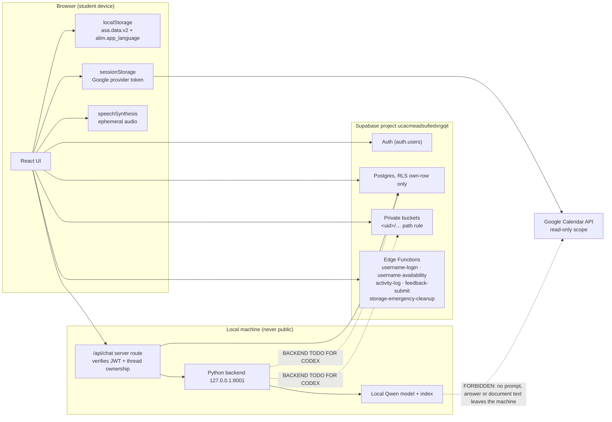

# Data flow and privacy

```
Document status: CURRENT
Generated from: current Lovable-managed project state · live Supabase project ucacmeadsufiedxrgqit (these Lovable-only edits are NOT claimed to be on any GitHub branch)
Production Supabase verified: 2026-09-15 (UTC)
Frontend commit: e0ef3464557d4786d214accb0d1bf44082ae3466
```

Where each class of student data lives, which components may read it, and what is
forbidden from leaving the machine. Boundaries here are the ones the backend must
respect — see `docs/contracts/EVENT_AND_TELEMETRY_CONTRACT.md` and
`docs/supabase/STORAGE_LIFECYCLES.md` for the enforcing detail.

## 1. Data classes and their homes

| Data class | Location | Read by | Status |
| --- | --- | --- | --- |
| Auth identity (email, `auth.uid()`, provider) | Supabase `auth.users` | Supabase Auth, RLS predicates | CURRENT — SUPABASE |
| Username | `public.profiles.username` (normalised, unique) + `username-login` / `username-availability` Edge Functions | frontend auth form (existence only) | CURRENT — SUPABASE |
| Profile details (full/preferred name, photo, nationality, phone, contact details, DOB) | `public.profiles` (own row only) | `/profile`, `/settings`, header greeting | CURRENT — SUPABASE |
| Avatar image | private bucket `profile-avatars/<uid>/…`, ≤ 2 MiB | signed URL for the owner | CURRENT — SUPABASE |
| Preferences (`app_language`, `selected_qwen_model`, audio, reminders, cleanup, reply-language policy) | `public.user_preferences.preferences` (JSONB, keyed by `user_id`) | i18n provider, Settings, Assistant | CURRENT — SUPABASE |
| App language cache | `localStorage["alim.app_language"]` — flash-avoidance only, never authoritative | i18n provider at boot | CURRENT — FRONTEND |
| Grades, assessments, planner events, materials metadata, school links | `localStorage["asa.data.v2"]` (browser only) | `AppDataProvider` consumers | CURRENT — FRONTEND (issue §6) |
| Tutoring chat threads/messages | `public.threads`, `public.messages` | owner only, via RLS | CURRENT — SUPABASE |
| Assistant threads/messages/attachments | `public.assistant_threads` / `_messages` / `_attachments` | owner only | CURRENT — SUPABASE |
| Assistant attachments (≤ 1 MiB) | private bucket `chat-attachments/<uid>/…` | owner via signed URL; backend parser | CURRENT — SUPABASE + BACKEND TODO FOR CODEX |
| Study materials | private bucket `user-materials/<uid>/…` | owner; indexing pipeline | CURRENT — SUPABASE |
| Document text and embeddings | `public.documents`, `public.document_chunks` | retrieval pipeline (own rows) | BACKEND TODO FOR CODEX (loose schema, issue §3) |
| Assistant output media descriptors | private bucket `assistant-descriptors/<uid>/…` | retrieval after binary deletion | BACKEND TODO FOR CODEX |
| Media retention queue | `public.media_retention_queue` | cleanup worker | CURRENT — SUPABASE (no producer yet) |
| Feedback | `public.feedback` via `feedback-submit`; optional bucket `feedback-messages` | admins (`app_metadata.role = 'admin'`) | CURRENT — SUPABASE |
| Activity/error telemetry | `public.usage_events` via `activity-log` | admins | CURRENT — SUPABASE |
| Google Calendar events (read-only) | Google API responses held in memory; provider token in `sessionStorage` only | `/planner` merge view | CURRENT — EXTERNAL INTEGRATION |
| Prompts, model answers, model weights, retrieval context | local machine only (Python backend + local model) | local backend | EXPECTED BACKEND CONTRACT |
| Speech audio | ephemeral browser `speechSynthesis`, never stored | the listening user | CURRENT — FRONTEND |

## 2. Flow diagram



## 3. Privacy rules

1. **Per-user isolation is absolute.** Every table policy and every storage
   policy resolves to `auth.uid()`; the first storage path folder must equal the
   user id. The backend must operate as the user (JWT) rather than with a
   service-role key for ordinary reads.
2. **`X-Student-Id` is context, not authorization.** It must never be the only
   thing standing between a request and another student's data
   (`docs/DOCUMENTATION_DISCOVERED_ISSUES.md` §2).
3. **Telemetry carries no content.** No prompts, answers, document text, file
   names, email addresses, tokens, calendar titles, URLs or raw
   `Error.message` — only bounded event names, feature/subject labels,
   `error_name` and an explicit simple `status`/`code`.
4. **No study content leaves the device.** Prompts, retrieved chunks, model
   weights and answers stay on the local machine. Web retrieval is the only
   outbound path and is gated by `allow_web`; it may send a query, never
   document contents.
5. **Google Calendar is read-only.** Scope `calendar.readonly`; the provider
   token lives in `sessionStorage` and dies with the tab; occurrences are never
   written back and are non-editable in the UI.
6. **Media minimisation.** Assistant *output* media is deleted 30 minutes after
   creation, but only once a text descriptor exists; ordinary study uploads are
   out of scope and are never auto-deleted.
7. **Admin access is narrow.** Only `app_metadata.role = 'admin'` (immutable by
   the user) may read `feedback` and `usage_events`; there is no admin read path
   to chats, documents or storage objects.
8. **Feedback is user-authored content**, not telemetry, and is submitted through
   an Edge Function so the client never writes admin-readable tables directly.


## Authenticated startup flow — CURRENT (2026-09-17)

Signed out → `/` (sign in / sign up; authentication NEVER waits on the local AI
backend) → **`/onboarding/language` — MANDATORY once per browser
session**: select a language (persists `user_preferences.preferences.app_language`
as the durable default) or explicitly skip → **`/onboarding/model` — MANDATORY
once per browser session**: system capability probe, recommendation, model
selection and prepare/poll; the app can be entered only after an explicit backend
`ready` confirmation (AI-ready) or an explicit "Continue without AI" (non-AI) →
`/onboarding/compliance` if compliance onboarding is still required (durable,
once, CURRENT SUPABASE `account_compliance`) → `/home`.

- Session gates: `alim.language_session.v1` and `alim.ai_session.v1`
  (`sessionStorage`). They survive a refresh and are cleared on sign-out.
- `language_onboarding_completed` is LEGACY compatibility metadata only — it is
  NOT a gate. `selected_qwen_model` is a durable PREFERENCE and never means the
  model is ready. Runtime/model/GPU readiness is never stored in Supabase.
- Route order is enforced: opening `/onboarding/model` by hand with no language
  decision redirects to `/onboarding/language`, and product routes stay blocked
  until both decisions exist (`startupRedirectFor`, `_authenticated/route.tsx`).
- There is NO mandatory system-admission screen between language and model;
  capability, admission and recommendation data are shown on the model screen.
  `/onboarding/system-admission` remains an optional diagnostics surface.
- Model preparation (`/api/system/capability`, `/api/model/prepare`,
  `/api/model/operation`, `/api/system/release`) is REQUIRED FUTURE BACKEND
  (BACKEND TODO FOR CODEX). Unreachable / 404 / timeout / unparsable ⇒
  `backend_unavailable`, shown truthfully; no values are fabricated.
- Resource policy: 50/50/50 admission, 30/25/30 runtime floors — CURRENT SUPABASE
  `get_ai_runtime_policy()`. Model catalogue: CURRENT SUPABASE `ai_model_catalog`,
  hard-coded list is fallback only.
- AI-dependent actions (chat, quiz/exam generation, grading) are centrally guarded
  (`AiFeatureGate` / `useAiBlocked`): without an AI-ready session no request is
  issued and one localized red notice offers retry model setup, Settings, or
  continuing with non-AI features. Non-AI features stay fully usable.
- The per-user `auto_storage_cleanup` preference is REMOVED; cleanup is the
  platform-wide 5-minute cron in `docs/supabase/STORAGE_LIFECYCLES.md`.

Canonical: `docs/sequences/POST_LOGIN_STARTUP.mmd`,
`docs/sequences/LANGUAGE_ONBOARDING.mmd`,
`docs/backend-handoff/POST_LOGIN_LANGUAGE_MODEL_GATE_HANDOFF.md`.

## Compliance, safety & peer messaging

**Startup order (CURRENT FRONTEND / CURRENT SUPABASE, 2026-09-17):** signed out →
sign in/up → `/onboarding/language` (MANDATORY per-session decision) →
`/onboarding/model` (MANDATORY per-session decision: backend-confirmed `ready`,
or explicit continue-without-AI) → `/onboarding/compliance` if still required
(CURRENT SUPABASE flag `account_compliance.compliance_onboarding_completed`, RPC
`complete_account_compliance_onboarding`) → `/home`. The system
admission gate is NOT part of this order any more; its data is shown on the model
screen and `/onboarding/system-admission` is optional. `account_compliance.account_status
= 'suspended_pending_review'` outranks every other route and redirects to
`/account/suspended`. Legal routes: `/legal/terms`, `/legal/privacy`,
`/legal/acceptable-use`, `/legal/child-safety`. See
`sequences/SIGNUP_ROLE_GUARDIAN_CONSENT.mmd`, `sequences/POST_LOGIN_STARTUP.mmd`.

## Post-login gate dependencies (2026-09-17)

- Supabase Auth has NO dependency on the local AI backend; sign-in, compliance,
  the language decision and every non-AI feature work with the backend absent.
- The language decision depends only on `sessionStorage` plus (optionally) the
  durable `app_language` preference; a failed preference read never skips it.
- The model decision depends on the REQUIRED FUTURE BACKEND for a `ready`
  confirmation, but never for progress: the explicit continue-without-AI path
  always exists.
- AI features (chat, RAG, quiz/exam generation, grading) depend on an AI-ready
  session; they are disabled centrally instead of failing at request time.
- No user content, readiness data or hardware measurement is persisted for the
  gate: only `app_language` and `selected_qwen_model` reach Supabase, and session
  decisions are discarded on sign-out.