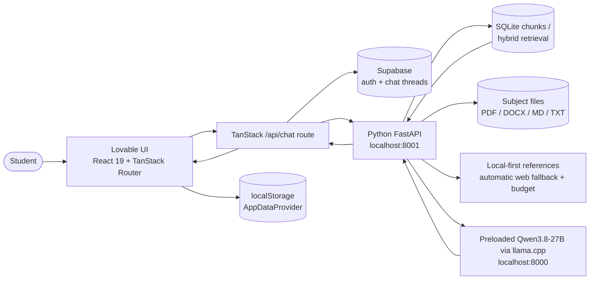

# Frontend Architecture — Alim's Study Assistant

Describes the codebase as it exists today, plus the recommended insertion points for the
local Python FastAPI backend.

## 1. Stack

| Layer | Technology | Notes |
| --- | --- | --- |
| Framework | TanStack Start v1 | SSR + server functions, file-based routing |
| UI | React 19 + TypeScript 5.8 | Function components, hooks only |
| Build | Vite 8 | Dev server on `http://localhost:8080` |
| Package manager | npm by default; Bun supported | `npm ci`, `npm run dev` from `frontend/` |
| Styling | Tailwind CSS v4 | Tokens in `frontend/src/styles.css` via `@theme` |
| Primitives | Radix UI / shadcn | `frontend/src/components/ui/*` |
| Data fetching | TanStack Query | `QueryClientProvider` in `frontend/src/routes/__root.tsx` |
| Auth + chat storage | Supabase (Lovable Cloud) | `frontend/src/integrations/supabase/*` |
| AI | Local Python context backend and preloaded Qwen runtime | `frontend/src/lib/context-backend.server.ts`, `frontend/src/routes/api/chat.ts` |

## 2. TanStack Start model

- **Routes** are files under `frontend/src/routes/`. Dots map to slashes; `index.tsx` is the leaf.
  `frontend/src/routeTree.gen.ts` is generated — never edited.
- **Server functions** (`createServerFn` from `@tanstack/react-start`) are typed RPC used for
  app-internal server work. Current example: `frontend/src/lib/chat.functions.ts`
  (`listThreads`, `listMessages`, `createThread`, `deleteThread`), each guarded by
  `.middleware([requireSupabaseAuth])`.
- **Server routes** (`createFileRoute(...).server.handlers`) are raw HTTP endpoints.
  Current example: `frontend/src/routes/api/chat.ts` (`POST`), which streams AI output.
- **Client-side middleware** in `frontend/src/start.ts` attaches the Supabase bearer token to
  protected server-function calls.

## 3. Vite / Bun local dev model

`npm run dev` starts Vite on port 8080 with SSR. Server functions and `frontend/src/routes/api/*` run in
the same process locally, and in an edge Worker runtime when published — so **no Node-only,
native or long-running AI workloads belong there**. This is a structural reason the Python
backend should own RAG/embeddings/model calls rather than TanStack server code.

## 4. Styling / design tokens

Tailwind v4 reads tokens from `frontend/src/styles.css`. Semantic tokens only in components
(`bg-background`, `text-muted-foreground`, `bg-surface`, `text-primary`, `--warning`).
Key values: light `#F7F8FA`, dark `#0D0E12`, accent `#6558D9`, failing-grade warning `#C96A00`,
14px radius, Helvetica-style stack. Backend integration must not introduce hardcoded colours.

## 5. Routing tree

```
frontend/src/routes/
  __root.tsx                     providers + shell + head
  index.tsx                      "/" title screen
  auth.tsx                       "/auth" sign in / sign up
  api/chat.ts                    "POST /api/chat" AI streaming endpoint
  _authenticated/
    route.tsx                    auth gate (redirects to /auth)
    home.tsx                     "/home"
    school.index.tsx             "/school"
    school.$subject.tsx          "/school/:subject"
    planner.tsx                  "/planner"
    stats.tsx                    "/stats"
    profile.tsx                  "/profile"
    settings.tsx                 "/settings"
    feedback.tsx                 "/feedback"
    help.tsx                     "/help"
    diagnostics.tsx              "/diagnostics"
    chat.index.tsx               "/chat"
    chat.$threadId.tsx           "/chat/:threadId"
```

Everything under `_authenticated/` is gated by `_authenticated/route.tsx`. The `_authenticated`
segment does not appear in the URL.

## 6. Shared providers (`frontend/src/routes/__root.tsx`)

| Provider | Source | Responsibility |
| --- | --- | --- |
| `QueryClientProvider` | `@tanstack/react-query` | Server-state cache for server functions and (future) Python API calls. Keys like `["threads"]`, `["messages", threadId]`. |
| `ThemeProvider` | `frontend/src/hooks/use-theme.tsx` | Light/dark class toggle, persisted locally. |
| `AppDataProvider` | `frontend/src/lib/store/app-data.tsx` | All prototype data: assessments, planner events, materials, school links, profile, demo mode. Context + `localStorage`. |
| `AcademicYearProvider` | `frontend/src/lib/store/academic-year.tsx` | Global academic-year context (default 2026–27, Grade 11). |
| `Toaster` | `frontend/src/components/ui/sonner` | Global toasts for success/error states. |

## 7. Component folders

| Folder | Role |
| --- | --- |
| `frontend/src/components/ui/*` | shadcn/Radix primitives. Pure UI, no data. |
| `frontend/src/components/app/*` | Product components: `AppShell`, `AppHeader`, `SubjectCard`, `GradeDisplay`, `StatsOverviewPanel`, `Timetable`, `MaterialsPanel`, `AssessmentDialog`, `EventDialog`, `TranscriptImportDialog`, `NotificationCenter`, `DemoMode`, `States`, `LiveClock`, `Badges`, `Breadcrumbs`, `AcademicYearSelector`, `SchoolLinksSection`. Read/write `AppDataProvider`. |
| `frontend/src/components/ai-elements/*` | Chat rendering primitives: `conversation`, `message`, `prompt-input`, `shimmer`. Transport-agnostic. |
| `frontend/src/components/StudyChat.tsx`, `ThreadList.tsx`, `AuthForm.tsx` | Chat shell, thread sidebar, auth form. |

## 8. Current data patterns

### a. Supabase auth + chat persistence
`supabase.auth` in the browser (`frontend/src/integrations/supabase/client.ts`), bearer token attached to
server functions via `frontend/src/integrations/supabase/auth-attacher.ts` and validated by
`auth-middleware.ts`. Threads/messages live in Supabase tables typed by
`frontend/src/integrations/supabase/types.ts` (auto-generated, never edited).

### b. AI and context path
`frontend/src/routes/api/chat.ts` authenticates the request, verifies thread ownership, and persists the
user message. It forwards only the current question and identifiers
to FastAPI, converts the completed Python answer and provenance metadata into an AI SDK UI stream,
and persists the assistant message. `StudyChat.tsx` renders source metadata with
`SourceSnippetList`. Backend failures return 503; study content is never sent to a cloud model as a
generation fallback.

### c. localStorage prototype data
`AppDataProvider` hydrates from `localStorage`, seeded from `frontend/src/lib/store/demo-data.ts` only when
demo mode is on. Grade math is computed client-side in `frontend/src/lib/grade-math.ts` from
`Assessment[]`. Static subject metadata lives in `frontend/src/lib/mock/subjects.ts`.

## 9. Python backend insertion points

Chat currently uses a server-only client so the existing Supabase-authenticated route remains the
single transcript writer. Other planned AI features can use a browser-side client later.

| Concern | Insertion point |
| --- | --- |
| Chat Python calls | `frontend/src/lib/context-backend.server.ts` (server-only fetch wrapper, timeout, typed errors) |
| Shared chat types | `frontend/src/lib/context-backend.types.ts` |
| Chat transport | Existing `DefaultChatTransport` continues to call `/api/chat`; the route calls FastAPI |
| Health/status | New `frontend/src/components/app/BackendStatusBanner.tsx`, rendered inside `AppShell` |
| RAG sources | New `frontend/src/components/app/SourceSnippetList.tsx`, rendered under assistant messages |

The browser calls the authenticated TanStack route. That server-side bridge verifies the Supabase
user/thread, persists the display transcript, and then calls FastAPI on `localhost:8001`. Model and
context services are never exposed directly to browser code.

## 10. System diagram



## 11. Invariants for the integration

- Do not edit `frontend/src/routeTree.gen.ts` or `frontend/src/integrations/supabase/{client,client.server,types,auth-middleware,auth-attacher}.ts`.
- Do not remove the `_authenticated` gate.
- Do not break SPF combined-subject logic in `frontend/src/lib/grade-math.ts`.
- Do not put secrets in `VITE_*`.
- Keep non-AI screens functional with the Python backend offline. Chat reports a clear 503.
