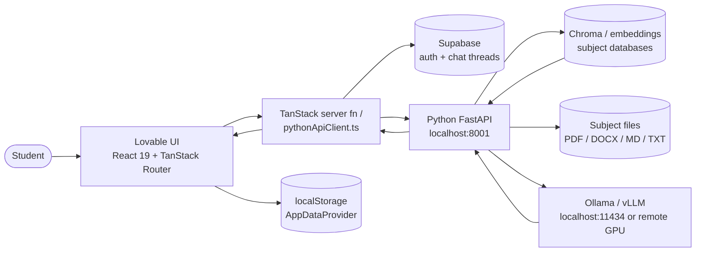

# Frontend Architecture — Alim's Study Assistant

Describes the codebase as it exists today, plus the recommended insertion points for the
local Python FastAPI backend.

## 1. Stack

| Layer | Technology | Notes |
| --- | --- | --- |
| Framework | TanStack Start v1 | SSR + server functions, file-based routing |
| UI | React 19 + TypeScript 5.8 | Function components, hooks only |
| Build | Vite 7 | Dev server on `http://localhost:8080` |
| Package manager | Bun | `bun install`, `bun run dev` |
| Styling | Tailwind CSS v4 | Tokens in `src/styles.css` via `@theme` |
| Primitives | Radix UI / shadcn | `src/components/ui/*` |
| Data fetching | TanStack Query | `QueryClientProvider` in `src/routes/__root.tsx` |
| Auth + chat storage | Supabase (Lovable Cloud) | `src/integrations/supabase/*` |
| AI | Lovable AI Gateway via `ai` SDK | `src/lib/ai-gateway.server.ts`, `src/routes/api/chat.ts` |

## 2. TanStack Start model

- **Routes** are files under `src/routes/`. Dots map to slashes; `index.tsx` is the leaf.
  `src/routeTree.gen.ts` is generated — never edited.
- **Server functions** (`createServerFn` from `@tanstack/react-start`) are typed RPC used for
  app-internal server work. Current example: `src/lib/chat.functions.ts`
  (`listThreads`, `listMessages`, `createThread`, `deleteThread`), each guarded by
  `.middleware([requireSupabaseAuth])`.
- **Server routes** (`createFileRoute(...).server.handlers`) are raw HTTP endpoints.
  Current example: `src/routes/api/chat.ts` (`POST`), which streams AI output.
- **Client-side middleware** in `src/start.ts` attaches the Supabase bearer token to
  protected server-function calls.

## 3. Vite / Bun local dev model

`bun run dev` starts Vite on port 8080 with SSR. Server functions and `src/routes/api/*` run in
the same process locally, and in an edge Worker runtime when published — so **no Node-only,
native or long-running AI workloads belong there**. This is a structural reason the Python
backend should own RAG/embeddings/model calls rather than TanStack server code.

## 4. Styling / design tokens

Tailwind v4 reads tokens from `src/styles.css`. Semantic tokens only in components
(`bg-background`, `text-muted-foreground`, `bg-surface`, `text-primary`, `--warning`).
Key values: light `#F7F8FA`, dark `#0D0E12`, accent `#6558D9`, failing-grade warning `#C96A00`,
14px radius, Helvetica-style stack. Backend integration must not introduce hardcoded colours.

## 5. Routing tree

```
src/routes/
  __root.tsx                     providers + shell + head
  index.tsx                      "/" title screen
  auth.tsx                       "/auth" sign in / sign up
  api/chat.ts                    "POST /api/chat" AI streaming endpoint
  _authenticated/
    route.tsx                    auth gate (redirects to /auth)
    home.tsx                     "/home"
    school.index.tsx             "/school"
    school.$subject.tsx          "/school/:subject"
    planner.tsx                  "/planner"
    stats.tsx                    "/stats"
    profile.tsx                  "/profile"
    settings.tsx                 "/settings"
    feedback.tsx                 "/feedback"
    help.tsx                     "/help"
    diagnostics.tsx              "/diagnostics"
    chat.index.tsx               "/chat"
    chat.$threadId.tsx           "/chat/:threadId"
```

Everything under `_authenticated/` is gated by `_authenticated/route.tsx`. The `_authenticated`
segment does not appear in the URL.

## 6. Shared providers (`src/routes/__root.tsx`)

| Provider | Source | Responsibility |
| --- | --- | --- |
| `QueryClientProvider` | `@tanstack/react-query` | Server-state cache for server functions and (future) Python API calls. Keys like `["threads"]`, `["messages", threadId]`. |
| `ThemeProvider` | `src/hooks/use-theme.tsx` | Light/dark class toggle, persisted locally. |
| `AppDataProvider` | `src/lib/store/app-data.tsx` | All prototype data: assessments, planner events, materials, school links, profile, demo mode. Context + `localStorage`. |
| `AcademicYearProvider` | `src/lib/store/academic-year.tsx` | Global academic-year context (default 2026–27, Grade 11). |
| `Toaster` | `src/components/ui/sonner` | Global toasts for success/error states. |

## 7. Component folders

| Folder | Role |
| --- | --- |
| `src/components/ui/*` | shadcn/Radix primitives. Pure UI, no data. |
| `src/components/app/*` | Product components: `AppShell`, `AppHeader`, `SubjectCard`, `GradeDisplay`, `StatsOverviewPanel`, `Timetable`, `MaterialsPanel`, `AssessmentDialog`, `EventDialog`, `TranscriptImportDialog`, `NotificationCenter`, `DemoMode`, `States`, `LiveClock`, `Badges`, `Breadcrumbs`, `AcademicYearSelector`, `SchoolLinksSection`. Read/write `AppDataProvider`. |
| `src/components/ai-elements/*` | Chat rendering primitives: `conversation`, `message`, `prompt-input`, `shimmer`. Transport-agnostic. |
| `src/components/StudyChat.tsx`, `ThreadList.tsx`, `AuthForm.tsx` | Chat shell, thread sidebar, auth form. |

## 8. Current data patterns

### a. Supabase auth + chat persistence
`supabase.auth` in the browser (`src/integrations/supabase/client.ts`), bearer token attached to
server functions via `src/integrations/supabase/auth-attacher.ts` and validated by
`auth-middleware.ts`. Threads/messages live in Supabase tables typed by
`src/integrations/supabase/types.ts` (auto-generated, never edited).

### b. Lovable AI Gateway
`src/routes/api/chat.ts` authenticates the request, verifies thread ownership, persists the user
message, then calls `createLovableAiGatewayProvider()` (`src/lib/ai-gateway.server.ts`) and
`streamText(...)`, persisting the assistant message in `onFinish`. `StudyChat.tsx` consumes it via
`useChat` + `DefaultChatTransport({ api: "/api/chat" })`.

### c. localStorage prototype data
`AppDataProvider` hydrates from `localStorage`, seeded from `src/lib/store/demo-data.ts` only when
demo mode is on. Grade math is computed client-side in `src/lib/grade-math.ts` from
`Assessment[]`. Static subject metadata lives in `src/lib/mock/subjects.ts`.

## 9. Where Python backend calls should be inserted

**Recommendation: a browser-side typed API client, not new TanStack server functions.**

| Concern | Insertion point |
| --- | --- |
| All Python calls | New `src/lib/pythonApiClient.ts` (fetch wrapper, base URL from `VITE_PYTHON_API_BASE_URL`, timeout, typed errors) |
| Shared types | New `src/lib/pythonApiTypes.ts` (mirrors `FRONTEND_DATA_MODEL.md`) |
| Mode switching | New `src/lib/backendMode.ts` (`python` \| `lovable` \| `mock`) |
| Chat transport | New `src/lib/pythonChatAdapter.ts`, swapped into the `transport` option of `useChat` in `StudyChat.tsx`. The chat UI itself does not change. |
| Health/status | New `src/components/app/BackendStatusBanner.tsx`, rendered inside `AppShell` |
| RAG sources | New `src/components/app/SourceSnippetList.tsx`, rendered under assistant messages |

Rationale: the Python backend runs on `localhost:8001` on the same machine as the browser, so a
direct browser → FastAPI call is simplest, keeps streaming intact and avoids proxying through the
edge runtime. If the backend later moves off-device or needs secret headers, put a thin proxy in a
TanStack server route (`src/routes/api/*`) and keep the same client interface.

## 10. System diagram



## 11. Invariants for the integration

- Do not edit `src/routeTree.gen.ts` or `src/integrations/supabase/{client,client.server,types,auth-middleware,auth-attacher}.ts`.
- Do not remove the `_authenticated` gate.
- Do not break SPF combined-subject logic in `src/lib/grade-math.ts`.
- Do not put secrets in `VITE_*`.
- Keep the app functional with the Python backend offline (mock/degraded mode).
