# Full UI, Frontend & Backend Wireframes

This pack is a code-navigation aid for maintainers and coding agents. It maps the current application as implemented and separates it from future integration work.

## Status language

- **IMPLEMENTED** — executable in the current repository.
- **IMPLEMENTED LOCAL** — runs in the frontend and persists in browser storage.
- **IMPLEMENTED CLOUD** — uses external Supabase for identity or chat persistence.
- **PLANNED** — documented contract or placeholder UI, not currently wired end to end.
- **OPTIONAL** — exists but is enabled only through explicit configuration.

## Reading order

Start with diagrams 1–4 for architecture, routing, composition, and state ownership. Then open the feature journey matching the code you intend to change. Every diagram is also available as a standalone `.mmd` file in [`docs/wireframes/`](wireframes/).

## Non-negotiable boundaries

1. The frontend owns the fixed 15-subject presentation model, subject languages, SPF display combination, Swiss grade rounding, and failing-grade styling.
2. external Supabase currently owns authentication and per-user chat threads/messages.
3. Browser storage currently owns grades, planner events, local materials, school links, profile, academic year, notifications, and demo mode.
4. Python owns AI context compilation, retrieval, memories, source provenance, document indexing, and local/remote model calls.
5. The TanStack `POST /api/chat` route is the authenticated bridge and the single current writer of chat transcript rows.
6. Quiz, mock-exam, answer-grading, study-plan, feedback, subject metadata, material-list, and health UI integrations are planned unless a diagram explicitly marks a backend-only endpoint as implemented.

## 1. System overview

The complete runtime boundary and service topology.

Standalone: [`01-system-overview.mmd`](wireframes/01-system-overview.mmd)

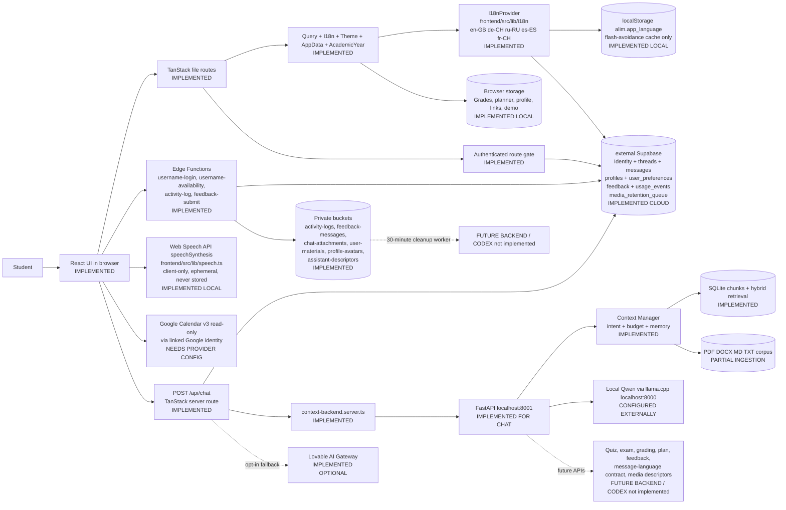
```mermaid
flowchart LR
  Student[Student] --> Browser[React UI in browser\nIMPLEMENTED]
  Browser --> Router[TanStack file routes\nIMPLEMENTED]
  Router --> Providers[Query + I18n + Theme + AppData + AcademicYear\nIMPLEMENTED]
  Providers --> I18n[I18nProvider\nfrontend/src/lib/i18n\nen-GB de-CH ru-RU es-ES fr-CH\nIMPLEMENTED]
  I18n --> LangCache[(localStorage alim.app_language\nflash-avoidance cache only\nIMPLEMENTED LOCAL)]
  Providers --> Local[(Browser storage\nGrades, planner, profile, links, demo\nIMPLEMENTED LOCAL)]
  Router --> Auth[Authenticated route gate\nIMPLEMENTED]
  Auth --> Cloud[(external Supabase\nIdentity + threads + messages\nprofiles + user_preferences\nfeedback + usage_events\nmedia_retention_queue\nIMPLEMENTED CLOUD)]
  I18n --> Cloud
  Browser --> Fns[Edge Functions\nusername-login, username-availability,\nactivity-log, feedback-submit\nIMPLEMENTED]
  Fns --> Cloud
  Fns --> Buckets[(Private buckets\nactivity-logs, feedback-messages,\nchat-attachments, user-materials, profile-avatars,\nassistant-descriptors\nIMPLEMENTED)]
  Browser --> Speech[Web Speech API speechSynthesis\nfrontend/src/lib/speech.ts\nclient-only, ephemeral, never stored\nIMPLEMENTED LOCAL]
  Browser --> GCal[Google Calendar v3 read-only\nvia linked Google identity\nNEEDS PROVIDER CONFIG]
  Browser --> ChatRoute[POST /api/chat\nTanStack server route\nIMPLEMENTED]
  ChatRoute --> Cloud
  ChatRoute --> Adapter[context-backend.server.ts\nIMPLEMENTED]
  Adapter --> Python[FastAPI localhost:8001\nIMPLEMENTED FOR CHAT]
  Python --> Context[Context Manager\nintent + budget + memory\nIMPLEMENTED]
  Context --> Retrieval[(SQLite chunks + hybrid retrieval\nIMPLEMENTED)]
  Context --> Files[(PDF DOCX MD TXT corpus\nPARTIAL INGESTION)]
  Python --> Model[Local Qwen via llama.cpp localhost:8000\nCONFIGURED EXTERNALLY]
  ChatRoute -. opt-in fallback .-> Gateway[Lovable AI Gateway\nIMPLEMENTED OPTIONAL]
  Python -. future APIs .-> Future[Quiz, exam, grading, plan, feedback,\nmessage-language contract, media descriptors\nFUTURE BACKEND / CODEX not implemented]
  Buckets -. 30-minute cleanup worker .-> FutureCleanup[FUTURE BACKEND / CODEX not implemented]
```

## 2. Routes and navigation

Every page route and the navigation surfaces that reach it.

Standalone: [`02-routes-navigation.mmd`](wireframes/02-routes-navigation.mmd)

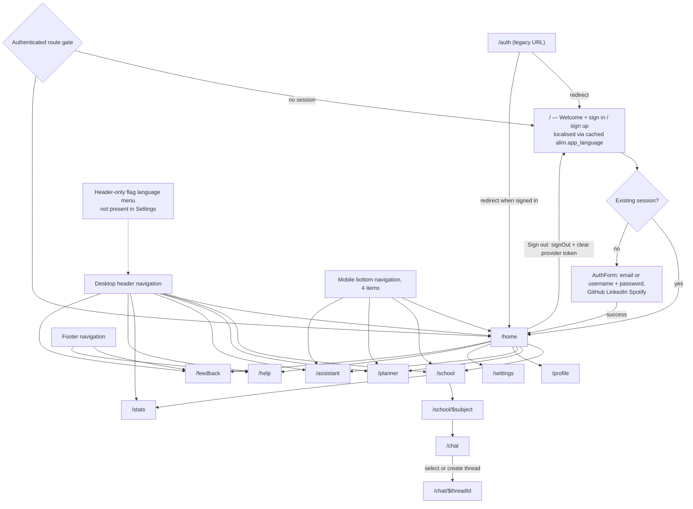
```mermaid
flowchart TD
  Root["/ — Welcome + sign in / sign up\nlocalised via cached alim.app_language"] --> SignedIn{Existing session?}
  SignedIn -->|yes| Home["/home"]
  SignedIn -->|no| AuthForm[AuthForm: email or username + password,\nGitHub LinkedIn Spotify]
  AuthForm -->|success| Home
  Auth["/auth (legacy URL)"] -->|redirect| Root
  Auth -->|redirect when signed in| Home
  Protected{Authenticated route gate} -->|no session| Root
  Protected --> Home
  Home -->|Sign out: signOut + clear provider token| Root
  Home --> School["/school"]
  Home --> Planner["/planner"]
  School --> Subject["/school/$subject"]
  School --> Stats["/stats"]
  Subject --> ChatEntry["/chat"]
  ChatEntry -->|select or create thread| Thread["/chat/$threadId"]
  Home --> Assistant["/assistant"]
  Home --> Profile["/profile"]
  Home --> Settings["/settings"]
  Home --> Help["/help"]
  Home --> Feedback["/feedback"]
  Header[Desktop header navigation] --> Home
  Header --> School
  Header --> Planner
  Header --> Assistant
  Header --> Stats
  Header --> Help
  Header --> Feedback
  HeaderLang[Header-only flag language menu\nnot present in Settings] -.-> Header
  Mobile[Mobile bottom navigation, 4 items] --> Home
  Mobile --> School
  Mobile --> Planner
  Mobile --> Assistant
  Footer[Footer navigation] --> Feedback
  Footer --> Help
```

## 3. Frontend composition

The provider, layout, screen, and chat-component hierarchy.

Standalone: [`03-frontend-composition.mmd`](wireframes/03-frontend-composition.mmd)

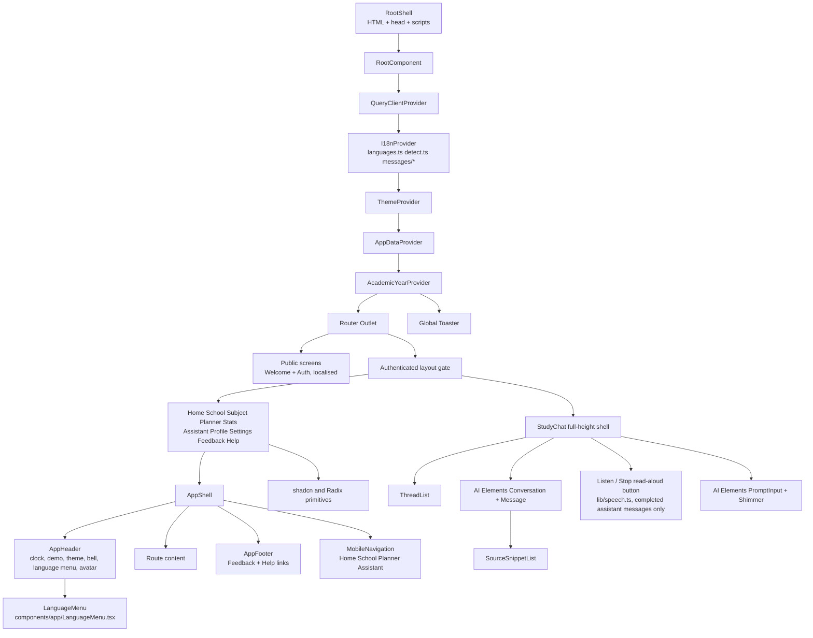
```mermaid
flowchart TD
  HTML[RootShell\nHTML + head + scripts] --> Root[RootComponent]
  Root --> Query[QueryClientProvider]
  Query --> I18nP[I18nProvider\nlanguages.ts detect.ts messages/*]
  I18nP --> Theme[ThemeProvider]
  Theme --> Data[AppDataProvider]
  Data --> Year[AcademicYearProvider]
  Year --> Outlet[Router Outlet]
  Year --> Toast[Global Toaster]
  Outlet --> Public[Public screens\nWelcome + Auth, localised]
  Outlet --> Gate[Authenticated layout gate]
  Gate --> Pages[Home School Subject Planner Stats\nAssistant Profile Settings Feedback Help]
  Pages --> Shell[AppShell]
  Shell --> Header[AppHeader\nclock, demo, theme, bell, language menu, avatar]
  Header --> LangMenu[LanguageMenu\ncomponents/app/LanguageMenu.tsx]
  Shell --> Content[Route content]
  Shell --> Footer[AppFooter\nFeedback + Help links]
  Shell --> Mobile[MobileNavigation\nHome School Planner Assistant]
  Gate --> Chat[StudyChat full-height shell]
  Chat --> Threads[ThreadList]
  Chat --> Conversation[AI Elements Conversation + Message]
  Chat --> Speech[Listen / Stop read-aloud button\nlib/speech.ts, completed assistant messages only]
  Chat --> Composer[AI Elements PromptInput + Shimmer]
  Conversation --> Sources[SourceSnippetList]
  Pages --> UI[shadcn and Radix primitives]
```

## 4. State ownership

The authoritative owner and storage location for each data family.

Standalone: [`04-state-ownership.mmd`](wireframes/04-state-ownership.mmd)

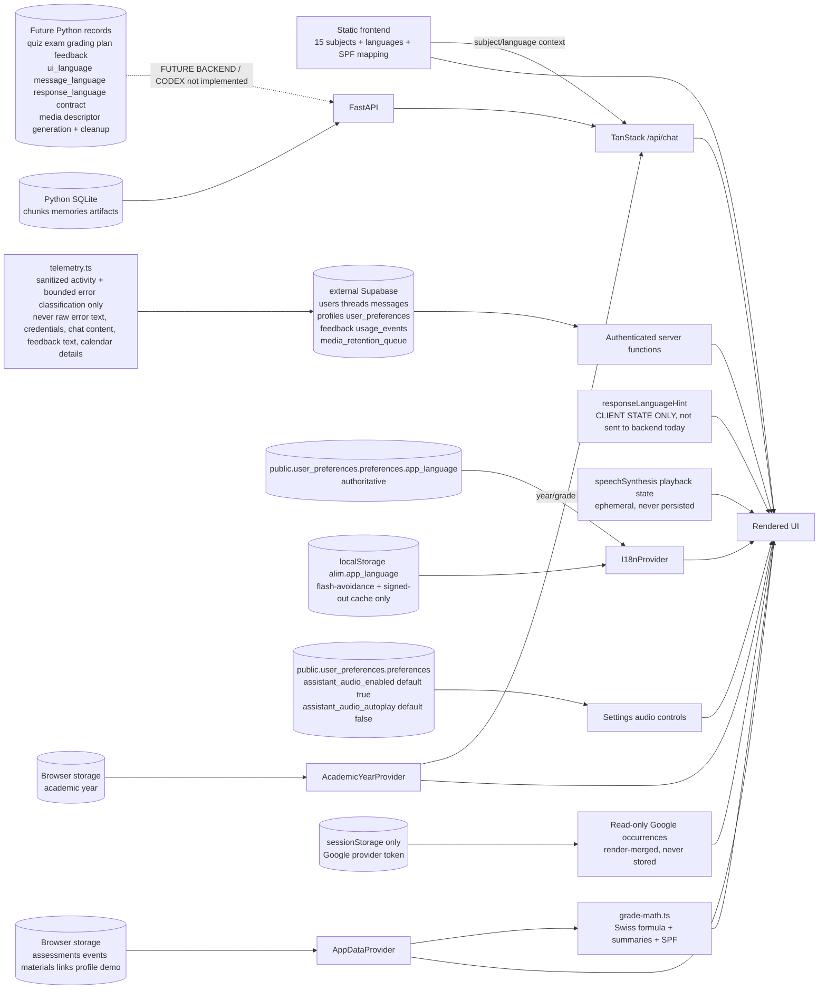
```mermaid
flowchart LR
  Static[Static frontend\n15 subjects + languages + SPF mapping] --> UI[Rendered UI]
  Local[(Browser storage\nassessments events materials links profile demo)] --> AppData[AppDataProvider]
  AppData --> UI
  AppData --> Grade[grade-math.ts\nSwiss formula + summaries + SPF]
  Grade --> UI
  Year[(Browser storage\nacademic year)] --> Academic[AcademicYearProvider]
  Academic --> UI
  Lang[(public.user_preferences.preferences.app_language\nauthoritative)] --> I18n[I18nProvider]
  LangCache[(localStorage alim.app_language\nflash-avoidance + signed-out cache only)] --> I18n
  I18n --> UI
  Audio[(public.user_preferences.preferences\nassistant_audio_enabled default true\nassistant_audio_autoplay default false)] --> SettingsUI[Settings audio controls]
  SettingsUI --> UI
  MsgHint[responseLanguageHint\nCLIENT STATE ONLY, not sent to backend today] --> UI
  SpeechState[speechSynthesis playback state\nephemeral, never persisted] --> UI
  Cloud[(external Supabase\nusers threads messages\nprofiles user_preferences\nfeedback usage_events\nmedia_retention_queue)] --> ServerFns[Authenticated server functions]
  Telemetry[telemetry.ts\nsanitized activity + bounded error classification only\nnever raw error text, credentials, chat content, feedback text, calendar details] --> Cloud
  GoogleToken[(sessionStorage only\nGoogle provider token)] --> GoogleEvents[Read-only Google occurrences\nrender-merged, never stored]
  GoogleEvents --> UI
  ServerFns --> UI
  Python[(Python SQLite\nchunks memories artifacts)] --> FastAPI[FastAPI]
  FastAPI --> ChatAPI[TanStack /api/chat]
  ChatAPI --> UI
  Static -->|subject/language context| ChatAPI
  Academic -->|year/grade context| ChatAPI
  Future[(Future Python records\nquiz exam grading plan feedback\nui_language message_language response_language contract\nmedia descriptor generation + cleanup)] -. FUTURE BACKEND / CODEX not implemented .-> FastAPI
```

## 5. Authentication journey

Protected route entry, sign-in, session restoration, and sign-out.

Standalone: [`05-authentication.mmd`](wireframes/05-authentication.mmd)

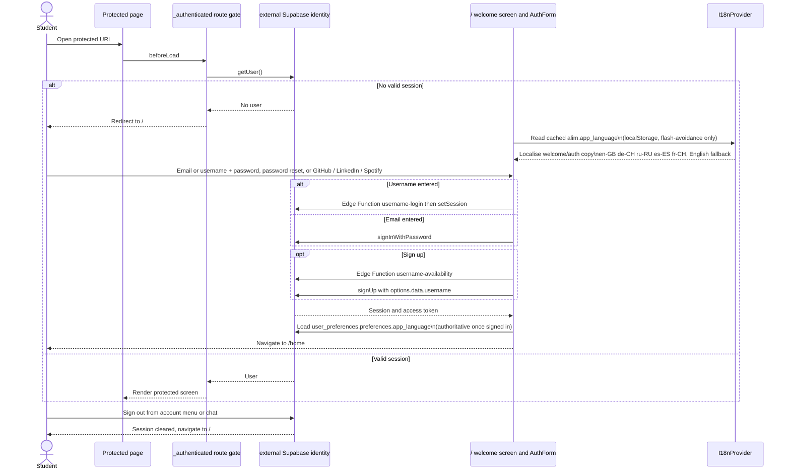
```mermaid
sequenceDiagram
  actor Student
  participant Page as Protected page
  participant Gate as _authenticated route gate
  participant Cloud as external Supabase identity
  participant Auth as / welcome screen and AuthForm
  participant I18n as I18nProvider
  Student->>Page: Open protected URL
  Page->>Gate: beforeLoad
  Gate->>Cloud: getUser()
  alt No valid session
    Cloud-->>Gate: No user
    Gate-->>Student: Redirect to /
    Auth->>I18n: Read cached alim.app_language\n(localStorage, flash-avoidance only)
    I18n-->>Auth: Localise welcome/auth copy\nen-GB de-CH ru-RU es-ES fr-CH, English fallback
    Student->>Auth: Email or username + password, password reset, or GitHub / LinkedIn / Spotify
    alt Username entered
      Auth->>Cloud: Edge Function username-login then setSession
    else Email entered
      Auth->>Cloud: signInWithPassword
    end
    opt Sign up
      Auth->>Cloud: Edge Function username-availability
      Auth->>Cloud: signUp with options.data.username
    end
    Cloud-->>Auth: Session and access token
    Auth->>Cloud: Load user_preferences.preferences.app_language\n(authoritative once signed in)
    Auth-->>Student: Navigate to /home
  else Valid session
    Cloud-->>Gate: User
    Gate-->>Page: Render protected screen
  end
  Student->>Cloud: Sign out from account menu or chat
  Cloud-->>Student: Session cleared, navigate to /
```

## 6. Home journey

How the dashboard derives its student-facing summary.

Standalone: [`06-home.mmd`](wireframes/06-home.mmd)

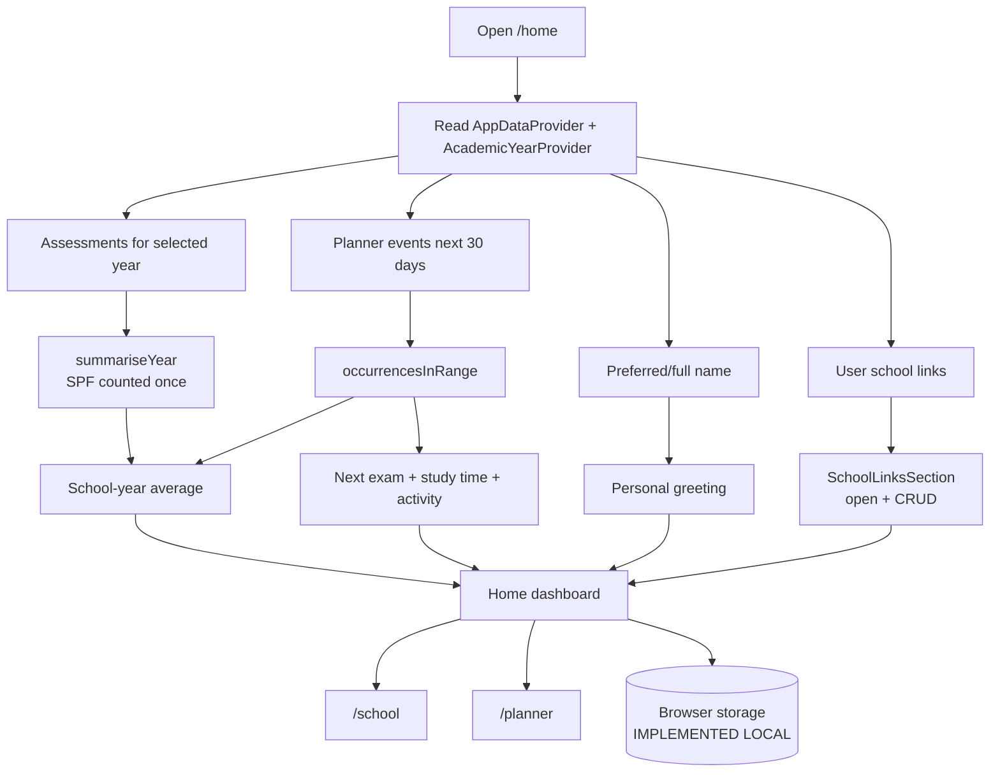
```mermaid
flowchart TD
  Open[Open /home] --> Read[Read AppDataProvider + AcademicYearProvider]
  Read --> Profile[Preferred/full name]
  Read --> Grades[Assessments for selected year]
  Read --> Events[Planner events next 30 days]
  Read --> Links[User school links]
  Grades --> Year[summariseYear\nSPF counted once]
  Events --> Occ[occurrencesInRange]
  Year --> Cards[School-year average]
  Occ --> Cards
  Occ --> Next[Next exam + study time + activity]
  Profile --> Greeting[Personal greeting]
  Links --> LinkUI[SchoolLinksSection\nopen + CRUD]
  Cards --> UI[Home dashboard]
  Next --> UI
  Greeting --> UI
  LinkUI --> UI
  UI --> School["/school"]
  UI --> Planner["/planner"]
  UI --> Local[(Browser storage\nIMPLEMENTED LOCAL)]
```

## 7. School and grades journey

Subject navigation, grade CRUD, calculations, and warnings.

Standalone: [`07-school-grades.mmd`](wireframes/07-school-grades.mmd)

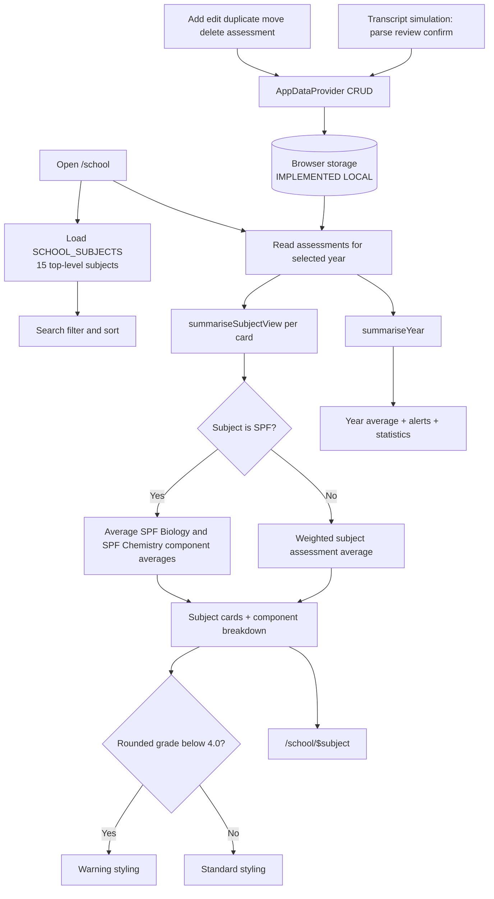
```mermaid
flowchart TD
  Open[Open /school] --> Subjects[Load SCHOOL_SUBJECTS\n15 top-level subjects]
  Open --> Data[Read assessments for selected year]
  Subjects --> Filter[Search filter and sort]
  Data --> SubjectCalc[summariseSubjectView per card]
  Data --> YearCalc[summariseYear]
  SubjectCalc --> SPF{Subject is SPF?}
  SPF -->|Yes| Combine[Average SPF Biology and SPF Chemistry component averages]
  SPF -->|No| Single[Weighted subject assessment average]
  Combine --> Cards[Subject cards + component breakdown]
  Single --> Cards
  YearCalc --> Overview[Year average + alerts + statistics]
  Cards --> Failing{Rounded grade below 4.0?}
  Failing -->|Yes| Orange[Warning styling]
  Failing -->|No| Normal[Standard styling]
  Cards --> Subject["/school/$subject"]
  Add[Add edit duplicate move delete assessment] --> AppData[AppDataProvider CRUD]
  Import[Transcript simulation: parse review confirm] --> AppData
  AppData --> Store[(Browser storage\nIMPLEMENTED LOCAL)]
  Store --> Data
```

## 8. Subject workspace journey

Subject tools, materials, statistics, and the SPF component split.

Standalone: [`08-subject-workspace.mmd`](wireframes/08-subject-workspace.mmd)

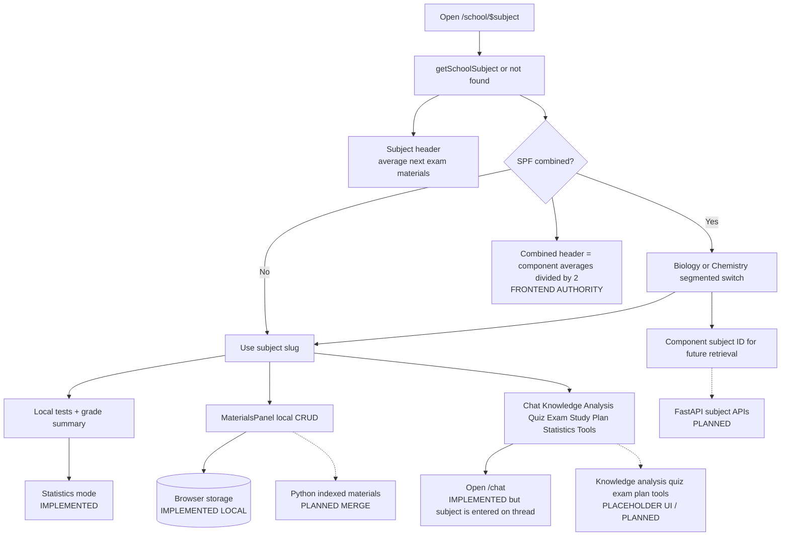
```mermaid
flowchart TD
  Route[Open /school/$subject] --> Lookup[getSchoolSubject or not found]
  Lookup --> Header[Subject header\naverage next exam materials]
  Lookup --> Components{SPF combined?}
  Components -->|No| Active[Use subject slug]
  Components -->|Yes| Toggle[Biology or Chemistry segmented switch]
  Toggle --> Active
  Active --> Grades[Local tests + grade summary]
  Active --> Materials[MaterialsPanel local CRUD]
  Active --> Modes[Chat Knowledge Analysis Quiz Exam Study Plan Statistics Tools]
  Grades --> Stats[Statistics mode\nIMPLEMENTED]
  Modes --> Chat[Open /chat\nIMPLEMENTED but subject is entered on thread]
  Modes -.-> Future[Knowledge analysis quiz exam plan tools\nPLACEHOLDER UI / PLANNED]
  Materials --> Local[(Browser storage\nIMPLEMENTED LOCAL)]
  Materials -.-> Indexed[Python indexed materials\nPLANNED MERGE]
  Toggle --> Scope[Component subject ID for future retrieval]
  Scope -.-> Python[FastAPI subject APIs\nPLANNED]
  Components --> Formula[Combined header = component averages divided by 2\nFRONTEND AUTHORITY]
```

## 9. Chat journey

Thread persistence, authentication, Python retrieval, model generation, and fallback.

Standalone: [`09-chat.mmd`](wireframes/09-chat.mmd)

```mermaid
sequenceDiagram
  actor Student
  participant UI as StudyChat
  participant I18n as I18nProvider + detectLanguage
  participant Fn as Authenticated server functions
  participant Cloud as external Supabase threads/messages
  participant API as TanStack POST /api/chat
  participant PY as Python FastAPI /api/chat
  participant RAG as Context Manager + retrieval
  participant LLM as Local Qwen via llama.cpp
  Student->>UI: Open /chat
  UI->>Fn: listThreads or createThread
  Fn->>Cloud: User-scoped thread operation
  Cloud-->>Fn: Thread
  UI-->>Student: Navigate /chat/{threadId}
  UI->>Fn: listMessages(threadId)
  Fn->>Cloud: User-scoped ordered messages
  Cloud-->>UI: Persisted UI messages
  Student->>UI: Submit question
  UI->>I18n: detectLanguage(text) + effectiveResponseLanguage(text, uiLanguage)
  I18n-->>UI: responseLanguageHint\nCLIENT STATE ONLY, kept per message
  UI-->>Student: Optimistic message + Thinking
  UI->>API: UI messages + thread + year + grade with bearer token\nresponseLanguageHint is NOT included in this payload today
  API->>Cloud: Verify ownership, then save user message
  API->>PY: Current question and study context with streaming disabled
  PY->>RAG: Build budgeted context and provenance
  RAG-->>PY: Relevant chunks and memory
  PY->>LLM: Compiled context + current question
  LLM-->>PY: Answer\nlanguage metadata NOT honoured today
  PY-->>API: Answer + sources + model + retrieval summary
  API->>Cloud: Save completed assistant UI message
  API-->>UI: AI SDK text and context-metadata stream parts
  UI-->>Student: Markdown answer + exam tip + collapsible sources
  opt Listen / Stop read-aloud
    Student->>UI: Click Listen on a completed assistant message
    UI->>UI: speechLocaleFor(answerText, uiLanguage) via lib/speech.ts\nWeb Speech API, ephemeral, never stored
    UI-->>Student: Spoken answer, or graceful no-op when unsupported/no voice
  end
  opt Python unavailable and fallback enabled
    API->>API: Use Lovable AI Gateway
    API-->>UI: Stream answer without Python sources
  end
  Note over PY,LLM: FUTURE BACKEND / CODEX not implemented:\nui_language, message_language and effective response_language contract;\nmessage_language wins only when confidently one of the five approved languages.
```

## 10. Planner journey

Recurring event CRUD, conflicts, views, and planned AI study plans.

Standalone: [`10-planner.mmd`](wireframes/10-planner.mmd)

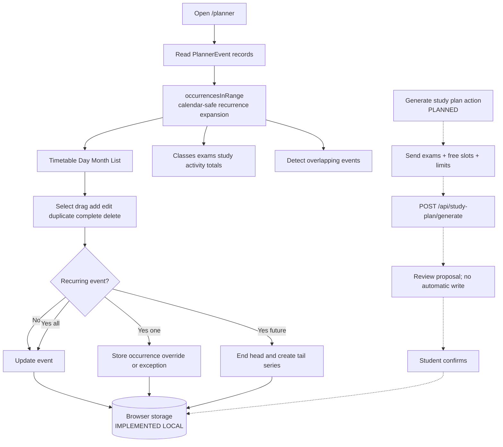
```mermaid
flowchart TD
  Open[Open /planner] --> Events[Read PlannerEvent records]
  Events --> Expand[occurrencesInRange\ncalendar-safe recurrence expansion]
  Expand --> Views[Timetable Day Month List]
  Expand --> Totals[Classes exams study activity totals]
  Expand --> Conflict[Detect overlapping events]
  Views --> Interact[Select drag add edit duplicate complete delete]
  Interact --> Scope{Recurring event?}
  Scope -->|No| Series[Update event]
  Scope -->|Yes one| Override[Store occurrence override or exception]
  Scope -->|Yes future| Split[End head and create tail series]
  Scope -->|Yes all| Series
  Series --> Store[(Browser storage\nIMPLEMENTED LOCAL)]
  Override --> Store
  Split --> Store
  Generate[Generate study plan action\nPLANNED] -.-> Context[Send exams + free slots + limits]
  Context -.-> Python[POST /api/study-plan/generate]
  Python -.-> Review[Review proposal; no automatic write]
  Review -.-> Confirm[Student confirms]
  Confirm -.-> Store
```

## 11. Materials journey

Local material records and the planned indexed-document pipeline.

Standalone: [`11-materials.mmd`](wireframes/11-materials.mmd)

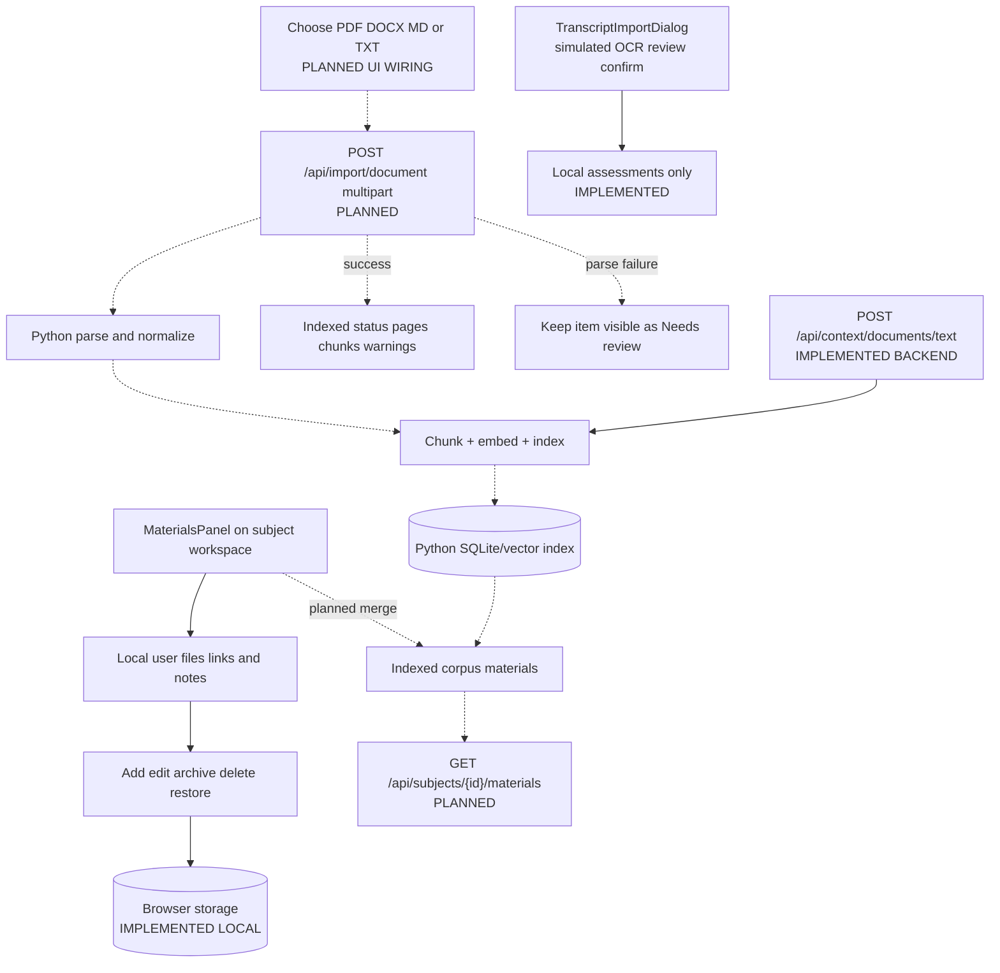
```mermaid
flowchart TD
  Panel[MaterialsPanel on subject workspace] --> LocalList[Local user files links and notes]
  LocalList --> CRUD[Add edit archive delete restore]
  CRUD --> Local[(Browser storage\nIMPLEMENTED LOCAL)]
  Panel -. planned merge .-> BackendList[Indexed corpus materials]
  BackendList -.-> GET["GET /api/subjects/{id}/materials\nPLANNED"]
  Upload[Choose PDF DOCX MD or TXT\nPLANNED UI WIRING] -.-> Import[POST /api/import/document multipart\nPLANNED]
  Import -.-> Parse[Python parse and normalize]
  Parse -.-> Chunk[Chunk + embed + index]
  Chunk -.-> Store[(Python SQLite/vector index)]
  Store -.-> BackendList
  Import -. success .-> Status[Indexed status pages chunks warnings]
  Import -. parse failure .-> Review[Keep item visible as Needs review]
  Text[POST /api/context/documents/text\nIMPLEMENTED BACKEND] --> Chunk
  Transcript[TranscriptImportDialog\nsimulated OCR review confirm] --> Assessments[Local assessments only\nIMPLEMENTED]
```

## 12. Quiz, exam, and grading journeys

The planned AI study tools and the frontend grading boundary.

Standalone: [`12-ai-study-tools.mmd`](wireframes/12-ai-study-tools.mmd)

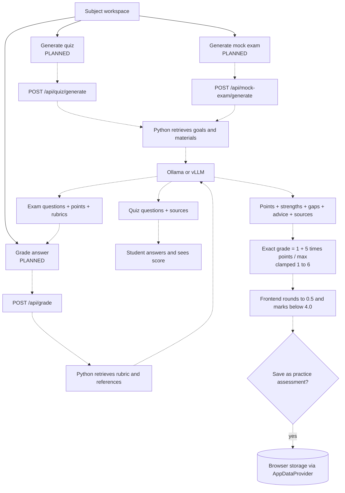
```mermaid
flowchart TD
  Subject[Subject workspace] --> Quiz[Generate quiz\nPLANNED]
  Subject --> Exam[Generate mock exam\nPLANNED]
  Subject --> Grade[Grade answer\nPLANNED]
  Quiz -.-> QAPI[POST /api/quiz/generate]
  Exam -.-> EAPI[POST /api/mock-exam/generate]
  Grade -.-> GAPI[POST /api/grade]
  QAPI -.-> Retrieve[Python retrieves goals and materials]
  EAPI -.-> Retrieve
  GAPI -.-> Rubric[Python retrieves rubric and references]
  Retrieve -.-> Model[Ollama or vLLM]
  Rubric -.-> Model
  Model -.-> QuizUI[Quiz questions + sources]
  Model -.-> ExamUI[Exam questions + points + rubrics]
  Model -.-> Result[Points + strengths + gaps + advice + sources]
  QuizUI -.-> Answers[Student answers and sees score]
  ExamUI -.-> Grade
  Result -.-> Formula[Exact grade = 1 + 5 times points / max\nclamped 1 to 6]
  Formula -.-> Display[Frontend rounds to 0.5 and marks below 4.0]
  Display -.-> Confirm{Save as practice assessment?}
  Confirm -. yes .-> Local[(Browser storage via AppDataProvider)]
```

## 13. Statistics journey

How local assessments become subject, yearly, and trend views.

Standalone: [`13-statistics.mmd`](wireframes/13-statistics.mmd)

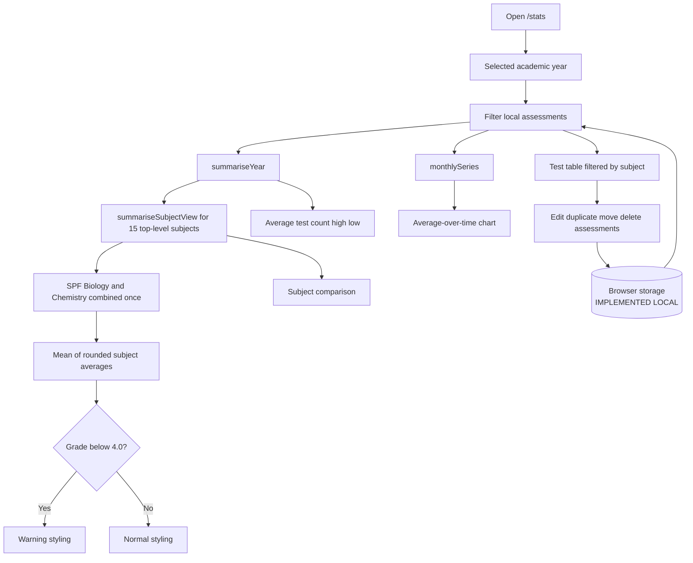
```mermaid
flowchart TD
  Open[Open /stats] --> Year[Selected academic year]
  Year --> Filter[Filter local assessments]
  Filter --> Summary[summariseYear]
  Filter --> Monthly[monthlySeries]
  Filter --> Rows[Test table filtered by subject]
  Summary --> Subjects[summariseSubjectView for 15 top-level subjects]
  Subjects --> SPF[SPF Biology and Chemistry combined once]
  SPF --> YearAverage[Mean of rounded subject averages]
  Summary --> KPI[Average test count high low]
  Monthly --> Trend[Average-over-time chart]
  Subjects --> Compare[Subject comparison]
  Rows --> CRUD[Edit duplicate move delete assessments]
  CRUD --> Store[(Browser storage\nIMPLEMENTED LOCAL)]
  Store --> Filter
  YearAverage --> Failing{Grade below 4.0?}
  Failing -->|Yes| Orange[Warning styling]
  Failing -->|No| Standard[Normal styling]
```

## 14. Supporting screens

Profile, settings, demo, help, feedback, diagnostics, notifications, and links.

Standalone: [`14-supporting-screens.mmd`](wireframes/14-supporting-screens.mmd)

```mermaid
flowchart TD
  Profile["/profile"] --> ProfileData[Account details from Supabase + academic year\nIMPLEMENTED]
  ProfileData --> Acct[(profiles + profile-avatars)]
  ProfileData --> Local[(Browser storage for grades and planner)]
  Settings["/settings"] --> Account[Account profile email password avatar\nIMPLEMENTED]
  Settings --> Toggles[Preference switches\nPERSISTED IN user_preferences]
  Settings --> Audio[assistant_audio_enabled default true\nassistant_audio_autoplay default false\nlocalised switches\nPERSISTED IN user_preferences]
  Settings --> Model[Local Qwen model selector\nPERSISTED IN user_preferences]
  Settings --> Storage[Storage usage filters and deletion\nIMPLEMENTED]
  NoteLang[Language selection lives in the header only,\nnot in Settings] -.-> Settings
  Assistant["/assistant"] --> AssistantData[General AI chat with attachments\nIMPLEMENTED; GENERATION PENDING]
  AssistantData --> Speech[Listen / Stop read-aloud\nlib/speech.ts, IMPLEMENTED LOCAL]
  AssistantData --> AssistantDB[(assistant_* tables + chat-attachments)]
  Demo[Demo Mode toggle] --> DemoData[Switch between user state and fresh demo state\nIMPLEMENTED LOCAL]
  Help["/help"] --> Guides[User guides section\nfive static A4 PDF downloads\nhelp-guides/alim-user-guide-{en,de,ru,es,fr}.pdf\nIMPLEMENTED]
  Feedback["/feedback"] --> Form[Category + message form\nIMPLEMENTED AND PERSISTED]
  Form --> FeedbackFn[Edge Function feedback-submit]
  FeedbackFn --> FeedbackDB[(public.feedback + private feedback-messages bucket)]
  Notifications[NotificationCenter] --> Derived[Derived from local exams and deadlines\nIMPLEMENTED LOCAL]
  SchoolLinks[SchoolLinksSection] --> LinkCRUD[Open add edit duplicate reorder delete\nIMPLEMENTED LOCAL]
  LinkCRUD --> Local
```

## 15. Offline and fallback behavior

What remains available when cloud, Python, or model services are unavailable.

Standalone: [`15-offline-fallback.mmd`](wireframes/15-offline-fallback.mmd)

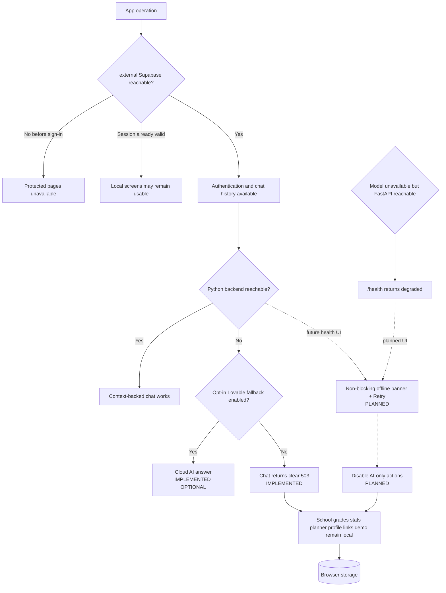
```mermaid
flowchart TD
  Start[App operation] --> Cloud{external Supabase reachable?}
  Cloud -->|No before sign-in| AuthBlocked[Protected pages unavailable]
  Cloud -->|Session already valid| LocalScreens[Local screens may remain usable]
  Cloud -->|Yes| Gate[Authentication and chat history available]
  Gate --> Python{Python backend reachable?}
  Python -->|Yes| AI[Context-backed chat works]
  Python -->|No| Fallback{Opt-in Lovable fallback enabled?}
  Fallback -->|Yes| Gateway[Cloud AI answer\nIMPLEMENTED OPTIONAL]
  Fallback -->|No| Error[Chat returns clear 503\nIMPLEMENTED]
  Python -. future health UI .-> Banner[Non-blocking offline banner + Retry\nPLANNED]
  Banner -.-> Disable[Disable AI-only actions\nPLANNED]
  Error --> Continue[School grades stats planner profile links demo remain local]
  Disable --> Continue
  Continue --> Store[(Browser storage)]
  ModelDown{Model unavailable but FastAPI reachable} --> Degraded["/health returns degraded"]
  Degraded -. planned UI .-> Banner
```

## Source-of-truth index

| Concern | Primary source |
| --- | --- |
| Route IDs and screen ownership | `frontend/src/routes/**`, `docs/ROUTE_SCREEN_MAP.md` |
| Root providers and app shell | `frontend/src/routes/__root.tsx`, `frontend/src/components/app/AppShell.tsx` |
| Navigation | `frontend/src/components/app/AppHeader.tsx`, `frontend/src/components/app/MobileNavigation.tsx` |
| Local state and recurrence | `frontend/src/lib/store/app-data.tsx`, `frontend/src/lib/date-utils.ts` |
| Subject model and SPF mapping | `frontend/src/lib/mock/subjects.ts`, `docs/SUBJECT_MODEL_AND_LANGUAGE_RULES.md` |
| Swiss grade calculations | `frontend/src/lib/grade-math.ts`, `frontend/src/lib/mock/grades.ts` |
| Chat UI and transport | `frontend/src/components/StudyChat.tsx` |
| Cloud thread/message operations | `frontend/src/lib/chat.functions.ts`, `frontend/src/routes/api/chat.ts` |
| Python bridge | `frontend/src/lib/context-backend.server.ts` |
| Python API and context pipeline | `backend/app/main.py`, `backend/app/context/**` |
| Current versus future ownership | `docs/STATE_AND_STORAGE.md`, `docs/UI_BACKEND_MAPPING.md` |

## Change checklist for coding agents

- Update a route by editing its file under `frontend/src/routes/`; never edit
  `frontend/src/routeTree.gen.ts`.
- Preserve the `_authenticated` layout gate for every protected screen.
- Keep non-AI screens usable when the Python backend is offline.
- Do not move local prototype data or cloud chat persistence without an explicit migration decision.
- Do not count SPF Biology and SPF Chemistry as two top-level subjects.
- Do not duplicate chat writes between the TanStack route and Python.
- Mark new diagram paths as implemented only after the corresponding UI and API path works end to end.

## 16. General assistant

Separate from tutoring chat: `assistant_threads` / `assistant_messages` /
`assistant_attachments`, attachments in the private `chat-attachments` bucket.
Replies are written by the local Python backend once that endpoint exists; the
frontend never fabricates them.

Standalone: [`16-assistant.mmd`](wireframes/16-assistant.mmd)

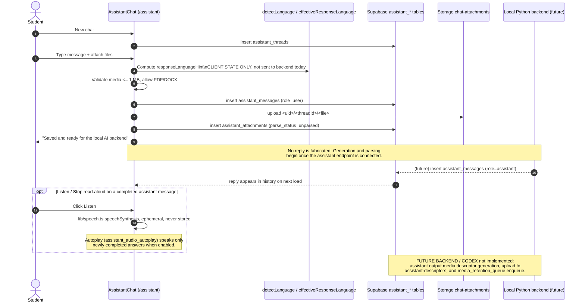
```mermaid
%% General-purpose AI assistant: separate data model from tutoring chat.
sequenceDiagram
    autonumber
    actor Student
    participant UI as AssistantChat (/assistant)
    participant I18n as detectLanguage / effectiveResponseLanguage
    participant DB as Supabase assistant_* tables
    participant ST as Storage chat-attachments
    participant PY as Local Python backend (future)

    Student->>UI: New chat
    UI->>DB: insert assistant_threads
    Student->>UI: Type message + attach files
    UI->>I18n: Compute responseLanguageHint\nCLIENT STATE ONLY, not sent to backend today
    UI->>UI: Validate media <= 1 MB, allow PDF/DOCX
    UI->>DB: insert assistant_messages (role=user)
    UI->>ST: upload <uid>/<threadId>/<file>
    UI->>DB: insert assistant_attachments (parse_status=unparsed)
    UI-->>Student: "Saved and ready for the local AI backend"
    Note over UI,PY: No reply is fabricated. Generation and parsing<br/>begin once the assistant endpoint is connected.
    PY-->>DB: (future) insert assistant_messages (role=assistant)
    DB-->>UI: reply appears in history on next load
    opt Listen / Stop read-aloud on a completed assistant message
      Student->>UI: Click Listen
      UI->>UI: lib/speech.ts speechSynthesis, ephemeral, never stored
      Note over UI: Autoplay (assistant_audio_autoplay) speaks only<br/>newly completed answers when enabled.
    end
    Note over PY,DB: FUTURE BACKEND / CODEX not implemented:<br/>assistant output media descriptor generation, upload to<br/>assistant-descriptors, and media_retention_queue enqueue.
```

## 17. Settings and storage management

Account/profile, local Qwen model choice, preferences and storage management
(usage RPC, warning at 10% remaining, automatic platform cleanup at 1%,
filtered multi-select deletion).

Standalone: [`17-settings-storage.mmd`](wireframes/17-settings-storage.mmd) and
[`ASSISTANT_SETTINGS_AND_STORAGE.md`](ASSISTANT_SETTINGS_AND_STORAGE.md).

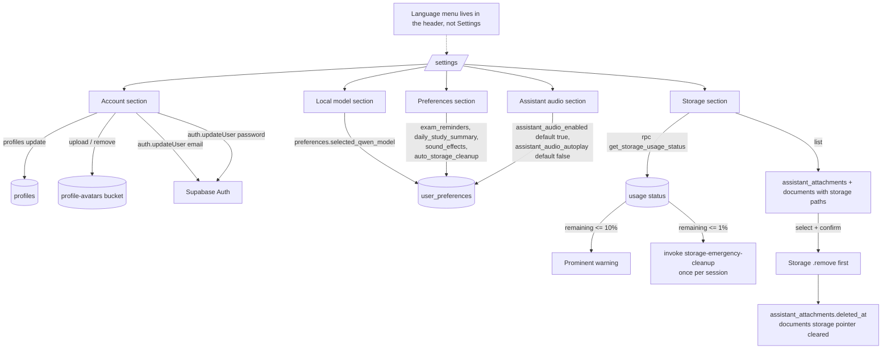
```mermaid
%% Settings and storage management against the live Supabase schema.
flowchart TD
    S[/settings/] --> A[Account section]
    S --> M[Local model section]
    S --> P[Preferences section]
    S --> AU2[Assistant audio section]
    S --> G[Storage section]

    A -->|profiles update| DBP[(profiles)]
    A -->|upload / remove| AV[(profile-avatars bucket)]
    A -->|auth.updateUser email| AU[Supabase Auth]
    A -->|auth.updateUser password| AU

    M -->|preferences.selected_qwen_model| DBU[(user_preferences)]
    P -->|exam_reminders, daily_study_summary,<br/>sound_effects,<br/>auto_storage_cleanup| DBU
    AU2 -->|assistant_audio_enabled default true,<br/>assistant_audio_autoplay default false| DBU

    NoteLang[Language menu lives in the header, not Settings] -.-> S

    G -->|rpc get_storage_usage_status| RPC[(usage status)]
    RPC -->|remaining <= 10%| W[Prominent warning]
    RPC -->|remaining <= 1%| EC[invoke storage-emergency-cleanup<br/>once per session]
    G -->|list| L[assistant_attachments + documents with storage paths]
    L -->|select + confirm| D1[Storage .remove first]
    D1 --> D2[assistant_attachments.deleted_at<br/>documents storage pointer cleared]
```

## 18. Internationalisation and language preference

How the UI language boots from a local cache, becomes authoritative from
`user_preferences`, and how per-message language hints and speech locales are
derived. The Python backend does not honour language metadata today.

Standalone: [`18-i18n-language.mmd`](wireframes/18-i18n-language.mmd)

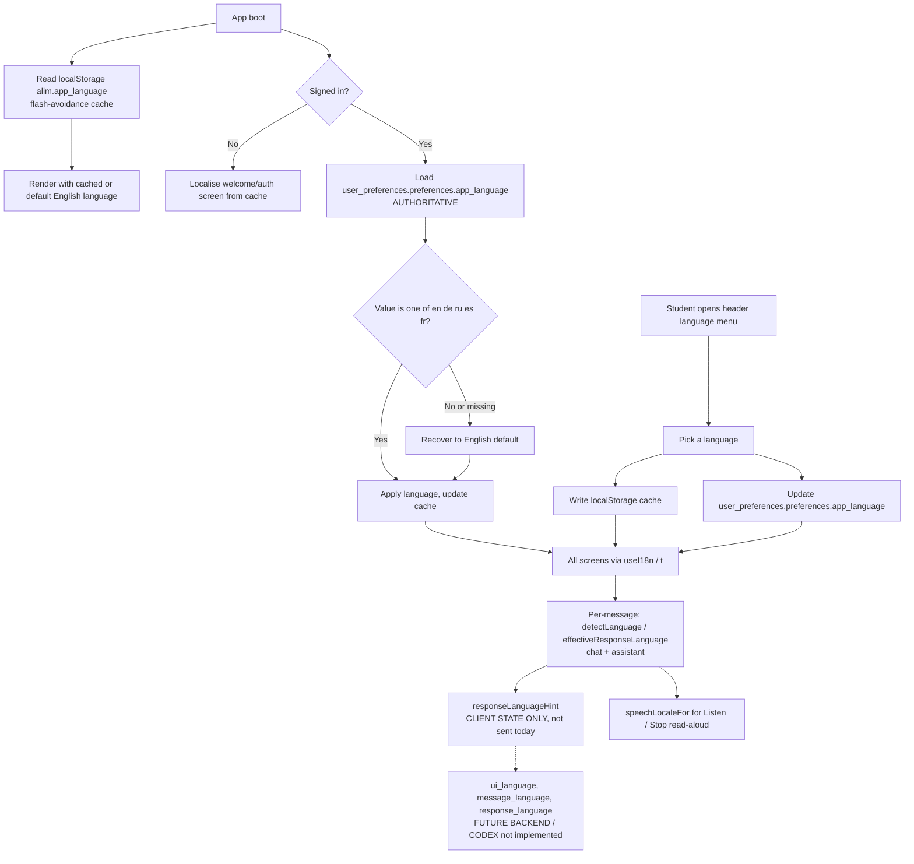
```mermaid
flowchart TD
  Boot[App boot] --> Cache[Read localStorage alim.app_language\nflash-avoidance cache]
  Cache --> Render[Render with cached or default English language]
  Boot --> AuthCheck{Signed in?}
  AuthCheck -->|No| WelcomeLocal[Localise welcome/auth screen from cache]
  AuthCheck -->|Yes| Load[Load user_preferences.preferences.app_language\nAUTHORITATIVE]
  Load --> Valid{Value is one of en de ru es fr?}
  Valid -->|Yes| Apply[Apply language, update cache]
  Valid -->|No or missing| English[Recover to English default]
  English --> Apply
  Apply --> UI[All screens via useI18n / t]
  Change[Student opens header language menu] --> Pick[Pick a language]
  Pick --> WriteCache[Write localStorage cache]
  Pick --> WriteDB[Update user_preferences.preferences.app_language]
  WriteCache --> UI
  WriteDB --> UI
  UI --> Detect[Per-message: detectLanguage / effectiveResponseLanguage\nchat + assistant]
  Detect --> Hint[responseLanguageHint\nCLIENT STATE ONLY, not sent today]
  Detect --> SpeechLocale[speechLocaleFor for Listen / Stop read-aloud]
  Hint -.-> FutureContract[ui_language, message_language, response_language\nFUTURE BACKEND / CODEX not implemented]
```

## 19. Read-aloud (Listen / Stop)

Browser-only speech synthesis for completed assistant answers in chat and the
assistant, gated by `assistant_audio_enabled` and `assistant_audio_autoplay`.
Nothing is uploaded or stored.

Standalone: [`19-read-aloud.mmd`](wireframes/19-read-aloud.mmd)

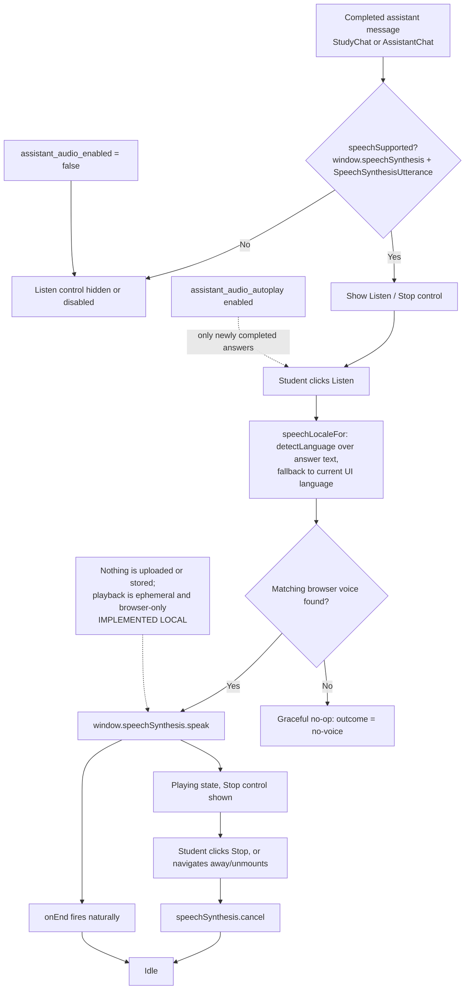
```mermaid
flowchart TD
  Message[Completed assistant message\nStudyChat or AssistantChat] --> Support{speechSupported?\nwindow.speechSynthesis + SpeechSynthesisUtterance}
  Support -->|No| Hidden[Listen control hidden or disabled]
  Support -->|Yes| Button[Show Listen / Stop control]
  Button --> Click[Student clicks Listen]
  Click --> Locale[speechLocaleFor: detectLanguage over answer text,\nfallback to current UI language]
  Locale --> VoiceMatch{Matching browser voice found?}
  VoiceMatch -->|Yes| Speak[window.speechSynthesis.speak]
  VoiceMatch -->|No| Degrade[Graceful no-op: outcome = no-voice]
  Speak --> Playing[Playing state, Stop control shown]
  Playing --> StopClick[Student clicks Stop, or navigates away/unmounts]
  StopClick --> Cancel[speechSynthesis.cancel]
  Cancel --> Idle[Idle]
  Speak --> End[onEnd fires naturally]
  End --> Idle
  Autoplay[assistant_audio_autoplay enabled] -. only newly completed answers .-> Click
  AudioOff[assistant_audio_enabled = false] --> Hidden
  Note1[Nothing is uploaded or stored;\nplayback is ephemeral and browser-only\nIMPLEMENTED LOCAL] -.-> Speak
```

## 20. Assistant media retention policy

Future backend policy for assistant-generated or assistant-fetched OUTPUT
media only: a text descriptor is kept, the original binary is deleted after a
30-minute window, and ordinary user study uploads are unaffected.

Standalone: [`20-media-retention.mmd`](wireframes/20-media-retention.mmd)

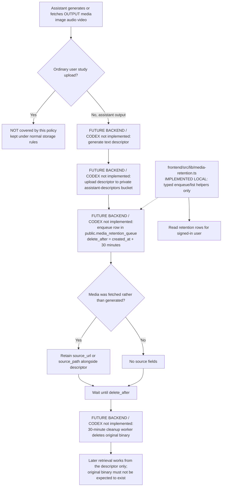
```mermaid
flowchart TD
  Gen[Assistant generates or fetches OUTPUT media\nimage audio video] --> Scope{Ordinary user study upload?}
  Scope -->|Yes| OutOfPolicy[NOT covered by this policy\nkept under normal storage rules]
  Scope -->|No, assistant output| Descriptor[FUTURE BACKEND / CODEX not implemented:\ngenerate text descriptor]
  Descriptor --> Upload[FUTURE BACKEND / CODEX not implemented:\nupload descriptor to private assistant-descriptors bucket]
  Upload --> Enqueue[FUTURE BACKEND / CODEX not implemented:\nenqueue row in public.media_retention_queue\ndelete_after = created_at + 30 minutes]
  Enqueue --> Source{Media was fetched rather than generated?}
  Source -->|Yes| Keep[Retain source_url or source_path alongside descriptor]
  Source -->|No| Skip[No source fields]
  Keep --> Wait[Wait until delete_after]
  Skip --> Wait
  Wait --> Cleanup[FUTURE BACKEND / CODEX not implemented:\n30-minute cleanup worker deletes original binary]
  Cleanup --> Retrieve[Later retrieval works from the descriptor only;\noriginal binary must not be expected to exist]
  ClientLib[frontend/src/lib/media-retention.ts\nIMPLEMENTED LOCAL: typed enqueue/list helpers only] -.-> Enqueue
  ClientLib --> ListUI[Read retention rows for signed-in user]
```
