# User Flows

Sequence diagrams for the current chat path and the target paths for unfinished subject tools.
Unless a section says implemented, it is a target flow. Participants:
**Student**, **UI** (Lovable frontend), **SF** (TanStack route or planned API client),
**PY** (local Python FastAPI), **SB** (canonical Supabase), **STATE** (Supabase-backed `AppDataProvider` plus UUID cache),
**RAG** (user-scoped Supabase chunks / local hybrid retrieval), **FILES** (private Storage objects), **LLM** (local OpenAI-compatible server).

## 1. Local app startup (target; health banner not yet implemented)

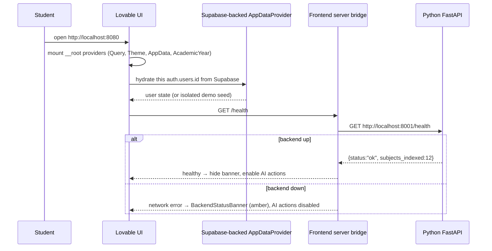

## 2. Sign-in / authenticated app load

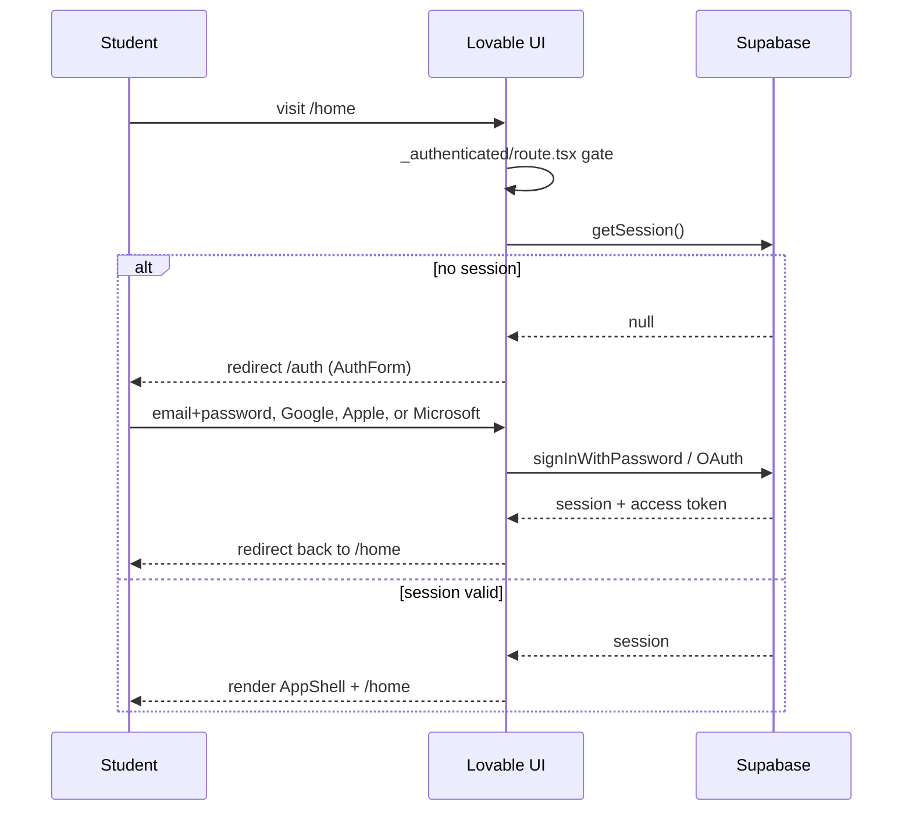

## 3. Dashboard load (`/school`)

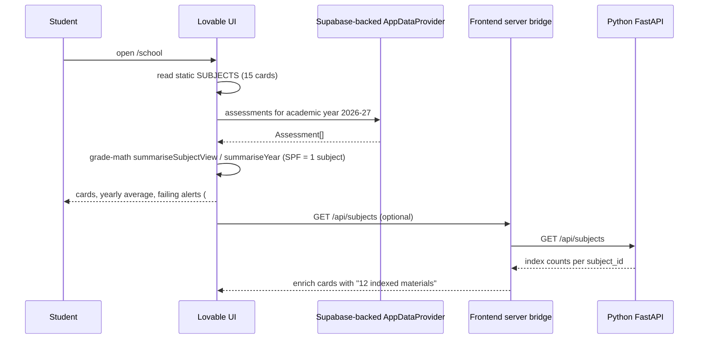

## 4. Subject selection

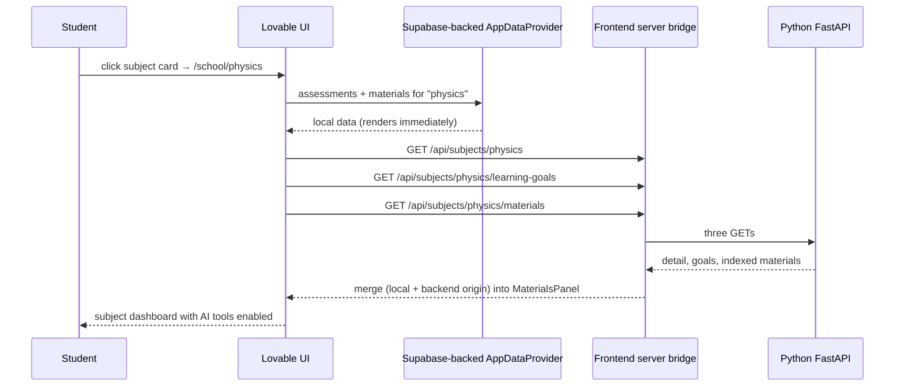

## 5. SPF Biology & Chemistry component switching

```mermaid
sequenceDiagram
    participant Student
    participant UI as Lovable UI
    participant LS as Supabase-backed AppDataProvider
    participant SF as Frontend server bridge
    participant PY as Python FastAPI
    Student->>UI: open /school/spf
    UI->>LS: assessments for spf-biology + spf-chemistry
    UI->>UI: combined = (avg(bio) + avg(chem)) / 2 → header (2 decimals)
    UI-->>Student: combined header + both component averages + segmented switch
    Student->>UI: switch to "Chemistry"
    UI->>UI: component_subject_id = "spf-chemistry" (no route change)
    UI->>SF: GET /api/subjects/spf/learning-goals?component_subject_id=spf-chemistry
    SF->>PY: scoped request
    PY-->>SF: chemistry goals + materials only
    SF-->>UI: chemistry workspace; combined header average unchanged
```

## 6. Asking a chat question (implemented)

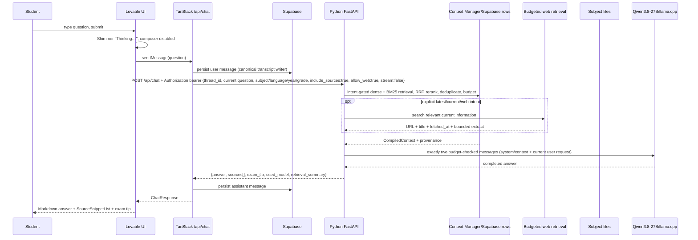

## 7. Generating a quiz

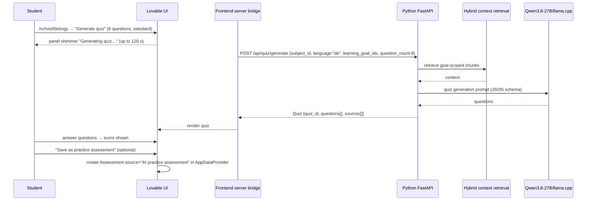

## 8. Generating a mock exam

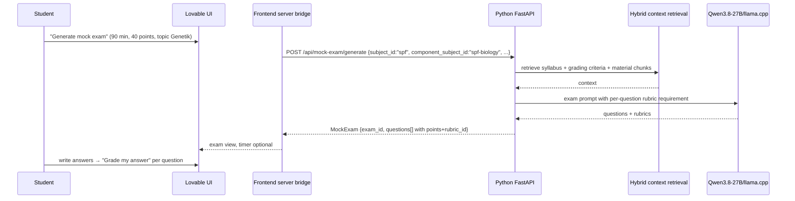

## 9. Grading a student answer

```mermaid
sequenceDiagram
    participant Student
    participant UI as Lovable UI
    participant SF as Frontend server bridge
    participant PY as Python FastAPI
    participant RAG as Hybrid context retrieval
    participant LLM as Qwen3.8-27B/llama.cpp
    participant LS as Supabase-backed AppDataProvider
    Student->>UI: submit answer for exam question (max 8 points)
    UI-->>Student: "Marking…" spinner
    SF->>PY: POST /api/grade {question, student_answer, max_points:8, rubric_id, subject_id, language}
    PY->>RAG: retrieve rubric + reference material
    RAG-->>PY: context
    PY->>LLM: rubric-based evaluation prompt
    LLM-->>PY: points + qualitative feedback
    PY->>PY: swiss_grade = points/max*5+1 (clamped 1..6)
    PY-->>SF: GradingResult {points_awarded:6, swiss_grade:4.75, strengths, missing_points, advice, sources}
    SF-->>UI: render result
    UI->>UI: roundToHalf() for rounded display; orange #C96A00 if < 4.0
    Student->>UI: "Save to my grades" (optional)
    UI->>LS: Assessment source="AI practice assessment", includeInStats toggle
```

## 10. Generating a study plan

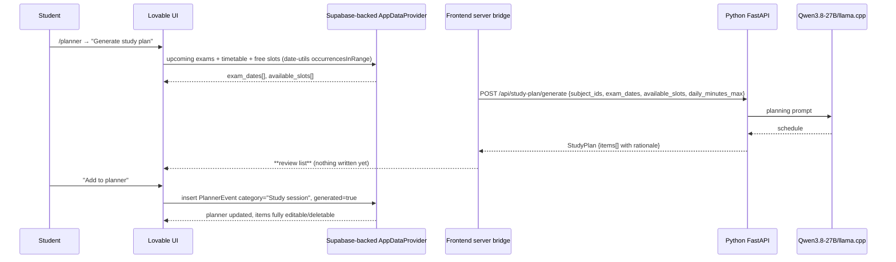

## 11. Importing material

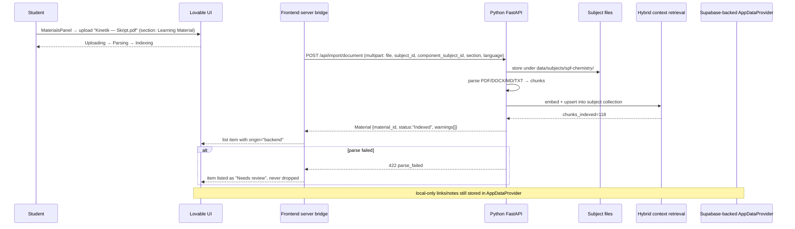

## 12. Saving feedback

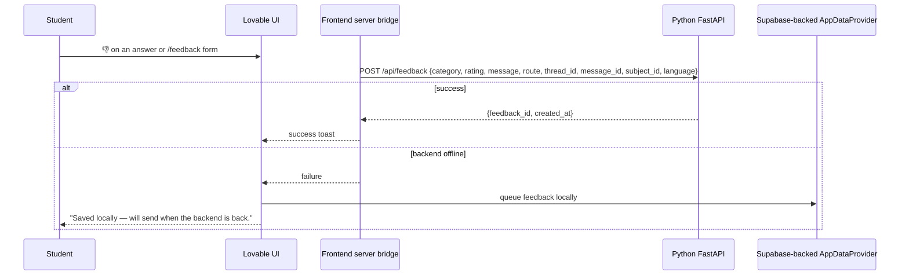

## 13. Loading a previous chat thread

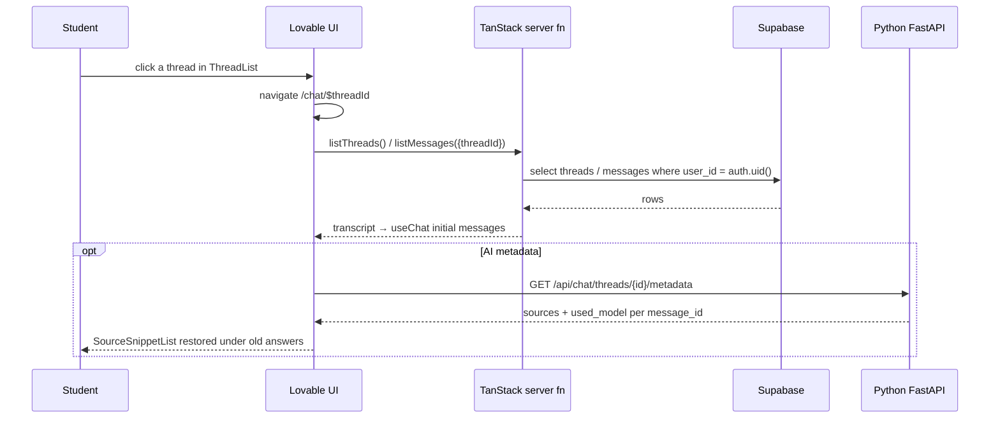

## 14. Backend unavailable / mock mode

```mermaid
sequenceDiagram
    participant Student
    participant UI as Lovable UI
    participant SF as Frontend server bridge
    participant PY as Python FastAPI
    participant LS as Supabase-backed AppDataProvider
    UI->>SF: GET /health (startup + every 60 s)
    SF->>PY: GET /health
    PY--xSF: ECONNREFUSED / timeout
    SF-->>UI: offline
    UI-->>Student: BackendStatusBanner "Study AI backend offline — grades, planner and materials still work." [Retry]
    Note over UI: AI buttons disabled with tooltips; /school /stats /planner /profile fully usable from LS
    Student->>UI: ask a question
    UI-->>Student: explicit service-unavailable error; no provider fallback
    Student->>UI: Retry
    UI->>SF: GET /health → ok → banner clears, AI re-enabled
```
