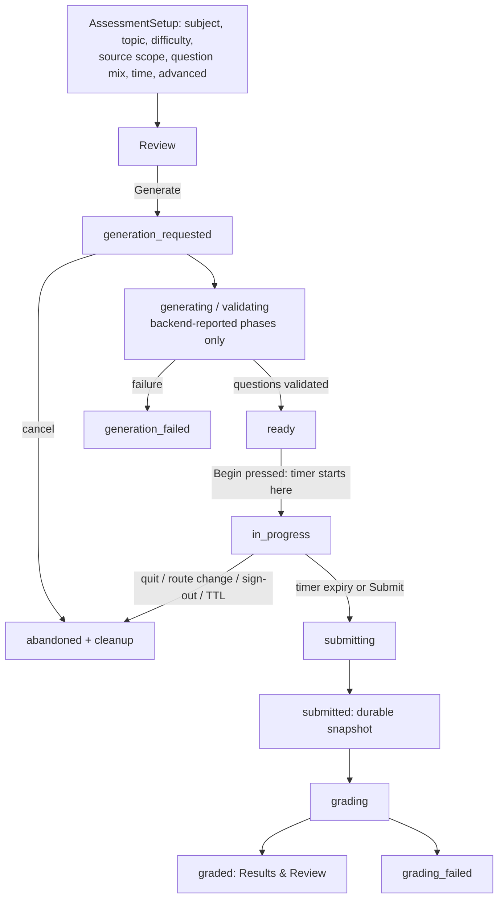
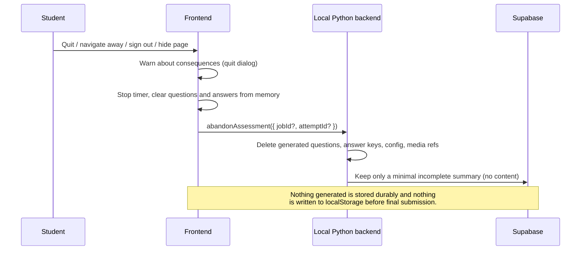
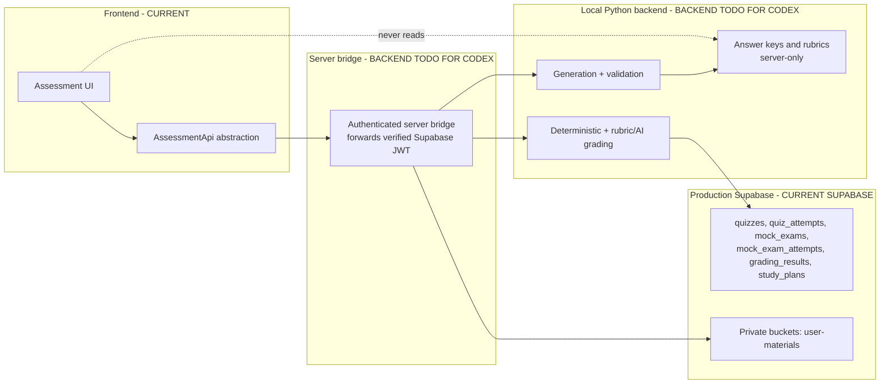

# Assessment System Architecture

Tags: **CURRENT FRONTEND**, **CURRENT SUPABASE**, **EXPECTED LOCAL BACKEND CONTRACT**,
**BACKEND TODO FOR CODEX**

Covers Quick Check, Practice, Quiz Mode, Mock Exam Mode, Results & Review and the
Knowledge Profile inside the existing subject workspace
(`/school/$subject`). The chat system, branding and unrelated areas are unchanged.

## 1. Scope and ownership

| Concern | Owner | State |
| --- | --- | --- |
| Setup wizard, runner, review, results UI | Frontend (`src/components/app/assessment/*`) | **CURRENT FRONTEND** |
| Typed question/answer/result contracts, Zod validation | Frontend (`src/lib/assessment/types.ts`) | **CURRENT FRONTEND** |
| Lifecycle state machine | Frontend (`src/lib/assessment/lifecycle.ts`) | **CURRENT FRONTEND** |
| Assessment API abstraction | Frontend (`src/lib/assessment/api.ts`) | **CURRENT FRONTEND** |
| Question generation, grading, mastery computation | Local Python backend | **BACKEND TODO FOR CODEX** |
| Durable completed attempts, answer keys, mastery rows | Production Supabase | **BACKEND TODO FOR CODEX** |

The production adapter (`unavailableAssessmentApi`) always returns
`backend_unavailable`. A clearly labelled development-only preview adapter
(`preview-adapter.ts`, installed via `installPreviewAdapterInDevelopment()`)
exists so the flows can be reviewed; it never runs in a production build and
never claims to be AI output.

## 2. Modes

| Mode | Kind | Tone | Timer default |
| --- | --- | --- | --- |
| Quick Check | `quick_check` | Light, immediate | Untimed |
| Practice | `practice` | Friendly, supportive | Untimed |
| Quiz | `quiz` | Focused | Optional preset |
| Mock Exam | `mock_exam` | Quiet, serious, distraction-suppressed | Required |

Difficulty is `easy | medium | advanced | very_advanced`
(Easy / Medium / Advanced / Very advanced). Source scope is
`materials | web | both` (My syllabus & materials / Verified web sources / Both)
and always reads from the existing Materials data — never a second library.

## 3. Setup → generation → attempt → submission → grading → result

## 4. Pre-submission abandonment and cleanup

Heartbeats (`heartbeat(attemptId)`) let the backend expire stale attempts by TTL
when the browser disappears without a clean abandon call.

## 5. Frontend / Supabase / future backend boundary

## 6. Answer-key security boundary

`PublicQuestion` (Zod, strict) is the only shape the runner ever receives. It has
no correct option ids, no canonical values, no tolerances, no model answers and
no rubrics; a payload containing any of those fields fails validation outright
(regression-tested). `AnswerKey` and `GradingRubric` are server-only types and
appear in the frontend exclusively inside a **graded** result, alongside the
model answer, explanation and distractor explanations.

## 7. Scientific rendering and input

One centralized `ScientificContentRenderer` renders the approved rich-content
union only: prose, inline/display maths (LaTeX canonical, KaTeX rendered),
chemistry (`mhchem` `\ce`/`\pu`), tables, images, diagrams, code, quotations and
poetry. Arbitrary AI HTML is never injected — there is no
`dangerouslySetInnerHTML` of model output. `MathAnswerInput` provides a math
field with keyboard entry and stores both the canonical LaTeX and a display form.
Language and humanities answers stay fully Unicode-safe: no diacritic
normalisation, BCE/CE preserved.

## 8. Durability rules

- Ephemeral (never durable): `setup`, `generation_requested`, `generating`, `ready`, `in_progress`.
- Durable: `submitted`, `grading`, `graded`, `grading_failed`, plus a minimal
  incomplete summary for abandoned/expired attempts.
- AI practice attempts default to `includeInStats = false` and never mix into
  teacher grade averages.
- Mastery is never derived from a single question; entries carry an observation
  count and confidence, and stay separate from official grades.

## 9. Accessibility and i18n

Keyboard-only operation, semantic fieldsets and labels, screen-reader question
numbering, status announcements for generation/grading, accessible non-drag
matching, click-to-enlarge images with alt plus long descriptions, timer
announcements and reduced-motion support. Every string comes from the existing
i18n system in all seven languages (en, de, gsw, ru, es, fr, it); gsw stays
ß-free.

## 10. Telemetry

Events only: `assessment_setup_opened`, `assessment_generation_requested`,
`assessment_generation_cancelled`, `assessment_ready`, `assessment_started`,
`assessment_answered`, `assessment_skipped`, `assessment_marked`,
`assessment_submitted`, `assessment_abandoned`, `assessment_grading_completed`,
`assessment_grading_failed`, `assessment_results_opened`. Never question text,
student answers, essay content, tokens, passwords or private material.

## CORRECTIONS AND ADDITIONS (verified 2026-09-16)

### Live Supabase assessment tables exist

The authoritative production project already contains `quizzes`,
`quiz_attempts`, `mock_exams`, `mock_exam_attempts`, `grading_results`,
`assessments` and `study_plans`, all with RLS and user ownership. Earlier
documentation claimed otherwise. The frontend contracts are therefore designed
to REUSE and EXTEND those tables; no parallel assessment tables are introduced,
and any future migration must be additive.

### Ephemeral content cleanup now also covers sign-out

`frontend/src/lib/assessment/api.ts` keeps the single pre-submission reference of
the tab in memory (never localStorage) via `setActiveAssessmentReference()`.
Cleanup is requested on:

- route leave (component unmount),
- `pagehide`,
- explicit Quit assessment,
- generation cancel,
- sign-out (`lib/sign-out.ts` calls `abandonActiveAssessment()` while the bearer
  token is still valid).

Browser lifecycle events remain best-effort; the backend heartbeat/TTL sweeper is
authoritative (FUTURE BACKEND / CODEX).

### Per-user quota interaction

Every durable assessment row a future backend writes on the user's behalf is
subject to the live per-user combined 50 MB quota guard. See
`docs/contracts/USER_QUOTA_CONTRACT.md`.

### AI readiness is not an authentication gate

The assessment modes report "AI backend unavailable" instead of blocking access.
Signing in, `/home` and every non-AI area work without the local backend; see
`docs/sequences/AUTH_STARTUP_HOME_VS_OPTIONAL_AI.mmd`.
