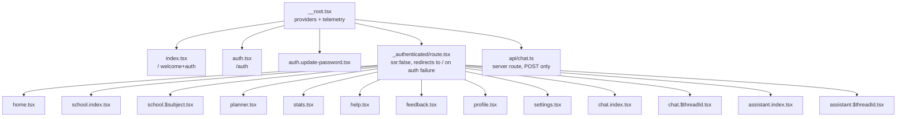

Document status: CURRENT
Generated from: current Lovable project · GitHub main (keyshavmor/study-swiss-star) · live Supabase project ucacmeadsufiedxrgqit
Last verified: 2026-09-14 (UTC)
Frontend commit: e0ef3464557d4786d214accb0d1bf44082ae3466

> Supersedes: `docs/archive/FRONTEND_ARCHITECTURE.md` (top-level). The old file is archived centrally; this document is the current source of truth.

# Frontend architecture

## Stack (CURRENT — FRONTEND)

Source: `frontend/package.json`.

- TanStack Start v1 (`@tanstack/react-start` ^1.168.32) on React 19.2, Vite 8, `nitro` server target.
- Routing: `@tanstack/react-router` ^1.170.18, file-based routes under `frontend/src/routes`, generated `frontend/src/routeTree.gen.ts`.
- Data/query layer: `@tanstack/react-query` ^5.101.1.
- Styling: Tailwind CSS v4 (`@tailwindcss/vite`), shadcn-derived primitives in `frontend/src/components/ui/*`.
- AI/chat SDK: `ai` ^7.0.42 + `@ai-sdk/react` ^4.0.45 (`useChat`, `DefaultChatTransport`, UI message streaming).
- Backend-as-a-service: `@supabase/supabase-js` ^2.111.0.
- Forms: `react-hook-form` + `@hookform/resolvers` + `zod`.
- Markdown/streaming render: `react-markdown`, `streamdown` family (mermaid/code/math/cjk plugins), used by chat message rendering.
- Build scripts (`frontend/package.json`):
  - `dev` → `vite dev`
  - `build` → `vite build`
  - `build:dev` → `vite build --mode development`
  - `preview` → `vite preview`
  - `typecheck` → `tsc --noEmit`
  - `lint` → `eslint .`
  - `format` → `prettier --write .`
  - `check:i18n` → `bun run ./scripts/check-translations.ts` — enforces that every non-English language dictionary in `frontend/src/lib/i18n/messages/*` has exactly the English (`en`) key set, no missing/extra/empty values, and that `gsw` never contains `ß`. Currently 822 keys per language, all languages complete (verified by running the script this pass).

## Routing model (CURRENT — FRONTEND)

Source: `frontend/src/routes/**`, `frontend/src/router.tsx`.

- `index.tsx` — `/`, the public welcome + `AuthForm` screen.
- `auth.tsx` — `/auth`, an alias of the same auth surface.
- `auth.update-password.tsx` — post password-reset-link landing page (`supabase.auth.updateUser`).
- `_authenticated/route.tsx` — the auth gate for every signed-in screen:
  ```ts
  export const Route = createFileRoute("/_authenticated")({
    ssr: false,
    beforeLoad: async () => {
      const { data, error } = await supabase.auth.getUser();
      if (error || !data.user) throw redirect({ to: "/" });
      return { user: data.user };
    },
    component: () => <Outlet />,
  });
  ```
  `ssr: false` means this whole subtree renders client-side only; the gate check runs in the browser using the Supabase JS client's local session, not on the server. Every screen below is reached only after a live `supabase.auth.getUser()` succeeds; failure redirects to `/`.
- `_authenticated/{home,school.index,school.$subject,planner,stats,help,feedback,profile,settings,chat.index,chat.$threadId,assistant.index,assistant.$threadId}.tsx` — one file per authenticated screen (dot-segments are TanStack Router's flat-file nested-path convention, e.g. `school.$subject` → `/school/:subject`).
- `api/chat.ts` — a **server route**, not a page: `createFileRoute("/api/chat")` with a `server.handlers.POST` function. This is the only backend boundary defined in the frontend routing tree (see "The `/api/chat` boundary" below).
- `__root.tsx` — the document shell: HTML head, global providers, global telemetry installation, and the `supabase.auth.onAuthStateChange` listener that invalidates the router/query cache on sign-in/sign-out/user-update.

### Route tree diagram

See `docs/frontend/COMPONENT_TREE.mmd` for the full component-per-route graph. Route-level structure only:



## Provider chain (CURRENT — FRONTEND)

Source: `frontend/src/routes/__root.tsx`, function `RootComponent`.

Nesting order, outermost first:

```
QueryClientProvider (TanStack Query, client from route context)
  I18nProvider            (frontend/src/lib/i18n/provider.tsx)
    ThemeProvider         (frontend/src/hooks/use-theme.tsx)
      AppDataProvider     (frontend/src/lib/store/app-data.tsx)
        AcademicYearProvider (frontend/src/lib/store/academic-year.tsx)
          <Outlet />
          <Toaster />     (sonner)
```

`RootComponent` also, outside the provider tree's render but as siblings-in-effect:
- calls `installGlobalErrorTelemetry()` once on mount (see Error handling below);
- tracks `page_viewed` on every pathname change via `track()` (`frontend/src/lib/telemetry.ts`);
- subscribes to `supabase.auth.onAuthStateChange`: on `SIGNED_IN`/`SIGNED_OUT`/`USER_UPDATED` it calls `router.invalidate()`, and on anything except `SIGNED_OUT` it also calls `queryClient.invalidateQueries()`.

Each provider's ownership is detailed per-datum in `docs/frontend/STATE_OWNERSHIP.md`.

## Service layer (`frontend/src/lib/*`) (CURRENT — FRONTEND)

Grouped by responsibility; each module runs under the signed-in user's Supabase session (RLS-scoped) unless noted.

- **Account & preferences** — `lib/account-data.ts`: `fetchAccountProfile`/`updateAccountProfile` (`public.profiles`), avatar upload/remove (`profile-avatars` bucket), `fetchPreferences`/`savePreferences` (`public.user_preferences.preferences` jsonb), `QWEN_MODELS`, `DEFAULT_PREFERENCES`.
- **General assistant** — `lib/assistant-data.ts`: CRUD over `assistant_threads`/`assistant_messages`/`assistant_attachments`, attachment validation, `chat-attachments` bucket usage. Deliberately separate from tutoring chat.
- **Tutoring chat** — `lib/chat.functions.ts`: TanStack server functions (`listThreads`, `listMessages`, `createThread`, `deleteThread`) over `public.threads`/`public.messages`.
- **Local backend bridge** — `lib/context-backend.server.ts` (server-only) + `lib/context-backend.types.ts`: `requestContextAnswer` calling the local Python context backend; see "`/api/chat` boundary" below.
- **Google Calendar** — `lib/google-calendar.ts`: `linkIdentity` OAuth, session-storage-only provider token, read-only Calendar API fetch, mapping to read-only planner `Occurrence`s.
- **Storage & retention** — `lib/storage-management.ts` (usage RPC, item listing/deletion, `storage-emergency-cleanup` function), `lib/media-retention.ts` (enqueues `media_retention_queue` rows for assistant-output media; the 30-minute cleanup worker itself is backend-owned and NOT implemented in the frontend).
- **Telemetry** — `lib/telemetry.ts`: `track`/`trackFailure`/`logActivity` → Edge Function `activity-log`; strict payload sanitisation (no passwords/tokens/content); `installGlobalErrorTelemetry` wires `window.onerror`/`unhandledrejection`.
- **i18n** — `lib/i18n/{languages,detect,format,provider,index,messages/*}` — see `docs/frontend/I18N_AND_LANGUAGE.md`.
- **Domain stores** — `lib/store/{app-data,academic-year,types,demo-data}` — see `docs/frontend/STATE_OWNERSHIP.md`.
- **Mock/prototype data** — `lib/mock/{subjects,grades,materials,academic}` — School subject catalogue, grade math test fixtures, static academic-year calendar; not backend-fed.
- **Grade math** — `lib/grade-math.ts`: pure functions for point→grade conversion and subject averages.
- **Date/time utilities** — `lib/date-utils.ts` (calendar math for the planner) and `lib/i18n/format.ts` (presentation) — see `docs/frontend/DATE_TIME_PRESENTATION.md`.
- **Sign-out** — `lib/sign-out.ts`: `signOutCompletely()` logs `auth_signout`, calls `supabase.auth.signOut()`, always clears the Google provider token from `sessionStorage`.
- **Speech** — `lib/speech.ts`: browser `speechSynthesis` wrapper used by `StudyChat` and `AssistantChat` (ephemeral, never persisted).

## Error boundaries and reporting (CURRENT — FRONTEND)

Three cooperating layers, all frontend-only:

1. **`lib/ui-error.ts`** — the `UiError` marker class. Only messages wrapped in `UiError` are safe to show verbatim in the UI (they are already localized, user-authored strings). Any other thrown error is assumed to be an English/raw provider message: it must be logged (`console.error`) and replaced with a localized generic message before being shown (pattern used throughout `AuthForm.tsx`, `feedback.tsx`, etc. via `localizedMessage()`).
2. **`lib/error-capture.ts`** — a server/runtime-side capture used by `frontend/src/server.ts`. It monkey-patches `console.error` to expand `Error`-like arguments (message, stack, `cause` chain up to depth 5, HTTP status if present) so h3's generic 500 responses don't swallow the original failure detail, and keeps the last captured error in memory for 5 seconds (`consumeLastCapturedError`) so the server can attach a real stack trace to an otherwise-opaque 500.
3. **`lib/lovable-error-reporting.ts`** — `reportLovableError(error, context)`, a client-only bridge to the Lovable editor's runtime telemetry (`window.__lovableEvents.captureException`, `window.__lovableReportRuntimeError`). It is a no-op outside the editor preview (`window` undefined, or the hooks absent). Called from:
   - `__root.tsx`'s `ErrorComponent` (`createRootRouteWithContext`'s `errorComponent`), tagged `{ boundary: "tanstack_root_error_component" }`, on every uncaught render error surfaced to the TanStack Router error boundary.

These three layers are independent: `UiError`/`ui-error.ts` governs what end users see; `error-capture.ts` governs what the local dev/server console and h3 error responses carry; `lovable-error-reporting.ts` governs what the Lovable editor's own telemetry sees. None of them replace `lib/telemetry.ts`, which is the Supabase-bound product analytics/error-classification pipe (`trackFailure`).

`__root.tsx` also defines `NotFoundComponent` (404, localized via `useI18n`) and `ErrorComponent` (generic localized error screen with retry/go-home actions), both registered on the root route (`notFoundComponent`, `errorComponent`).

## The `/api/chat` server route boundary (CURRENT — FRONTEND / EXPECTED BACKEND CONTRACT)

Source: `frontend/src/routes/api/chat.ts`, `frontend/src/lib/context-backend.server.ts`, `frontend/src/lib/context-backend.types.ts`.

This is the single seam between the frontend and the local Python context backend for tutoring chat. Full request/response contract is documented in `docs/archive/SUPABASE_SERVICES.md`/backend contract docs; the architecture-relevant facts are:

- It is a TanStack Start **server route** (`server.handlers.POST`), so it runs on the Node/nitro server process that serves the frontend, not in the browser and not inside `_authenticated`'s client-side gate.
- Auth is re-verified independently of the router gate: it requires `Authorization: Bearer <supabase access token>` and calls `supabase.auth.getClaims(token)` itself; 401 otherwise. It does not trust the browser-side session state.
- It owns writing both the user message and (in `onFinish`) the assistant message into `public.messages`, keyed to a `threads` row it has independently verified belongs to the caller (`threads.id + user_id`).
- On backend failure it maps `ContextBackendError` to the error's own `status` (default 503) and forwards its message as the raw HTTP body — the frontend chat UI (`StudyChat.tsx`) never sees backend internals, only a generic localized failure toast (`chat.sendFailed`).
- It streams responses using the AI SDK's `createUIMessageStream`, emitting `text-start`/`text-delta`/`text-end` plus one custom data part `data-context-metadata` carrying `{ sources, examTip, usedModel, retrievalSummary }` — this is how `StudyChat.tsx` renders exam tips and source snippets without a second round trip.
- `requestContextAnswer` (in `context-backend.server.ts`) is the only code path that talks to the local Python backend (`ALIM_CONTEXT_BACKEND_URL`, default `http://127.0.0.1:8001`); no other frontend module calls it directly.

Status: the route itself is CURRENT — FRONTEND (fully implemented and shipped). The local Python backend's actual behaviour behind it is BACKEND IMPLEMENTATION UNKNOWN beyond the documented contract.
