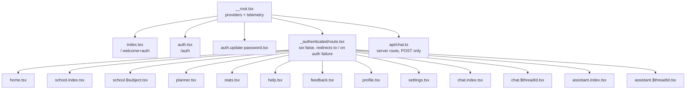

Document status: CURRENT
Generated from: current Lovable-managed project state · live Supabase project ucacmeadsufiedxrgqit (these Lovable-only edits are NOT claimed to be on any GitHub branch)
Production Supabase verified: 2026-09-15 (UTC)
Frontend commit: e0ef3464557d4786d214accb0d1bf44082ae3466

> Supersedes: `docs/archive/FRONTEND_ARCHITECTURE.md` (top-level). The old file is archived centrally; this document is the current source of truth.

# Frontend architecture

## Stack (CURRENT — FRONTEND)

Source: `frontend/package.json`.

- TanStack Start v1 (`@tanstack/react-start` ^1.168.32) on React 19.2, Vite 8, `nitro` server target.
- Routing: `@tanstack/react-router` ^1.170.18, file-based routes under `frontend/src/routes`, generated `frontend/src/routeTree.gen.ts`.
- Data/query layer: `@tanstack/react-query` ^5.101.1.
- Styling: Tailwind CSS v4 (`@tailwindcss/vite`), shadcn-derived primitives in `frontend/src/components/ui/*`.
- AI/chat SDK: `ai` ^7.0.42 + `@ai-sdk/react` ^4.0.45 (`useChat`, `DefaultChatTransport`, UI message streaming).
- Backend-as-a-service: `@supabase/supabase-js` ^2.111.0.
- Forms: `react-hook-form` + `@hookform/resolvers` + `zod`.
- Markdown/streaming render: `react-markdown`, `streamdown` family (mermaid/code/math/cjk plugins), used by chat message rendering.
- Build scripts (`frontend/package.json`):
  - `dev` → `vite dev`
  - `build` → `vite build`
  - `build:dev` → `vite build --mode development`
  - `preview` → `vite preview`
  - `typecheck` → `tsc --noEmit`
  - `lint` → `eslint .`
  - `format` → `prettier --write .`
  - `check:i18n` → `bun run ./scripts/check-translations.ts` — enforces that every non-English language dictionary in `frontend/src/lib/i18n/messages/*` has exactly the English (`en`) key set, no missing/extra/empty values, and that `gsw` never contains `ß`. Currently 822 keys per language, all languages complete (verified by running the script this pass).

## Routing model (CURRENT — FRONTEND)

Source: `frontend/src/routes/**`, `frontend/src/router.tsx`.

- `index.tsx` — `/`, the public welcome + `AuthForm` screen.
- `auth.tsx` — `/auth`, an alias of the same auth surface.
- `auth.update-password.tsx` — post password-reset-link landing page (`supabase.auth.updateUser`).
- `_authenticated/route.tsx` — the auth gate for every signed-in screen:
  ```ts
  export const Route = createFileRoute("/_authenticated")({
    ssr: false,
    beforeLoad: async () => {
      const { data, error } = await supabase.auth.getUser();
      if (error || !data.user) throw redirect({ to: "/" });
      return { user: data.user };
    },
    component: () => <Outlet />,
  });
  ```
  `ssr: false` means this whole subtree renders client-side only; the gate check runs in the browser using the Supabase JS client's local session, not on the server. Every screen below is reached only after a live `supabase.auth.getUser()` succeeds; failure redirects to `/`.
- `_authenticated/{home,school.index,school.$subject,planner,stats,help,feedback,profile,settings,chat.index,chat.$threadId,assistant.index,assistant.$threadId}.tsx` — one file per authenticated screen (dot-segments are TanStack Router's flat-file nested-path convention, e.g. `school.$subject` → `/school/:subject`).
- `api/chat.ts` — a **server route**, not a page: `createFileRoute("/api/chat")` with a `server.handlers.POST` function. This is the only backend boundary defined in the frontend routing tree (see "The `/api/chat` boundary" below).
- `__root.tsx` — the document shell: HTML head, global providers, global telemetry installation, and the `supabase.auth.onAuthStateChange` listener that invalidates the router/query cache on sign-in/sign-out/user-update.

### Route tree diagram

See `docs/frontend/COMPONENT_TREE.mmd` for the full component-per-route graph. Route-level structure only:



## Provider chain (CURRENT — FRONTEND)

Source: `frontend/src/routes/__root.tsx`, function `RootComponent`.

Nesting order, outermost first:

```
QueryClientProvider (TanStack Query, client from route context)
  I18nProvider            (frontend/src/lib/i18n/provider.tsx)
    ThemeProvider         (frontend/src/hooks/use-theme.tsx)
      AppDataProvider     (frontend/src/lib/store/app-data.tsx)
        AcademicYearProvider (frontend/src/lib/store/academic-year.tsx)
          <Outlet />
          <Toaster />     (sonner)
```

`RootComponent` also, outside the provider tree's render but as siblings-in-effect:
- calls `installGlobalErrorTelemetry()` once on mount (see Error handling below);
- tracks `page_viewed` on every pathname change via `track()` (`frontend/src/lib/telemetry.ts`);
- subscribes to `supabase.auth.onAuthStateChange`: on `SIGNED_IN`/`SIGNED_OUT`/`USER_UPDATED` it calls `router.invalidate()`, and on anything except `SIGNED_OUT` it also calls `queryClient.invalidateQueries()`.

Each provider's ownership is detailed per-datum in `docs/frontend/STATE_OWNERSHIP.md`.

## Service layer (`frontend/src/lib/*`) (CURRENT — FRONTEND)

Grouped by responsibility; each module runs under the signed-in user's Supabase session (RLS-scoped) unless noted.

- **Account & preferences** — `lib/account-data.ts`: `fetchAccountProfile`/`updateAccountProfile` (`public.profiles`), avatar upload/remove (`profile-avatars` bucket), `fetchPreferences`/`savePreferences` (`public.user_preferences.preferences` jsonb), `QWEN_MODELS`, `DEFAULT_PREFERENCES`.
- **General assistant** — `lib/assistant-data.ts`: CRUD over `assistant_threads`/`assistant_messages`/`assistant_attachments`, attachment validation, `chat-attachments` bucket usage. Deliberately separate from tutoring chat.
- **Tutoring chat** — `lib/chat.functions.ts`: TanStack server functions (`listThreads`, `listMessages`, `createThread`, `deleteThread`) over `public.threads`/`public.messages`.
- **Local backend bridge** — `lib/context-backend.server.ts` (server-only) + `lib/context-backend.types.ts`: `requestContextAnswer` calling the local Python context backend; see "`/api/chat` boundary" below.
- **Google Calendar** — `lib/google-calendar.ts`: `linkIdentity` OAuth, session-storage-only provider token, read-only Calendar API fetch, mapping to read-only planner `Occurrence`s.
- **Storage & retention** — `lib/storage-management.ts` (usage RPC, item listing/deletion, `storage-emergency-cleanup` function), `lib/media-retention.ts` (enqueues `media_retention_queue` rows for assistant-output media; the 30-minute cleanup worker itself is backend-owned and NOT implemented in the frontend).
- **Telemetry** — `lib/telemetry.ts`: `track`/`trackFailure`/`logActivity` → Edge Function `activity-log`; strict payload sanitisation (no passwords/tokens/content); `installGlobalErrorTelemetry` wires `window.onerror`/`unhandledrejection`.
- **i18n** — `lib/i18n/{languages,detect,format,provider,index,messages/*}` — see `docs/frontend/I18N_AND_LANGUAGE.md`.
- **Domain stores** — `lib/store/{app-data,academic-year,types,demo-data}` — see `docs/frontend/STATE_OWNERSHIP.md`.
- **Mock/prototype data** — `lib/mock/{subjects,grades,materials,academic}` — School subject catalogue, grade math test fixtures, static academic-year calendar; not backend-fed.
- **Grade math** — `lib/grade-math.ts`: pure functions for point→grade conversion and subject averages.
- **Date/time utilities** — `lib/date-utils.ts` (calendar math for the planner) and `lib/i18n/format.ts` (presentation) — see `docs/frontend/DATE_TIME_PRESENTATION.md`.
- **Sign-out** — `lib/sign-out.ts`: `signOutCompletely()` logs `auth_signout`, calls `supabase.auth.signOut()`, always clears the Google provider token from `sessionStorage`.
- **Speech** — `lib/speech.ts`: browser `speechSynthesis` wrapper used by `StudyChat` and `AssistantChat` (ephemeral, never persisted).

## Error boundaries and reporting (CURRENT — FRONTEND)

Three cooperating layers, all frontend-only:

1. **`lib/ui-error.ts`** — the `UiError` marker class. Only messages wrapped in `UiError` are safe to show verbatim in the UI (they are already localized, user-authored strings). Any other thrown error is assumed to be an English/raw provider message: it must be logged (`console.error`) and replaced with a localized generic message before being shown (pattern used throughout `AuthForm.tsx`, `feedback.tsx`, etc. via `localizedMessage()`).
2. **`lib/error-capture.ts`** — a server/runtime-side capture used by `frontend/src/server.ts`. It monkey-patches `console.error` to expand `Error`-like arguments (message, stack, `cause` chain up to depth 5, HTTP status if present) so h3's generic 500 responses don't swallow the original failure detail, and keeps the last captured error in memory for 5 seconds (`consumeLastCapturedError`) so the server can attach a real stack trace to an otherwise-opaque 500.
3. **`lib/lovable-error-reporting.ts`** — `reportLovableError(error, context)`, a client-only bridge to the Lovable editor's runtime telemetry (`window.__lovableEvents.captureException`, `window.__lovableReportRuntimeError`). It is a no-op outside the editor preview (`window` undefined, or the hooks absent). Called from:
   - `__root.tsx`'s `ErrorComponent` (`createRootRouteWithContext`'s `errorComponent`), tagged `{ boundary: "tanstack_root_error_component" }`, on every uncaught render error surfaced to the TanStack Router error boundary.

These three layers are independent: `UiError`/`ui-error.ts` governs what end users see; `error-capture.ts` governs what the local dev/server console and h3 error responses carry; `lovable-error-reporting.ts` governs what the Lovable editor's own telemetry sees. None of them replace `lib/telemetry.ts`, which is the Supabase-bound product analytics/error-classification pipe (`trackFailure`).

`__root.tsx` also defines `NotFoundComponent` (404, localized via `useI18n`) and `ErrorComponent` (generic localized error screen with retry/go-home actions), both registered on the root route (`notFoundComponent`, `errorComponent`).

## The `/api/chat` server route boundary (CURRENT — FRONTEND / EXPECTED BACKEND CONTRACT)

Source: `frontend/src/routes/api/chat.ts`, `frontend/src/lib/context-backend.server.ts`, `frontend/src/lib/context-backend.types.ts`.

This is the single seam between the frontend and the local Python context backend for tutoring chat. Full request/response contract is documented in `docs/archive/SUPABASE_SERVICES.md`/backend contract docs; the architecture-relevant facts are:

- It is a TanStack Start **server route** (`server.handlers.POST`), so it runs on the Node/nitro server process that serves the frontend, not in the browser and not inside `_authenticated`'s client-side gate.
- Auth is re-verified independently of the router gate: it requires `Authorization: Bearer <supabase access token>` and calls `supabase.auth.getClaims(token)` itself; 401 otherwise. It does not trust the browser-side session state.
- It owns writing both the user message and (in `onFinish`) the assistant message into `public.messages`, keyed to a `threads` row it has independently verified belongs to the caller (`threads.id + user_id`).
- On backend failure it maps `ContextBackendError` to the error's own `status` (default 503) and forwards its message as the raw HTTP body — the frontend chat UI (`StudyChat.tsx`) never sees backend internals, only a generic localized failure toast (`chat.sendFailed`).
- It streams responses using the AI SDK's `createUIMessageStream`, emitting `text-start`/`text-delta`/`text-end` plus one custom data part `data-context-metadata` carrying `{ sources, examTip, usedModel, retrievalSummary }` — this is how `StudyChat.tsx` renders exam tips and source snippets without a second round trip.
- `requestContextAnswer` (in `context-backend.server.ts`) is the only code path that talks to the local Python backend (`ALIM_CONTEXT_BACKEND_URL`, default `http://127.0.0.1:8001`); no other frontend module calls it directly.

Status: the route itself is CURRENT — FRONTEND (fully implemented and shipped). The local Python backend's actual behaviour behind it is BACKEND IMPLEMENTATION UNKNOWN beyond the documented contract.


## Added this pass — authenticated startup flow

Signed out → `/` → `/onboarding/language` (once, CURRENT SUPABASE flag
`language_onboarding_completed`) → `/onboarding/model` (every new browser session, CURRENT
FRONTEND sessionStorage gate `alim.ai_session.v1`) → `/home`. Guard: `_authenticated/route.tsx`.
Model preparation backend (`/api/model/prepare`, `/api/model/operation`) is EXPECTED LOCAL BACKEND
CONTRACT / BACKEND TODO FOR CODEX. Resource policy: 50/50/50 admission, 30/25/30 runtime floors —
CURRENT SUPABASE `get_ai_runtime_policy()`. Model catalog: CURRENT SUPABASE `ai_model_catalog`
(10 Qwen entries), hard-coded list is fallback only. The per-user `auto_storage_cleanup`
preference is REMOVED; storage cleanup is now the platform-wide 5-minute cron job described in
`docs/supabase/STORAGE_LIFECYCLES.md`. See `docs/sequences/POST_LOGIN_STARTUP.mmd`,
`LANGUAGE_ONBOARDING.mmd`, `MODEL_SELECTION_READINESS.mmd`, `MODEL_CACHED_SHARED_DOWNLOAD.mmd`,
`RESOURCE_BLOCKED_NON_AI.mmd`, `SETTINGS_MODEL_RETRY.mmd`, `MODEL_DOWNLOAD_DEDUPLICATION.mmd`,
`AI_SESSION_STATE_MACHINE.mmd`, `STORAGE_CAPACITY_CLEANUP.mmd`.

## Compliance, system admission, safety & peer messaging (this pass)

**Startup order (CURRENT FRONTEND / CURRENT SUPABASE):** signed out → sign in/up →
`/onboarding/compliance` (gated on CURRENT SUPABASE flag
`account_compliance.compliance_onboarding_completed`, RPC
`complete_account_compliance_onboarding`) → `/onboarding/language` → SYSTEM ADMISSION gate
(`/onboarding/system-admission`, every new browser session, sessionStorage lease
`alim.admission_session.v1`, FAILS CLOSED — EXPECTED LOCAL BACKEND CONTRACT) → model readiness gate
(`alim.ai_session.v1`) → `/home`. `account_compliance.account_status = 'suspended_pending_review'`
outranks every other route and redirects to `/account/suspended`. New legal routes:
`/legal/terms`, `/legal/privacy`, `/legal/acceptable-use`, `/legal/child-safety`. See
`sequences/SIGNUP_ROLE_GUARDIAN_CONSENT.mmd`,
`sequences/STARTUP_COMPLIANCE_LANGUAGE_ADMISSION_MODEL_HOME.mmd`.

**System admission (EXPECTED LOCAL BACKEND CONTRACT, policy is CURRENT SUPABASE via
`get_system_admission_policy()`):** max 10 admitted users; login requires ≥50% free GPU/RAM/local
disk; automatic model rebalancing preserves in-flight requests and queues new allocations; health
informs model recommendation. Effective utilisation ceiling reconciles the earlier free-floor
policy (GPU≥30% free, RAM≥25% free, storage≥30% free) with the new 75%-used ceiling as an
ADDITIONAL cap: effective max used = GPU 70%, RAM 75%, storage 70%. See
`sequences/ADMISSION_MAX10_LOGIN50_RULE.mmd`, `sequences/EFFECTIVE_CAPS_75_VS_30_25_30_FLOORS.mmd`,
`sequences/MODEL_LOAD_BALANCING_LIGHTER_ASSIGNMENT.mmd`,
`sequences/INFLIGHT_PRESERVE_NEWCOMER_QUEUE_SAFE_REBALANCE.mmd`,
`sequences/SYSTEM_HEALTH_AGGREGATION.mmd`. New route: `/system-health`.

**Content safety (EXPECTED LOCAL BACKEND CONTRACT; queue/strike tables are CURRENT SUPABASE):**
verdicts `allow | block_warning | block_suspend_pending_review | safety_unavailable | scanning`.
First CONFIRMED violation blocks content and records a warning; second CONFIRMED violation sets
`suspended_pending_review` and, for students, queues a `guardian_notification_queue` item for
HUMAN review only — no automatic permanent deletion, no guardian disclosure from an unreviewed AI
classification. `apply_confirmed_safety_strike(...)` is service-role only, never callable from the
browser. Age-appropriate curriculum discussion of history/war/medicine/sexual health is explicitly
allowed; explicit/graphic/instructional/glorifying content unsuitable for minors is blocked. See
`sequences/FIRST_SAFETY_STRIKE.mmd`, `sequences/SECOND_STRIKE_SUSPENSION_GUARDIAN_REVIEW.mmd`.

**Peer messaging (CURRENT SUPABASE reads; sends are EXPECTED LOCAL BACKEND CONTRACT):** exact
username discovery only (`find_peer_by_exact_username`, no directory);
`get_or_create_direct_peer_conversation`, `mark_peer_conversation_read`; tables
`peer_conversations`, `peer_conversation_members`, `peer_messages`, `peer_message_attachments`,
`peer_message_notifications`, all RLS-scoped by membership. Direct client writes to messages and
attachments are intentionally disabled — only the local backend, after an `allow` verdict, may
persist them via `sendPeerMessage`. Attachments: private bucket `peer-message-attachments`, hard
250000-byte limit, PDF/DOC/DOCX/JPEG/PNG/WEBP allow-list, client-side compression ladder before
upload, no authenticated direct upload. New preferences: `peer_message_notifications` (default
true), `browser_message_notifications` (default false). New routes: `/messages`,
`/messages/$conversationId`. See `sequences/PEER_CHAT_CREATION_BY_USERNAME.mmd`,
`sequences/PEER_MESSAGE_MODERATION_SEND_NOTIFY.mmd`,
`sequences/ATTACHMENT_COMPRESS_SCAN_STORE.mmd`,
`sequences/OFFLINE_MESSAGE_NEXT_LOGIN_UNREAD.mmd`,
`sequences/MESSAGING_STORAGE_RLS_BOUNDARIES.mmd`.

**Endpoints (EXPECTED LOCAL BACKEND CONTRACT, centralised in
`frontend/src/lib/local-backend-endpoints.ts`):** `/api/model/*`,
`/api/system/admission/check`, `/api/system/health`, `/api/system/session/heartbeat`,
`/api/system/runtime/release`, `/api/system/model/recommendation`, `/api/safety/moderate`,
`/api/peer-messaging/send`, `/api/safety/attachment-scan`. The browser never talks to the local
backend directly: a TanStack server function forwards the caller's already-verified Supabase
bearer JWT server-to-server; `X-Student-Id` is context/cross-check only, never an authorization
boundary; no service-role key is used anywhere in this path.

**Sign-out (CURRENT FRONTEND; sweeper is BACKEND TODO FOR CODEX):** best-effort runtime release
call while the token is still valid, then Supabase `signOut()`, then clearing the AI session,
admission lease, Google token, transient messaging state and object URLs. A heartbeat/lease-TTL
sweeper that reclaims an abandoned session's model process/VRAM, session CPU/context RAM and
temporary local artifacts when the browser closes mid-flight is **not implemented** anywhere in
this repository. See `sequences/RELEASE_MY_MODEL.mmd`,
`sequences/SIGNOUT_RUNTIME_RELEASE_LEASE_TTL_FALLBACK.mmd`.

**Data rights (CURRENT SUPABASE):** `get_user_visible_supabase_health()` (unsupported quotas
reported as `not_exposed_by_sql`, never invented), `get_my_data_summary()`, and the JWT-protected
Edge Function `delete-my-data` (`range | all_content | delete_account`, Storage objects deleted
before DB rows, caller-only, no target-user-id parameter accepted). See
`sequences/DELETE_MY_DATA_RANGE.mmd`, `sequences/DELETE_MY_DATA_ALL_CONTENT_KEEP_ACCOUNT.mmd`,
`sequences/DELETE_ACCOUNT.mmd`, `sequences/GDPR_PRIVACY_DATA_MAP_RIGHTS_WORKFLOW.mmd`.

**LEGAL REVIEW REQUIRED BEFORE PRODUCTION:** see `legal/LEGAL_REVIEW_REQUIRED.md`. This pass makes
no claim of GDPR or any other regulatory certification; lawful basis, DPAs, records of processing,
breach procedures, jurisdictional guardian-consent rules and cookie/ePrivacy analysis are
organisational decisions outside what frontend code can establish.


## Post-login gate — CURRENT (2026-09-17)

Supersedes any statement earlier in this file that language onboarding is a
once-per-account step or that model setup is optional/advisory.

Canonical order after Supabase Auth succeeds:
compliance (durable, once) → **language decision for this browser session**
(select a language or explicit skip) → **model decision for this browser
session** (backend-confirmed `ready`, or an explicit "Continue without AI") →
`/home` and the rest of the product.

- Authentication and non-AI product areas never depend on the local AI backend.
- `user_preferences.preferences.app_language` stays the durable default used to
  preselect the language screen; `language_onboarding_completed` is kept only as
  legacy compatibility metadata and is not a gate.
- `selected_qwen_model` persists a *preference*; readiness comes only from an
  explicit backend `ready` state (`alim.ai_session.v1` in `sessionStorage`).
- The decisions survive a refresh in the same session and are cleared on
  sign-out; direct navigation to a protected route re-runs the same gate.
- AI actions are centrally guarded (`AiFeatureGate` / `useAiBlocked`): blocked
  actions issue no request and show one localized red notice with retry,
  Settings and non-AI paths.

Full contract: `docs/backend-handoff/POST_LOGIN_LANGUAGE_MODEL_GATE_HANDOFF.md`;
sequence: `docs/sequences/POST_LOGIN_STARTUP.mmd`.
