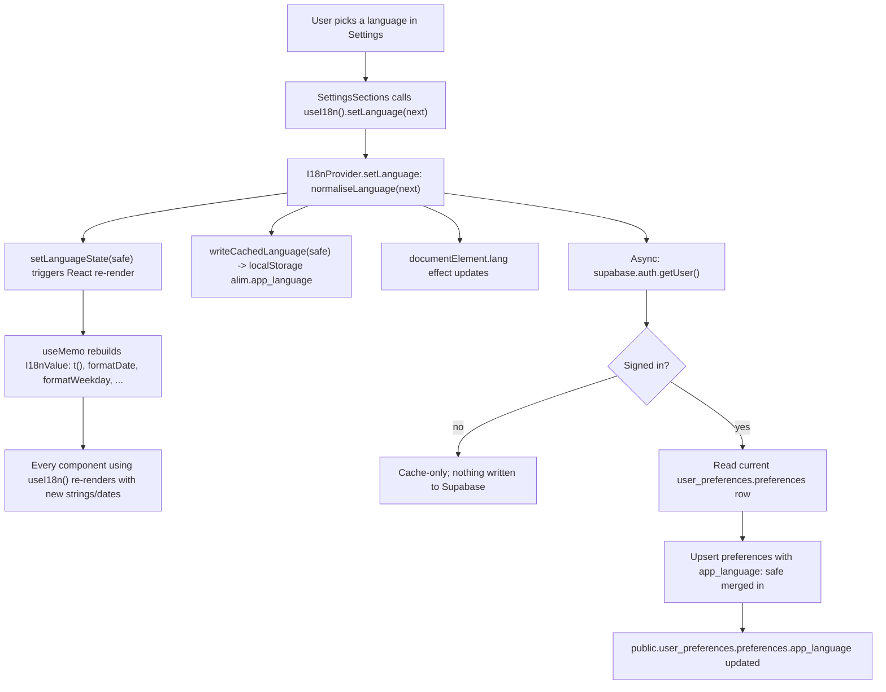
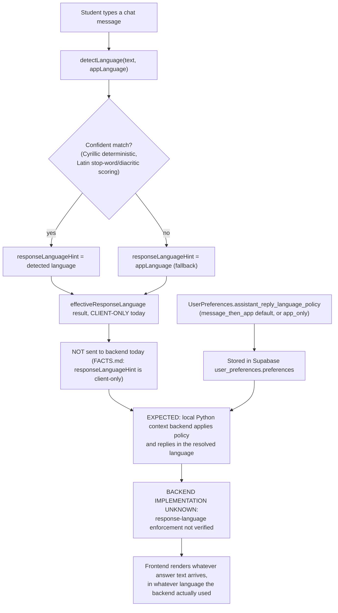

Document status: CURRENT
Generated from: current Lovable project · GitHub main (keyshavmor/study-swiss-star) · live Supabase project ucacmeadsufiedxrgqit
Last verified: 2026-09-14 (UTC)
Frontend commit: e0ef3464557d4786d214accb0d1bf44082ae3466

# Internationalisation and language state

Source: `frontend/src/lib/i18n/{languages.ts,detect.ts,format.ts,provider.tsx,index.ts,messages/*}`.

## The 7 approved language codes (CURRENT — FRONTEND)

Source: `frontend/src/lib/i18n/languages.ts`, `LANGUAGE_CODES` /
`LANGUAGES`. Exactly seven, and only these seven — anything else is rejected
and recovered to English by `normaliseLanguage()`:

| code | flag | locale | intlLocale | nativeName | englishName |
|---|---|---|---|---|---|
| `en` | 🇬🇧 | en-GB | en-GB | English | English |
| `de` | 🇩🇪 | de-DE | de-DE | **Hochdeutsch** | Standard German |
| `gsw` | 🇨🇭 | gsw-CH | de-CH | **Schwiizerdütsch** | Swiss German |
| `ru` | 🇷🇺 | ru-RU | ru-RU | Русский | Russian |
| `es` | 🇪🇸 | es-ES | es-ES | Español | Spanish |
| `fr` | 🇫🇷 | fr-CH | fr-CH | Français | French |
| `it` | 🇮🇹 | it-CH | it-CH | Italiano | Italian |

`DEFAULT_LANGUAGE = "en"`.

**`de` vs `gsw` are separate languages with separate copy** — not dialectal
variants of one dictionary. `de` is Standard German (Hochdeutsch); `gsw` is
Swiss German (Schwiizerdütsch). Two rules enforce their separation:

1. **No `ß` in `gsw`.** Swiss German orthography never uses `ß`; the check
   script (`scripts/check-translations.ts`) fails the build if any `gsw`
   dictionary value contains it.
2. **`gsw` has explicit weekday labels**, not `Intl`-derived ones, because
   `Intl` has no dependable `gsw` locale data. `languages.ts`:

   ```ts
   export const GSW_WEEKDAYS_LONG = [
     "Mäntig", "Zischtig", "Mittwuch", "Dunschtig", "Fritig", "Samschtig", "Sunntig",
   ] as const;
   export const GSW_WEEKDAYS_SHORT = ["Mä", "Zi", "Mi", "Du", "Fr", "Sa", "Su"] as const;
   ```

   `gsw`'s `intlLocale` is `de-CH` — used only for non-weekday `Intl` calls
   (e.g. `formatNumber`) where borrowing German/Swiss formatting is
   acceptable; weekday names always take the explicit `gsw` path in
   `lib/i18n/format.ts::formatWeekday` (`if (language === "gsw") { ... }`),
   never the `Intl.DateTimeFormat` fallback used by the other six languages.

REMOVED (per FACTS.md, must not reappear): "five-language wording" — any
older documentation or copy describing five supported languages is stale;
the current and only correct count is seven.

## Message catalogue layout (CURRENT — FRONTEND)

Source directory: `frontend/src/lib/i18n/messages/*`. One dictionary file per
functional area, each exporting a `Record<TranslationKey, string>` per
language (or is combined per-language — see `lib/i18n/messages/index.ts` for
the exact aggregation), covering:

```
assistant.ts  auth.ts      calendar.ts   chat.ts        common.ts
events.ts     feedback.ts  grades.ts     help.ts        home.ts
index.ts      materials.ts misc.ts       nav.ts         notifications.ts
planner.ts    profile.ts   school.ts     settings.ts    states.ts
```

`index.ts` assembles the final `dictionaries: Record<LanguageCode, Record<TranslationKey, string>>`
and the `TranslationKey` union consumed by `useI18n().t(key, vars)`
(`frontend/src/lib/i18n/provider.tsx`). Missing keys fall back to the English
value and log a dev-only `console.warn`; they are never shown as raw keys in
production silently — `translate()` returns the literal key string only as a
last resort placeholder.

### Key-count verification (CURRENT — FRONTEND, verified this pass)

Run from `/dev-server/frontend`:

```
bun run ./scripts/check-translations.ts
```

This pass's output:

```
✓ de — 822 keys, 0 missing
✓ gsw — 822 keys, 0 missing
✓ ru — 822 keys, 0 missing
✓ es — 822 keys, 0 missing
✓ fr — 822 keys, 0 missing
✓ it — 822 keys, 0 missing
✓ gsw contains no "ß"

English key count: 822
All languages complete.
```

The script enforces: every non-English dictionary has exactly the English
(`en`) key set (no missing, no extra, no empty values), and `gsw` never
contains `ß`. It is wired as `check:i18n` in `frontend/package.json` — see
`docs/frontend/FRONTEND_ARCHITECTURE.md`.

## Persistence: Supabase authoritative, localStorage cache only (CURRENT — SUPABASE / CURRENT — FRONTEND)

Source: `frontend/src/lib/i18n/provider.tsx`, header comment is explicit:

> Supabase `user_preferences.preferences.app_language` is authoritative for a
> signed-in user. A localStorage cache only prevents a flash of the wrong
> language and keeps the last chosen language on the signed-out welcome
> screen.

Concretely:

- **Authoritative store:** `public.user_preferences.preferences` (jsonb),
  key `app_language`, read/written via `UserPreferences.app_language` (see
  `docs/frontend/FRONTEND_DATA_MODEL.md` §3). `fetchPreferences()`/
  `savePreferences()` in `lib/account-data.ts` and the provider's own direct
  `supabase.from("user_preferences")` calls both touch this same column.
- **localStorage cache key:** `"alim.app_language"`
  (`LANGUAGE_STORAGE_KEY` in `languages.ts`). Read once, after hydration,
  by `I18nProvider` to avoid a server/client mismatch flash; written every
  time `setLanguage()` runs or the Supabase value loads. It is explicitly
  **not** a source of truth — `writeCachedLanguage()`'s catch comment states
  "storage may be unavailable; the Supabase value stays authoritative".
- For a signed-out user (no `userId` from `supabase.auth.getUser()`), the
  cache is the only language state — there is nothing else to be
  authoritative over.
- On `SIGNED_IN` / `USER_UPDATED` auth events, the provider re-reads
  `user_preferences` and overwrites both React state and the cache — the
  Supabase row always wins once a session exists.

## `documentElement.lang` (CURRENT — FRONTEND)

`I18nProvider` sets `document.documentElement.lang = language` (the 2-3
letter app language code, e.g. `"gsw"`) on every language change:

```ts
useEffect(() => {
  if (typeof document !== "undefined") document.documentElement.lang = language;
}, [language]);
```

Note this sets the raw `LanguageCode` (`"en"`, `"de"`, `"gsw"`, …), not the
richer BCP-47 `locale` field (`"en-GB"`, `"de-DE"`, `"gsw-CH"`, …) that
`localeFor()` produces for `Intl`/speech-synthesis use.

## The four distinct language concepts (CURRENT — FRONTEND)

The frontend deliberately tracks **four separate** language notions. They are
never merged into a single "language" setting:

1. **Interface language** — `UserPreferences.app_language`. Controls every
   translated UI string (`useI18n().t`) and date/number formatting locale.
   Selected explicitly by the user in Settings; persisted per "Persistence"
   above.
2. **User-message language** — the language a student actually typed their
   chat message in, as guessed client-side by
   `lib/i18n/detect.ts::detectLanguage(text, fallback)`. This is a per-message,
   ephemeral classification — never persisted, never shown as a setting.
3. **AI-response language** — the language the assistant's reply *should* be
   in. The frontend computes a **hint** for this
   (`effectiveResponseLanguage(text, uiLanguage)`) but — per
   `context-backend.types.ts`/`account-data.ts` comments — enforcing it is a
   **BACKEND IMPLEMENTATION UNKNOWN** responsibility today; see "State
   precedence" below.
4. **Speech (TTS) language** — the `speechSynthesis` locale used by
   `lib/speech.ts`, chosen per FACTS.md as "effectiveResponseLanguage else app
   language", respecting `assistant_audio_enabled`, entirely
   BROWSER-ONLY/ephemeral (never persisted, per `speech.ts`'s own docs).

These four can legitimately disagree at any moment: a student with
`app_language = "en"` can type a message in French, expect a French reply,
while the UI chrome around the chat stays in English.

## State precedence (CURRENT — FRONTEND / EXPECTED BACKEND CONTRACT)

`lib/i18n/detect.ts::effectiveResponseLanguage`:

```ts
export function effectiveResponseLanguage(text: string, uiLanguage: LanguageCode): LanguageCode {
  const detected = detectLanguage(text, uiLanguage);
  return detected.confident ? detected.language : uiLanguage;
}
```

Precedence rule, in order:

1. **A confidently detected, supported message language wins.**
   `detectLanguage()` returns `{ language, confident: true }` only when
   there's clear signal (Cyrillic is always deterministic → `ru`; Latin
   scripts need `best score ≥ 2`, or `≥ 1` on very short input, plus a clear
   margin over the runner-up — see the stop-word/diacritic scoring in
   `detect.ts`).
2. **Otherwise, the app (interface) language is used** as the fallback —
   both as `detectLanguage`'s own fallback argument and as
   `effectiveResponseLanguage`'s return value when detection isn't confident.

This precedence mirrors the Supabase preference
`assistant_reply_language_policy: "message_then_app"` (the live default; see
`docs/frontend/FRONTEND_DATA_MODEL.md` §3) — "message" (if confident) then
"app". The alternative stored policy value, `"app_only"`, is a valid
Supabase value the frontend *reads and writes*, but **`detect.ts` does not
branch on it today** — `effectiveResponseLanguage` always applies the
message-then-app rule regardless of the stored policy. Wiring
`assistant_reply_language_policy` into `effectiveResponseLanguage` (so
`"app_only"` disables message detection) is unimplemented frontend work, and
actually enforcing whichever policy is selected inside AI responses is
**BACKEND IMPLEMENTATION UNKNOWN** — per `FACTS.md`: *"response-language
enforcement"* is explicitly listed as NOT implemented in the local Python
backend.

**Status label for this whole precedence mechanism:**
FRONTEND + SUPABASE CONTRACT READY / LOCAL BACKEND IMPLEMENTATION REQUIRED.
The frontend fully computes, stores, and is ready to send a language
hint/policy; no backend code path is verified to consume it.

## Flow diagram 1 — language selector → provider → re-render → Supabase



## Flow diagram 2 — user message → detection → hint → expected backend policy → AI response language




## Added this pass — authenticated startup flow

Signed out → `/` → `/onboarding/language` (once, CURRENT SUPABASE flag
`language_onboarding_completed`) → `/onboarding/model` (every new browser session, CURRENT
FRONTEND sessionStorage gate `alim.ai_session.v1`) → `/home`. Guard: `_authenticated/route.tsx`.
Model preparation backend (`/api/model/prepare`, `/api/model/operation`) is EXPECTED LOCAL BACKEND
CONTRACT / BACKEND TODO FOR CODEX. Resource policy: 50/50/50 admission, 30/25/30 runtime floors —
CURRENT SUPABASE `get_ai_runtime_policy()`. Model catalog: CURRENT SUPABASE `ai_model_catalog`
(10 Qwen entries), hard-coded list is fallback only. The per-user `auto_storage_cleanup`
preference is REMOVED; storage cleanup is now the platform-wide 5-minute cron job described in
`docs/supabase/STORAGE_LIFECYCLES.md`. See `docs/sequences/POST_LOGIN_STARTUP.mmd`,
`LANGUAGE_ONBOARDING.mmd`, `MODEL_SELECTION_READINESS.mmd`, `MODEL_CACHED_SHARED_DOWNLOAD.mmd`,
`RESOURCE_BLOCKED_NON_AI.mmd`, `SETTINGS_MODEL_RETRY.mmd`, `MODEL_DOWNLOAD_DEDUPLICATION.mmd`,
`AI_SESSION_STATE_MACHINE.mmd`, `STORAGE_CAPACITY_CLEANUP.mmd`.

## Compliance, system admission, safety & peer messaging (this pass)

**Startup order (CURRENT FRONTEND / CURRENT SUPABASE):** signed out → sign in/up →
`/onboarding/compliance` (gated on CURRENT SUPABASE flag
`account_compliance.compliance_onboarding_completed`, RPC
`complete_account_compliance_onboarding`) → `/onboarding/language` → SYSTEM ADMISSION gate
(`/onboarding/system-admission`, every new browser session, sessionStorage lease
`alim.admission_session.v1`, FAILS CLOSED — EXPECTED LOCAL BACKEND CONTRACT) → model readiness gate
(`alim.ai_session.v1`) → `/home`. `account_compliance.account_status = 'suspended_pending_review'`
outranks every other route and redirects to `/account/suspended`. New legal routes:
`/legal/terms`, `/legal/privacy`, `/legal/acceptable-use`, `/legal/child-safety`. See
`sequences/SIGNUP_ROLE_GUARDIAN_CONSENT.mmd`,
`sequences/STARTUP_COMPLIANCE_LANGUAGE_ADMISSION_MODEL_HOME.mmd`.

**System admission (EXPECTED LOCAL BACKEND CONTRACT, policy is CURRENT SUPABASE via
`get_system_admission_policy()`):** max 10 admitted users; login requires ≥50% free GPU/RAM/local
disk; automatic model rebalancing preserves in-flight requests and queues new allocations; health
informs model recommendation. Effective utilisation ceiling reconciles the earlier free-floor
policy (GPU≥30% free, RAM≥25% free, storage≥30% free) with the new 75%-used ceiling as an
ADDITIONAL cap: effective max used = GPU 70%, RAM 75%, storage 70%. See
`sequences/ADMISSION_MAX10_LOGIN50_RULE.mmd`, `sequences/EFFECTIVE_CAPS_75_VS_30_25_30_FLOORS.mmd`,
`sequences/MODEL_LOAD_BALANCING_LIGHTER_ASSIGNMENT.mmd`,
`sequences/INFLIGHT_PRESERVE_NEWCOMER_QUEUE_SAFE_REBALANCE.mmd`,
`sequences/SYSTEM_HEALTH_AGGREGATION.mmd`. New route: `/system-health`.

**Content safety (EXPECTED LOCAL BACKEND CONTRACT; queue/strike tables are CURRENT SUPABASE):**
verdicts `allow | block_warning | block_suspend_pending_review | safety_unavailable | scanning`.
First CONFIRMED violation blocks content and records a warning; second CONFIRMED violation sets
`suspended_pending_review` and, for students, queues a `guardian_notification_queue` item for
HUMAN review only — no automatic permanent deletion, no guardian disclosure from an unreviewed AI
classification. `apply_confirmed_safety_strike(...)` is service-role only, never callable from the
browser. Age-appropriate curriculum discussion of history/war/medicine/sexual health is explicitly
allowed; explicit/graphic/instructional/glorifying content unsuitable for minors is blocked. See
`sequences/FIRST_SAFETY_STRIKE.mmd`, `sequences/SECOND_STRIKE_SUSPENSION_GUARDIAN_REVIEW.mmd`.

**Peer messaging (CURRENT SUPABASE reads; sends are EXPECTED LOCAL BACKEND CONTRACT):** exact
username discovery only (`find_peer_by_exact_username`, no directory);
`get_or_create_direct_peer_conversation`, `mark_peer_conversation_read`; tables
`peer_conversations`, `peer_conversation_members`, `peer_messages`, `peer_message_attachments`,
`peer_message_notifications`, all RLS-scoped by membership. Direct client writes to messages and
attachments are intentionally disabled — only the local backend, after an `allow` verdict, may
persist them via `sendPeerMessage`. Attachments: private bucket `peer-message-attachments`, hard
250000-byte limit, PDF/DOC/DOCX/JPEG/PNG/WEBP allow-list, client-side compression ladder before
upload, no authenticated direct upload. New preferences: `peer_message_notifications` (default
true), `browser_message_notifications` (default false). New routes: `/messages`,
`/messages/$conversationId`. See `sequences/PEER_CHAT_CREATION_BY_USERNAME.mmd`,
`sequences/PEER_MESSAGE_MODERATION_SEND_NOTIFY.mmd`,
`sequences/ATTACHMENT_COMPRESS_SCAN_STORE.mmd`,
`sequences/OFFLINE_MESSAGE_NEXT_LOGIN_UNREAD.mmd`,
`sequences/MESSAGING_STORAGE_RLS_BOUNDARIES.mmd`.

**Endpoints (EXPECTED LOCAL BACKEND CONTRACT, centralised in
`frontend/src/lib/local-backend-endpoints.ts`):** `/api/model/*`,
`/api/system/admission/check`, `/api/system/health`, `/api/system/session/heartbeat`,
`/api/system/runtime/release`, `/api/system/model/recommendation`, `/api/safety/moderate`,
`/api/peer-messaging/send`, `/api/safety/attachment-scan`. The browser never talks to the local
backend directly: a TanStack server function forwards the caller's already-verified Supabase
bearer JWT server-to-server; `X-Student-Id` is context/cross-check only, never an authorization
boundary; no service-role key is used anywhere in this path.

**Sign-out (CURRENT FRONTEND; sweeper is BACKEND TODO FOR CODEX):** best-effort runtime release
call while the token is still valid, then Supabase `signOut()`, then clearing the AI session,
admission lease, Google token, transient messaging state and object URLs. A heartbeat/lease-TTL
sweeper that reclaims an abandoned session's model process/VRAM, session CPU/context RAM and
temporary local artifacts when the browser closes mid-flight is **not implemented** anywhere in
this repository. See `sequences/RELEASE_MY_MODEL.mmd`,
`sequences/SIGNOUT_RUNTIME_RELEASE_LEASE_TTL_FALLBACK.mmd`.

**Data rights (CURRENT SUPABASE):** `get_user_visible_supabase_health()` (unsupported quotas
reported as `not_exposed_by_sql`, never invented), `get_my_data_summary()`, and the JWT-protected
Edge Function `delete-my-data` (`range | all_content | delete_account`, Storage objects deleted
before DB rows, caller-only, no target-user-id parameter accepted). See
`sequences/DELETE_MY_DATA_RANGE.mmd`, `sequences/DELETE_MY_DATA_ALL_CONTENT_KEEP_ACCOUNT.mmd`,
`sequences/DELETE_ACCOUNT.mmd`, `sequences/GDPR_PRIVACY_DATA_MAP_RIGHTS_WORKFLOW.mmd`.

**LEGAL REVIEW REQUIRED BEFORE PRODUCTION:** see `legal/LEGAL_REVIEW_REQUIRED.md`. This pass makes
no claim of GDPR or any other regulatory certification; lawful basis, DPAs, records of processing,
breach procedures, jurisdictional guardian-consent rules and cookie/ePrivacy analysis are
organisational decisions outside what frontend code can establish.
