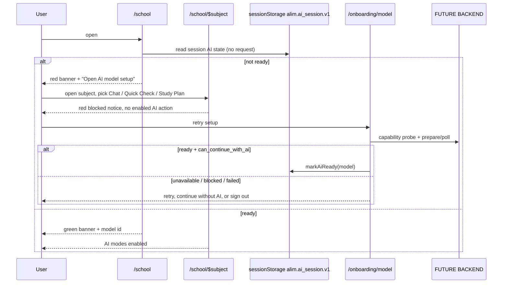
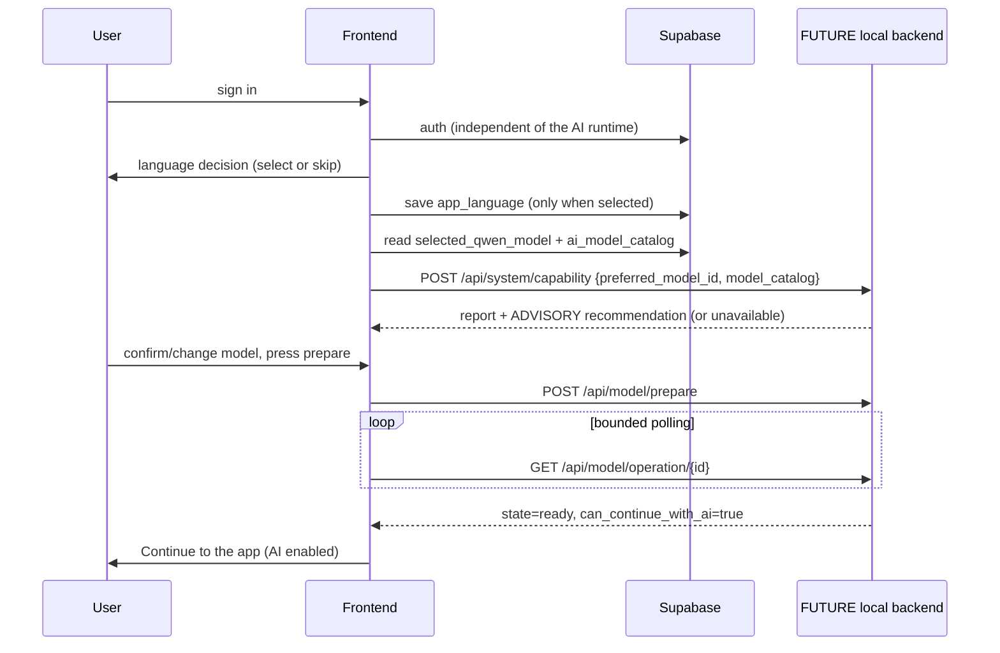
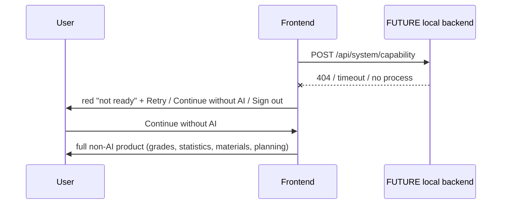
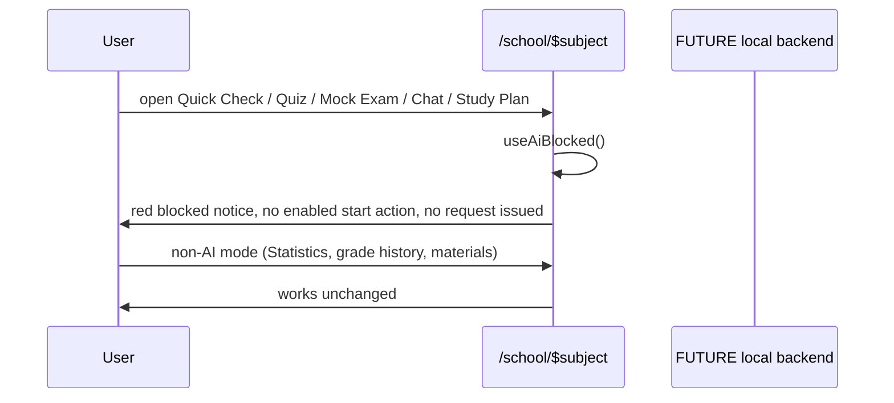
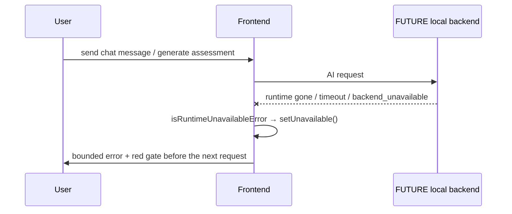
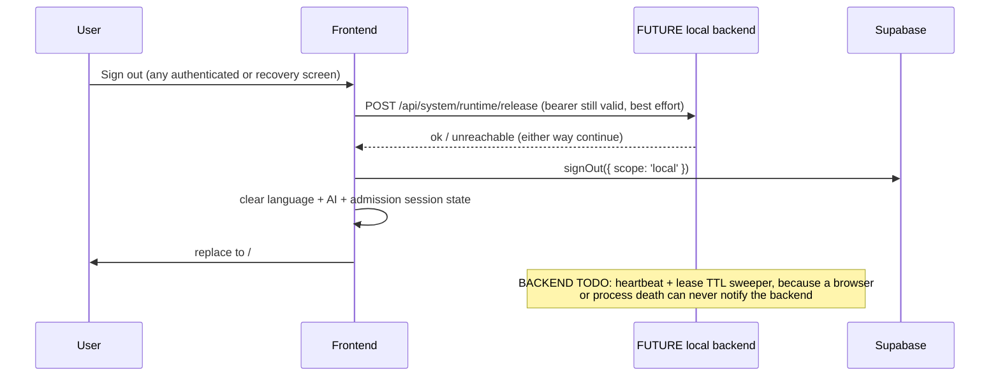

# School / Subject AI dependency matrix

Status tags: **CURRENT FRONTEND**, **CURRENT SUPABASE**, **FUTURE CODEX BACKEND**
(not implemented today). Source of truth in code:
`frontend/src/lib/ai-mode-classification.ts`,
`frontend/src/components/app/AiStatusBanner.tsx`,
`frontend/src/components/app/AiFeatureGate.tsx`,
`frontend/src/lib/ai-availability.tsx`.

## 1. Readiness truth (CURRENT FRONTEND)

- The only readiness truth is `useAiAvailability()`, fed by the session-scoped
  `alim.ai_session.v1` state in `lib/ai-session.ts`.
- `status: "ready"` is written **only** after the model screen received an
  explicit backend `state = ready` with `can_continue_with_ai = true`.
- A persisted `user_preferences.preferences.selected_qwen_model` is a preference
  only and never implies readiness.
- Runtime/GPU/model-process state is never stored in Supabase.
- Rendering the School page, the Subject page or `AiStatusBanner` issues no
  backend or AI request. Only the canonical model setup page
  (`/onboarding/model`, plus the Settings readiness panel) probes capability,
  recommends a model and runs prepare/poll.

## 2. School page (`/school`) — CURRENT FRONTEND

| Control / area | AI? | Enabled when | Behaviour when AI not ready |
| --- | --- | --- | --- |
| `AiStatusBanner` | no request | always rendered | green ready (+ model id), neutral preparing, red destructive blocked with "Open AI model setup" + "Open Settings" |
| Add test, Upload transcript | no | always | unchanged |
| Sort / filter / subject grid | no | always | unchanged |
| Year average table, rounding accordion | no | always | unchanged |
| Statistics overview panel | no | always | unchanged |

## 3. Subject page (`/school/$subject`) — CURRENT FRONTEND

| Mode | AI-dependent | Blocked behaviour |
| --- | --- | --- |
| Chat | yes | the "Open study chat" button is **not** rendered; `AiBlockedNotice` appears instead, so navigation into an AI chat is impossible |
| Quick Check | yes | `AssessmentModePanel` pre-request guard: red notice, no enabled generate action |
| Knowledge Profile | partially | stored/read-only mastery content stays visible; red notice + "only the AI analysis is blocked" note; no AI refresh/analyse action |
| Quiz Mode (practice + scored) | yes | `AssessmentModePanel` guard, both variants |
| Mock Exam | yes | `AssessmentModePanel` guard |
| Study Plan (placeholder) | yes (generation) | red notice above the placeholder; no generate action is rendered |
| Statistics | no | fully usable: averages, chart, grade history, add/edit/delete test |
| Subject Tools | per tool | non-AI utilities stay usable; AI-backed tools (`concept-explainer`, `summary-generator`, `flashcard-generator`) are gated |
| Materials panel, component switch, averages header | no | unchanged |

Blocked-state actions come from the shared `AiBlockedNotice`: **Retry model
setup** (→ `/onboarding/model`), **Use non-AI features** (→ `/home`), **Open
Settings**, **Sign out** (`signOutCompletely`).

## 4. Post-login order (CURRENT FRONTEND)

`Supabase auth` → suspended account interception → **per-session language
decision** (choose / skip / sign out) → **per-session model decision** (ready or
explicit continue-without-AI) → compliance onboarding if still required → app.
Direct URL navigation cannot skip an earlier stage (`lib/startup-flow.ts`,
`_authenticated/route.tsx`). Sign-out clears both session decisions.

## 5. Supabase contract (CURRENT SUPABASE)

- `user_preferences.preferences.app_language` — durable SAVED DEFAULT HINT (never counts as the session selection).
- `user_preferences.preferences.selected_qwen_model` — durable **preference**.
- `user_preferences.preferences.language_onboarding_completed` — legacy
  compatibility metadata; never gates the per-session language screen.
- `ai_model_catalog` — model catalogue/fallback for the picker.
- Read failures degrade to defaults and never imply AI readiness.

## 6. FUTURE CODEX BACKEND — still not implemented

1. `POST /api/system/capability` — request body `{ preferred_model_id, model_catalog }`;
   response carries `os`, nullable `active_user_count`, RAM / GPU VRAM / runtime
   storage totals and availability, `load_balancing`, an ADVISORY
   `recommendation` (`recommended_model_id` + `alternatives`, constrained to the
   forwarded `model_catalog`) and `measured_at`. The recommendation is advisory
   only: it preselects the picker and never means "ready".
2. `POST /api/model/prepare` and `GET /api/model/operation/{operation_id}` — states
   `checking_backend, checking_resources, checking_model, queued, downloading,
   downloaded, loading, ready, blocked, failed, backend_unavailable`, nullable
   `progress_percent`, `can_continue_with_ai`, `can_continue_without_ai`,
   `retryable`, `blocking_reasons`.
3. `POST /api/system/runtime/release` — best-effort release on sign-out, plus
   `POST /api/system/session/heartbeat` and a lease/TTL sweeper, because a
   browser or process death cannot notify the backend.
4. Assessment generation and grading, study-plan generation, safety moderation.

Acceptance criteria for Codex: every AI-feature request must be rejected unless
the caller's verified Supabase bearer maps to a session with a loaded model;
readiness is reported only from the runtime, never from Supabase preferences;
all polling responses must reach a terminal state (`ready`, `blocked`, `failed`,
`backend_unavailable`) so the frontend's bounded polling never hangs.

## 7. Sequence (CURRENT FRONTEND + FUTURE BACKEND)

## 8. Control-level contract (CURRENT FRONTEND)

### Language screen `/onboarding/language`

| Control | Enabled when | Effect | Failure behaviour |
| --- | --- | --- | --- |
| Language button (×7) | always | sets the SESSION selection and switches the UI language immediately | none |
| Continue | a language was clicked in THIS session | writes `app_language` + legacy `language_onboarding_completed`, marks the session decision `selected`, routes to `/onboarding/model` | save error shown inline, decision not recorded, retry possible |
| Skip language selection | always | marks the session decision `skipped` (no language is pretended to be chosen), routes to `/onboarding/model` | never blocked by Supabase |
| Retry (load failure) | preference read failed | re-reads the saved default | Skip and Sign out stay available |
| Sign out | always | best-effort runtime release → Supabase `signOut({ scope: 'local' })` → session state cleared → replace to `/` | release failure never traps the user |

A saved `app_language` is rendered as "your saved default" only. It never counts
as the session decision and never enables Continue.

### Model screen `/onboarding/model`

| Control | Enabled when | Effect | Failure behaviour |
| --- | --- | --- | --- |
| System check / Re-check | always | `POST /api/system/capability` via authenticated server fn with `preferred_model_id` + `model_catalog` | unavailable report shown truthfully; no hardware value is guessed |
| Model picker | catalogue loaded and no check running | marks the selection MANUAL and persists `selected_qwen_model` as a preference | save error inline; preference never implies readiness |
| Check / prepare model | a model is selected and no check running | `POST /api/model/prepare` then bounded polling of `GET /api/model/operation/{id}` (max 400 polls) | terminal `blocked` / `failed` / `backend_unavailable` states render red with reason codes |
| Continue to the app | backend reported `state=ready` AND `can_continue_with_ai=true` | enters AI-ready session mode | never rendered otherwise |
| Continue without AI | always | records session non-AI mode | product stays fully usable without AI |
| Sign out | always | as above, then replace to `/` | release failure never traps the user |

Preparation is NEVER auto-started from a persisted preference: the capability
report and the advisory recommendation are visible before any download begins. A
recommendation arriving after mount preselects the picker only while the user has
not chosen manually.

### School / Subject AI status and recovery

`AiStatusBanner` is read-only: rendering it probes nothing and downloads nothing.
Blocked state states plainly that non-AI features (grades, statistics, materials,
planning) remain usable and offers "Open AI model setup" → `/onboarding/model`,
"Open Settings" and "Sign out". The canonical setup page and Settings are the only
places that own capability probe, recommendation and preparation.

### Mid-session runtime loss

`lib/ai-runtime-errors.ts` is the single recogniser, used by the subject chat
(`StudyChat`), the assistant (`AssistantChat`) and `AssessmentModePanel`. Request
failures that mean the local runtime is gone or timed out, and assessment
`backend_unavailable` failures, call `setUnavailable()` on the central AI state so
the red gate appears before the next request. It recognises the exact server
texts in use today ("Context backend is unavailable", "Context backend request
timed out", "Local Qwen backend unavailable", code `context_backend_unavailable`).
Content-safety rejections (including a fail-closed `safety_unavailable` served as
503), validation errors, authorisation errors, quota errors and user cancellation
never do.

Grading polling is bounded the same way: a failed `getGradingStatus` or
`getResult` leaves the grading state with a visible failure instead of spinning,
and only `backend_unavailable` downgrades central AI readiness.

### Durable vs session state

| State | Where | Lifetime |
| --- | --- | --- |
| `app_language`, `selected_qwen_model`, `language_onboarding_completed` | Supabase `user_preferences.preferences` | durable, preferences only |
| language decision (`selected` / `skipped`) | sessionStorage | authenticated browser session; cleared on sign-out |
| AI decision (`ai-ready` / `non-ai`) + model id | sessionStorage | authenticated browser session; cleared on sign-out |
| GPU / VRAM / RAM / storage / `active_user_count` / model readiness | FUTURE backend runtime only | never stored in Supabase |

## 9. Sequences (CURRENT FRONTEND + FUTURE BACKEND)

