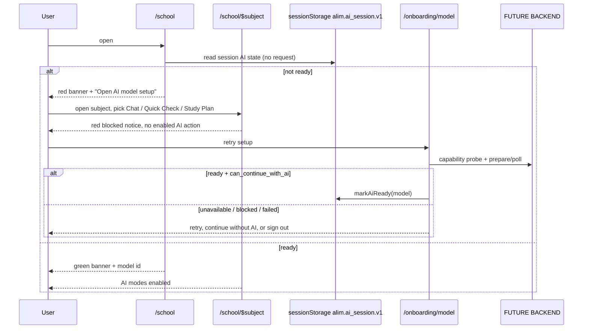

# School / Subject AI dependency matrix

Status tags: **CURRENT FRONTEND**, **CURRENT SUPABASE**, **FUTURE CODEX BACKEND**
(not implemented today). Source of truth in code:
`frontend/src/lib/ai-mode-classification.ts`,
`frontend/src/components/app/AiStatusBanner.tsx`,
`frontend/src/components/app/AiFeatureGate.tsx`,
`frontend/src/lib/ai-availability.tsx`.

## 1. Readiness truth (CURRENT FRONTEND)

- The only readiness truth is `useAiAvailability()`, fed by the session-scoped
  `alim.ai_session.v1` state in `lib/ai-session.ts`.
- `status: "ready"` is written **only** after the model screen received an
  explicit backend `state = ready` with `can_continue_with_ai = true`.
- A persisted `user_preferences.preferences.selected_qwen_model` is a preference
  only and never implies readiness.
- Runtime/GPU/model-process state is never stored in Supabase.
- Rendering the School page, the Subject page or `AiStatusBanner` issues no
  backend or AI request. Only the canonical model setup page
  (`/onboarding/model`, plus the Settings readiness panel) probes capability,
  recommends a model and runs prepare/poll.

## 2. School page (`/school`) — CURRENT FRONTEND

| Control / area | AI? | Enabled when | Behaviour when AI not ready |
| --- | --- | --- | --- |
| `AiStatusBanner` | no request | always rendered | green ready (+ model id), neutral preparing, red destructive blocked with "Open AI model setup" + "Open Settings" |
| Add test, Upload transcript | no | always | unchanged |
| Sort / filter / subject grid | no | always | unchanged |
| Year average table, rounding accordion | no | always | unchanged |
| Statistics overview panel | no | always | unchanged |

## 3. Subject page (`/school/$subject`) — CURRENT FRONTEND

| Mode | AI-dependent | Blocked behaviour |
| --- | --- | --- |
| Chat | yes | the "Open study chat" button is **not** rendered; `AiBlockedNotice` appears instead, so navigation into an AI chat is impossible |
| Quick Check | yes | `AssessmentModePanel` pre-request guard: red notice, no enabled generate action |
| Knowledge Profile | partially | stored/read-only mastery content stays visible; red notice + "only the AI analysis is blocked" note; no AI refresh/analyse action |
| Quiz Mode (practice + scored) | yes | `AssessmentModePanel` guard, both variants |
| Mock Exam | yes | `AssessmentModePanel` guard |
| Study Plan (placeholder) | yes (generation) | red notice above the placeholder; no generate action is rendered |
| Statistics | no | fully usable: averages, chart, grade history, add/edit/delete test |
| Subject Tools | per tool | non-AI utilities stay usable; AI-backed tools (`concept-explainer`, `summary-generator`, `flashcard-generator`) are gated |
| Materials panel, component switch, averages header | no | unchanged |

Blocked-state actions come from the shared `AiBlockedNotice`: **Retry model
setup** (→ `/onboarding/model`), **Use non-AI features** (→ `/home`), **Open
Settings**, **Sign out** (`signOutCompletely`).

## 4. Post-login order (CURRENT FRONTEND)

`Supabase auth` → suspended account interception → **per-session language
decision** (choose / skip / sign out) → **per-session model decision** (ready or
explicit continue-without-AI) → compliance onboarding if still required → app.
Direct URL navigation cannot skip an earlier stage (`lib/startup-flow.ts`,
`_authenticated/route.tsx`). Sign-out clears both session decisions.

## 5. Supabase contract (CURRENT SUPABASE)

- `user_preferences.preferences.app_language` — durable default/preselection.
- `user_preferences.preferences.selected_qwen_model` — durable **preference**.
- `user_preferences.preferences.language_onboarding_completed` — legacy
  compatibility metadata; never gates the per-session language screen.
- `ai_model_catalog` — model catalogue/fallback for the picker.
- Read failures degrade to defaults and never imply AI readiness.

## 6. FUTURE CODEX BACKEND — still not implemented

1. `GET /system/capability` — OS, active users, RAM/GPU VRAM/storage totals and
   availability, load-balancing mode, recommendation + alternatives, `measured_at`.
2. `POST /model/prepare` and `GET /model/operations/{operation_id}` — states
   `checking_backend, checking_resources, checking_model, queued, downloading,
   downloaded, loading, ready, blocked, failed, backend_unavailable`, nullable
   `progress_percent`, `can_continue_with_ai`, `can_continue_without_ai`,
   `retryable`, `blocking_reasons`.
3. `POST /runtime/release` — best-effort release on sign-out, plus a
   lease/heartbeat/TTL sweeper because a browser or process death cannot notify.
4. Assessment generation and grading, study-plan generation, safety moderation.

Acceptance criteria for Codex: every AI-feature request must be rejected unless
the caller's verified Supabase bearer maps to a session with a loaded model;
readiness is reported only from the runtime, never from Supabase preferences;
all polling responses must reach a terminal state (`ready`, `blocked`, `failed`,
`backend_unavailable`) so the frontend's bounded polling never hangs.

## 7. Sequence (CURRENT FRONTEND + FUTURE BACKEND)

