# Full UI, Frontend & Backend Wireframes

This pack is a code-navigation aid for maintainers and coding agents. It maps the current application as implemented and separates it from future integration work.

## Status language

- **IMPLEMENTED** — executable in the current repository.
- **IMPLEMENTED LOCAL** — runs in the frontend and persists in browser storage.
- **IMPLEMENTED CLOUD** — uses Lovable Cloud for identity or chat persistence.
- **PLANNED** — documented contract or placeholder UI, not currently wired end to end.
- **OPTIONAL** — exists but is enabled only through explicit configuration.

## Reading order

Start with diagrams 1–4 for architecture, routing, composition, and state ownership. Then open the feature journey matching the code you intend to change. Every diagram is also available as a standalone `.mmd` file in [`docs/wireframes/`](wireframes/).

## Non-negotiable boundaries

1. The frontend owns the fixed 15-subject presentation model, subject languages, SPF display combination, Swiss grade rounding, and failing-grade styling.
2. Lovable Cloud currently owns authentication and per-user chat threads/messages.
3. Browser storage currently owns grades, planner events, local materials, school links, profile, academic year, notifications, and demo mode.
4. Python owns AI context compilation, retrieval, memories, source provenance, document indexing, and local/remote model calls.
5. The TanStack `POST /api/chat` route is the authenticated bridge and the single current writer of chat transcript rows.
6. Quiz, mock-exam, answer-grading, study-plan, feedback, subject metadata, material-list, and health UI integrations are planned unless a diagram explicitly marks a backend-only endpoint as implemented.

## 1. System overview

The complete runtime boundary and service topology.

Standalone: [`01-system-overview.mmd`](wireframes/01-system-overview.mmd)

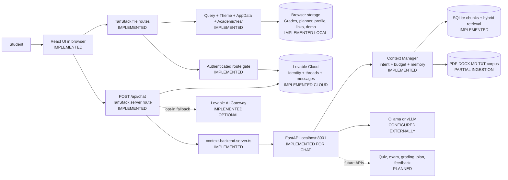

## 2. Routes and navigation

Every page route and the navigation surfaces that reach it.

Standalone: [`02-routes-navigation.mmd`](wireframes/02-routes-navigation.mmd)

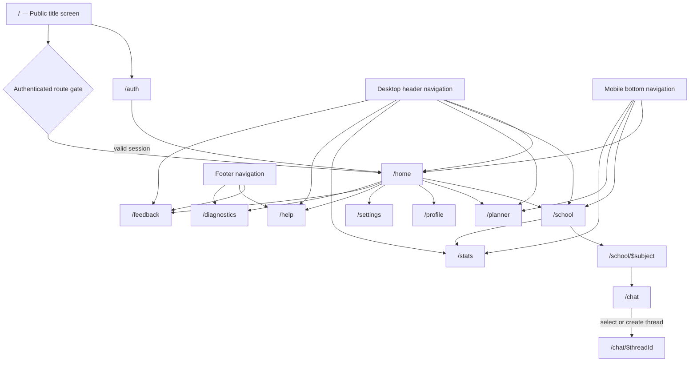

## 3. Frontend composition

The provider, layout, screen, and chat-component hierarchy.

Standalone: [`03-frontend-composition.mmd`](wireframes/03-frontend-composition.mmd)

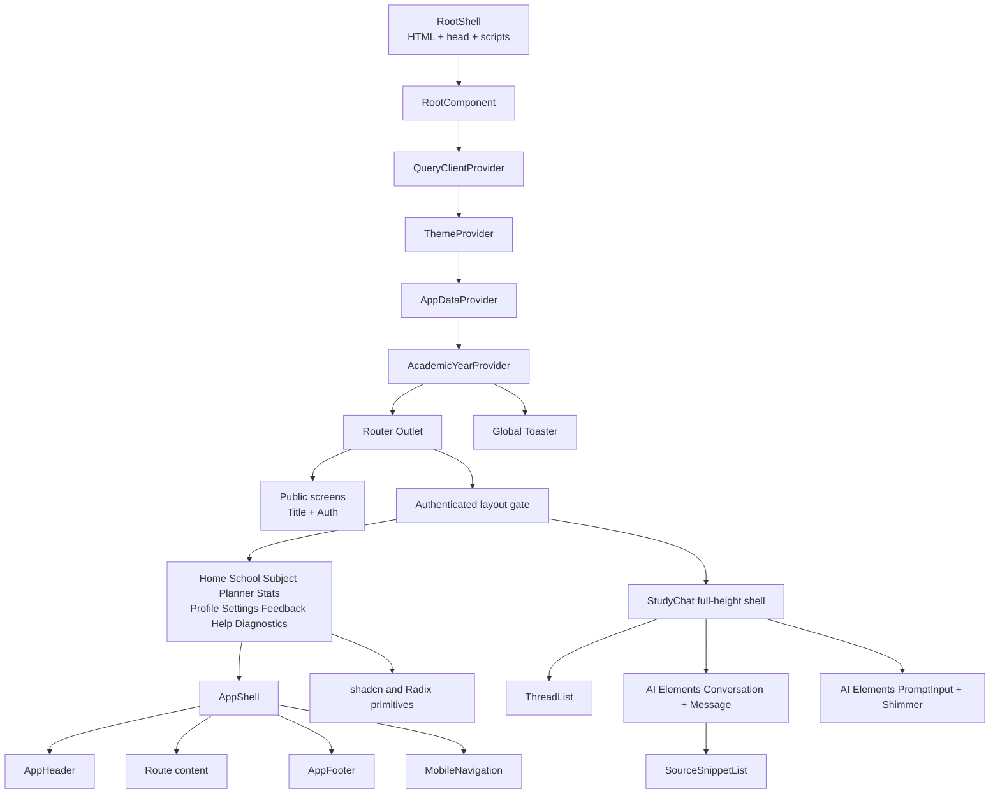

## 4. State ownership

The authoritative owner and storage location for each data family.

Standalone: [`04-state-ownership.mmd`](wireframes/04-state-ownership.mmd)

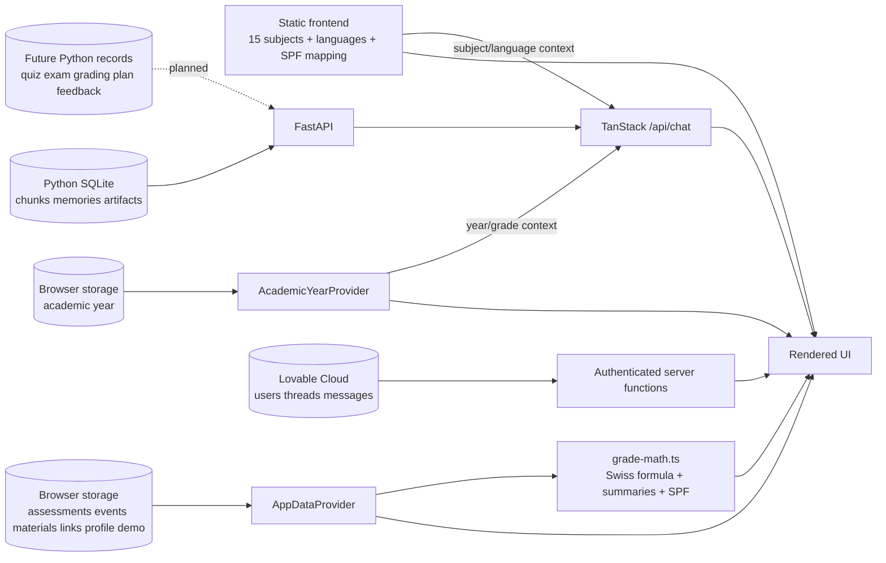

## 5. Authentication journey

Protected route entry, sign-in, session restoration, and sign-out.

Standalone: [`05-authentication.mmd`](wireframes/05-authentication.mmd)

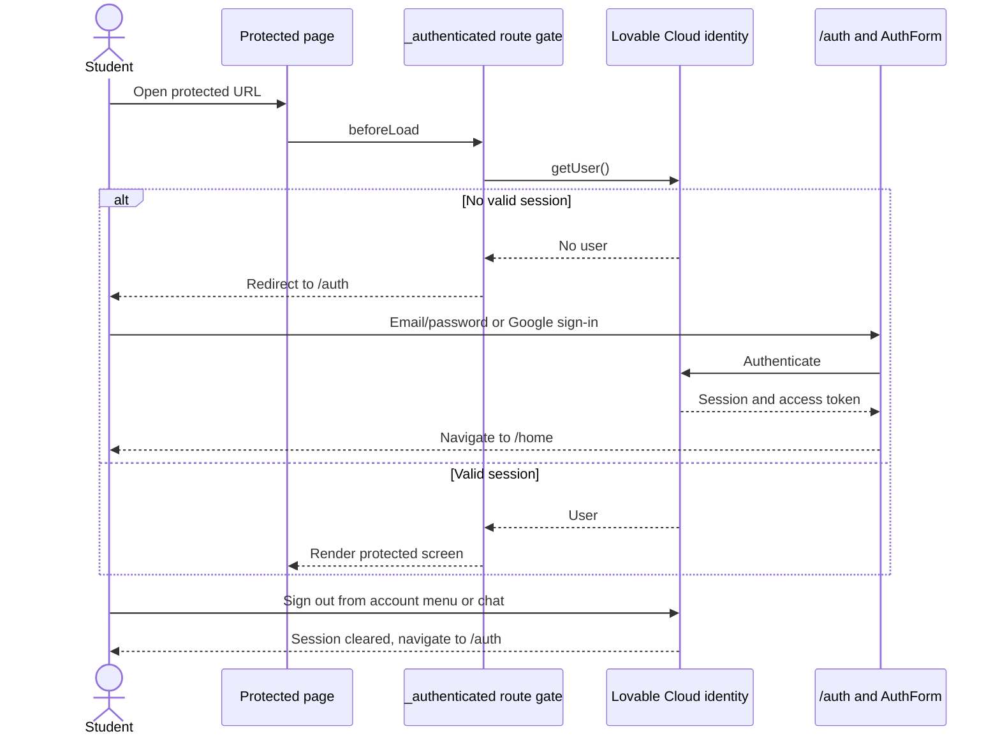

## 6. Home journey

How the dashboard derives its student-facing summary.

Standalone: [`06-home.mmd`](wireframes/06-home.mmd)

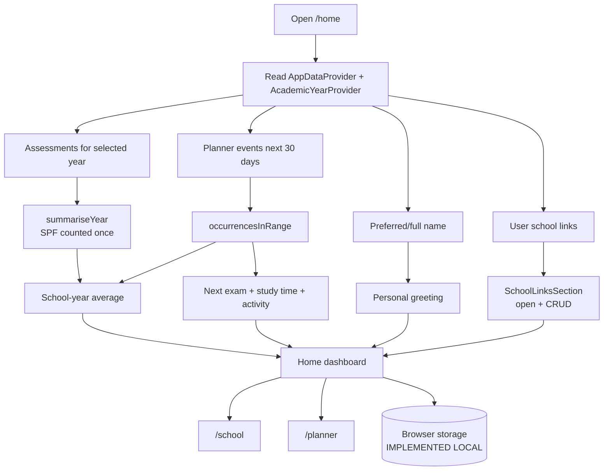

## 7. School and grades journey

Subject navigation, grade CRUD, calculations, and warnings.

Standalone: [`07-school-grades.mmd`](wireframes/07-school-grades.mmd)

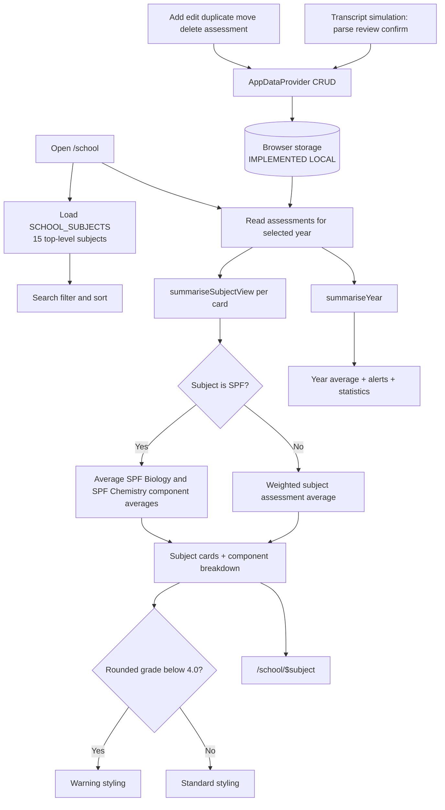

## 8. Subject workspace journey

Subject tools, materials, statistics, and the SPF component split.

Standalone: [`08-subject-workspace.mmd`](wireframes/08-subject-workspace.mmd)

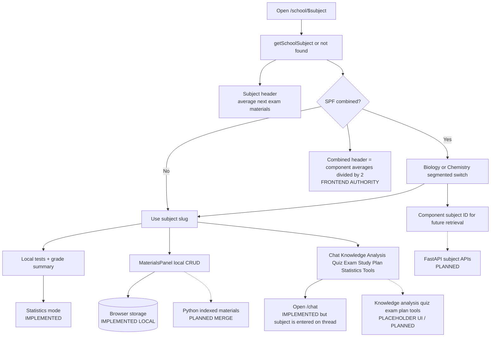

## 9. Chat journey

Thread persistence, authentication, Python retrieval, model generation, and fallback.

Standalone: [`09-chat.mmd`](wireframes/09-chat.mmd)

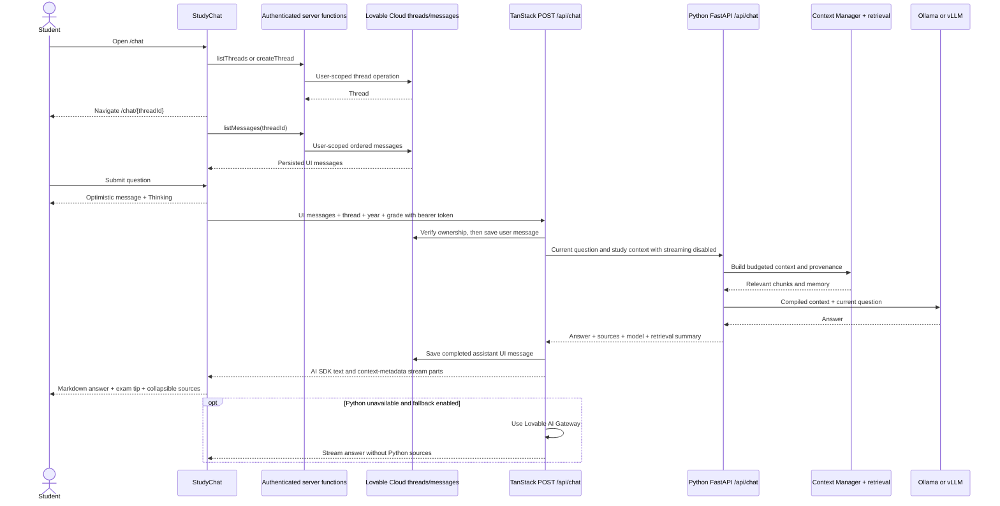

## 10. Planner journey

Recurring event CRUD, conflicts, views, and planned AI study plans.

Standalone: [`10-planner.mmd`](wireframes/10-planner.mmd)

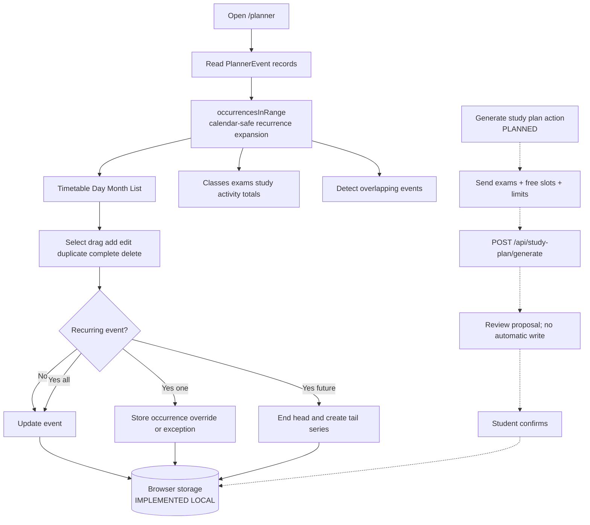

## 11. Materials journey

Local material records and the planned indexed-document pipeline.

Standalone: [`11-materials.mmd`](wireframes/11-materials.mmd)

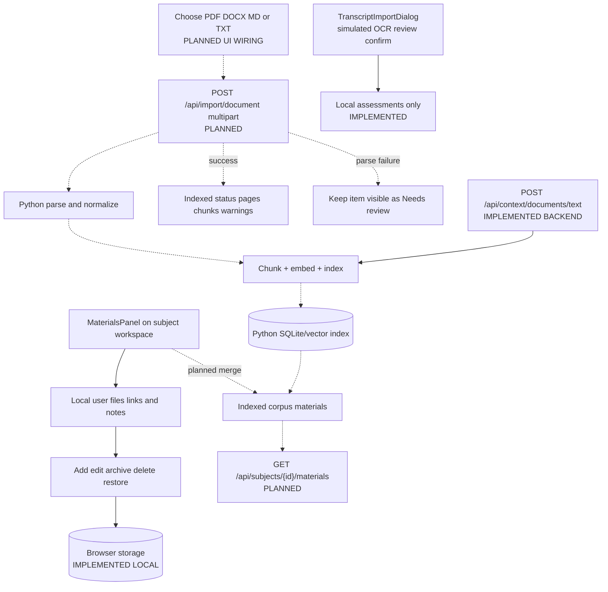

## 12. Quiz, exam, and grading journeys

The planned AI study tools and the frontend grading boundary.

Standalone: [`12-ai-study-tools.mmd`](wireframes/12-ai-study-tools.mmd)

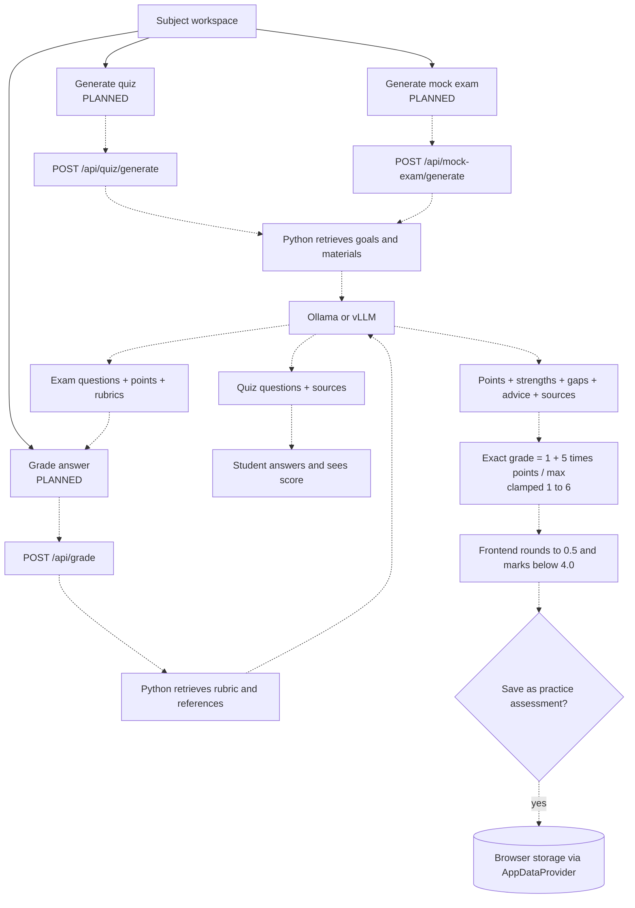

## 13. Statistics journey

How local assessments become subject, yearly, and trend views.

Standalone: [`13-statistics.mmd`](wireframes/13-statistics.mmd)

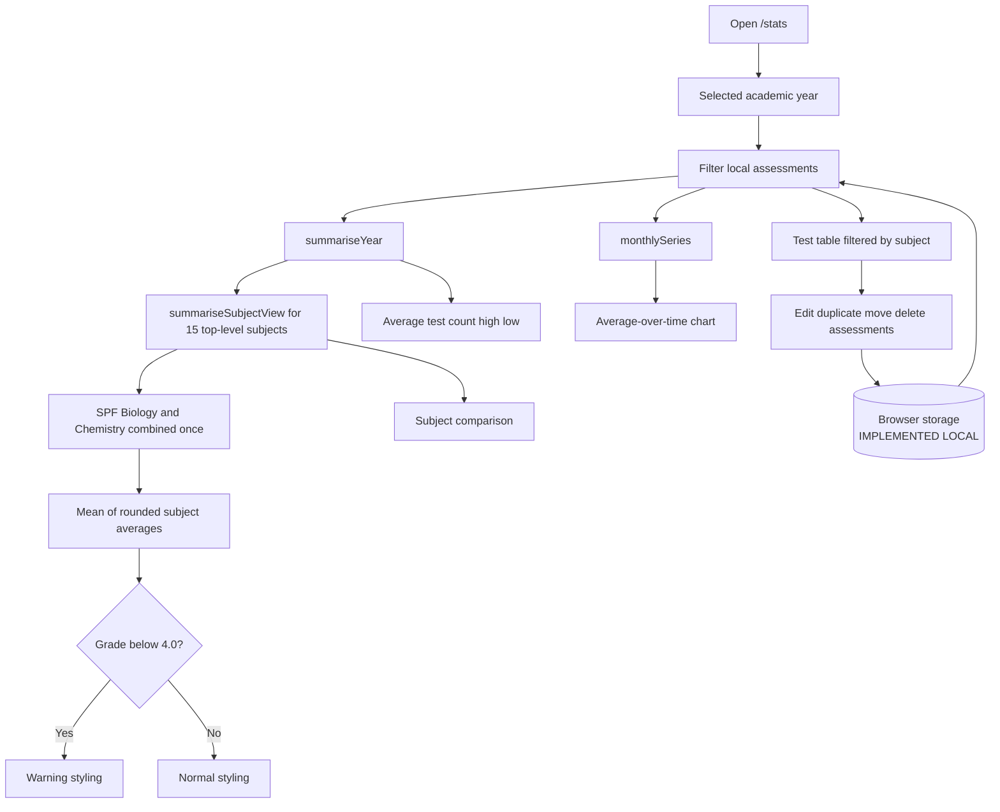

## 14. Supporting screens

Profile, settings, demo, help, feedback, diagnostics, notifications, and links.

Standalone: [`14-supporting-screens.mmd`](wireframes/14-supporting-screens.mmd)

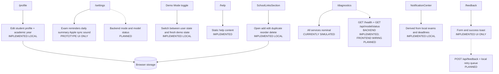

## 15. Offline and fallback behavior

What remains available when cloud, Python, or model services are unavailable.

Standalone: [`15-offline-fallback.mmd`](wireframes/15-offline-fallback.mmd)

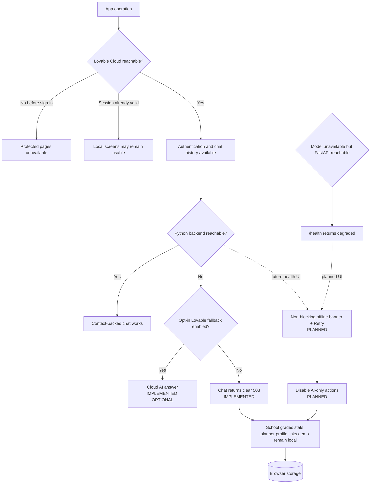

## Source-of-truth index

| Concern | Primary source |
| --- | --- |
| Route IDs and screen ownership | `frontend/src/routes/**`, `docs/ROUTE_SCREEN_MAP.md` |
| Root providers and app shell | `frontend/src/routes/__root.tsx`, `frontend/src/components/app/AppShell.tsx` |
| Navigation | `frontend/src/components/app/AppHeader.tsx`, `frontend/src/components/app/MobileNavigation.tsx` |
| Local state and recurrence | `frontend/src/lib/store/app-data.tsx`, `frontend/src/lib/date-utils.ts` |
| Subject model and SPF mapping | `frontend/src/lib/mock/subjects.ts`, `docs/SUBJECT_MODEL_AND_LANGUAGE_RULES.md` |
| Swiss grade calculations | `frontend/src/lib/grade-math.ts`, `frontend/src/lib/mock/grades.ts` |
| Chat UI and transport | `frontend/src/components/StudyChat.tsx` |
| Cloud thread/message operations | `frontend/src/lib/chat.functions.ts`, `frontend/src/routes/api/chat.ts` |
| Python bridge | `frontend/src/lib/context-backend.server.ts` |
| Python API and context pipeline | `backend/app/main.py`, `backend/app/context/**` |
| Current versus future ownership | `docs/STATE_AND_STORAGE.md`, `docs/UI_BACKEND_MAPPING.md` |

## Change checklist for coding agents

- Update a route by editing its file under `frontend/src/routes/`; never edit
  `frontend/src/routeTree.gen.ts`.
- Preserve the `_authenticated` layout gate for every protected screen.
- Keep non-AI screens usable when the Python backend is offline.
- Do not move local prototype data or cloud chat persistence without an explicit migration decision.
- Do not count SPF Biology and SPF Chemistry as two top-level subjects.
- Do not duplicate chat writes between the TanStack route and Python.
- Mark new diagram paths as implemented only after the corresponding UI and API path works end to end.
